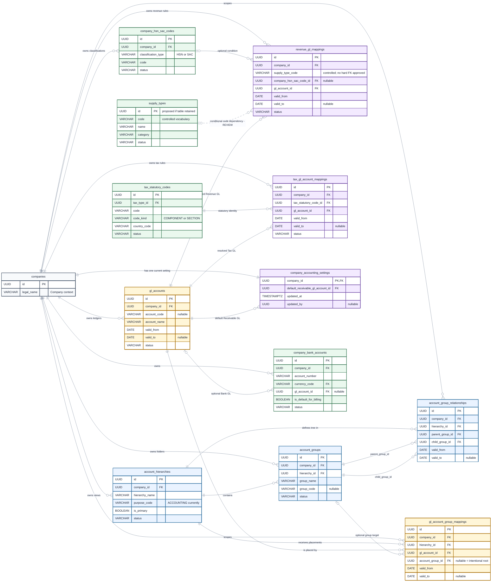

# SKMC ERP Accounting Configuration ERD

## Scope

This Entity Relationship Diagram shows only the **current approved Accounting Configuration design** from [`requirements/database.md`](requirements/database.md), especially **Accounting Setup / Chart of Accounts Tables**. It deliberately excludes journals, journal lines, balances, reconciliation, accounting periods, Account Types/classifications, future Account Determination, and transaction tables.

The diagram is landscape-oriented, uses Crow's Foot cardinality, and keeps the current separation between hierarchy structure, GL identity/placement, automatic account resolution, and supporting references.

## Complete ERD

The standalone editable Mermaid source is [`accounting_configuration_erd.mmd`](accounting_configuration_erd.mmd).

`currency_code` and `tax_type_id` remain marked as foreign keys, but their `currencies` and `tax_types` targets are intentionally not expanded because the requested supporting-reference boundary contains only Company HSN/SAC, Tax Statutory Code, and conditional Supply Type context.

## Legend

| Visual / term | Meaning |
|---|---|
| Light blue — Hierarchy Structure | The whole hierarchy view, its non-posting Group folders, and effective-dated Group-to-Group tree placement. |
| Light amber — GL Identity & Placement | Stable posting-ledger identity and effective-dated GL-to-Group/root placement. |
| Light violet — Account Resolution | Rules/settings that automatically select Revenue, Tax, or default Receivable GL Accounts. |
| Light green — Supporting References | Tax/catalogue reference data and the optional Bank-to-GL association; these are not accounting-core tables. |
| Solid Crow's Foot relationship | Current physical FK relationship. |
| Dashed relationship | Conditional/reference dependency only; no hard FK is approved. |
| Hierarchy | The entire Company-created accounting/reporting view. |
| Group | A non-posting folder/node inside a hierarchy. |
| GL Account | A stable posting ledger/account identity. |
| Group Relationship | Effective-dated **Group → Group** parent/child placement. |
| GL Placement | Effective-dated **GL Account → Group/root** placement. |
| Revenue/Tax Mapping | An automatic account-selection rule, not a posting or transaction. |

## Business Distinctions Preserved

1. `account_hierarchies` represents the whole accounting/reporting view.
2. `account_groups` contains non-posting folders. It has no permanent `parent_group_id`.
3. `account_group_relationships` alone defines the effective-dated Group tree: **Parent Group → Child Group**.
4. `gl_accounts` contains stable posting-ledger identities, not Groups, hierarchy placement, classifications, or balances.
5. `gl_account_group_mappings` places a GL Account in a Group or intentionally at hierarchy root without changing the GL identity.
6. `revenue_gl_mappings` resolves a Revenue GL from Company, Supply Type, and optional Company HSN/SAC.
7. `tax_gl_account_mappings` resolves a GL for a GST COMPONENT or TDS/TCS SECTION statutory identity.
8. `company_accounting_settings` holds the Company's single current default Receivable GL Account.
9. `company_bank_accounts.gl_account_id` is nullable; no separate Bank-to-GL mapping table exists.
10. `supply_types` remains REVIEW/table-versus-enum unresolved, so its connection is intentionally dashed and `supply_type_code` is not shown as a hard FK.
