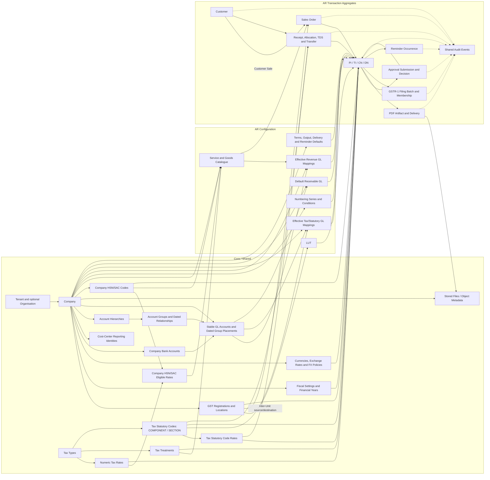

# AR MVP Architecture and Company Configuration Design

Status: **review proposal, not an approved MVP freeze or an implementation specification**. Prepared 14 September 2026; aligned to the latest reviewed `database.md` direction on 17 September 2026.

This document follows the architecture request supplied on 14 September 2026, as corrected by the latest product decisions on LUT, historical-period editing, TDS/TCS, numbering and table scope. **Confirmed** means stated in those requests or retained from an existing non-conflicting requirement. **Proposed** means a design recommendation for review. **TBD** means a business decision is still required. Proposed defaults are not silently promoted to confirmed requirements.

**17 September alignment note:** this architecture now follows the reviewed Company Configuration/database decisions through `CHG-2026-09-17-018`, including KEEP `company_location_versions`, KEEP `gst_registration_types`, the three explicit Cost Center bases (Business Segment, Team, Location), shared `stored_files`, and LUT validation for `EXPWOP`/`SEZWOP` only. It does not reopen those approved decisions.

## 1. Executive Summary

Build the current AR service with isolated Core and AR feature modules, one PostgreSQL database initially, and a background worker using the same application release. Keep business ownership explicit even while modules share deployment infrastructure. AR consumes Core contracts; Core has no invoice, billing, reminder, or payment dependencies. No service-per-master split, event bus, distributed transaction platform, or codebase restructuring is required at this stage.

The immediate deliverable is a **Company Configuration MVP**: shared company/legal, location/GST, fiscal, currency, statutory, bank and reporting masters, plus the AR catalogue and policies needed to consume them. A four-step company wizard should lead to activation; conditional AR setup then appears as grouped readiness tasks. Company activation is not a promise that every invoice type or supply route can be issued.

The reviewed Company Configuration and downstream table inventory now lives in [database.md](requirements/database.md). Section 8 summarizes how that working database review supports the architecture without repeating its table-by-table schema. The current counts—55 KEEP, 32 ADD proposals, 9 REVIEW, 10 DEFER and 33 REMOVE/MERGED/REPLACED legacy dispositions—are status evidence, not an approved implementation count. The physical total reaches 87 only if every downstream ADD proposal is later approved; replaced/deferred structures are not counted as parallel tables. Section 13 identifies the staged approval and implementation gates.

The tax foundation now separates controlled Tax Types, Company-owned HSN/SAC codes, numeric Tax Rates, effective Company HSN/SAC eligible-rate mappings, controlled Tax Treatments, and Tax Statutory Codes/Rates for GST COMPONENT and TDS/TCS SECTION identities. Service Type/SKU keeps one directly selected eligible rate for the current catalogue default, and finalized invoice lines preserve the tax facts actually applied.

The CoA foundation now separates stable GL Account identity from Company-created Account Groups and effective-dated hierarchy placement. Effective Revenue and Tax/Statutory GL mappings, one Company default Receivable GL, and a direct Bank Account-to-GL FK support AR resolution without predefined groups, Account Types, or hardcoded account names.

Preserve master history where time changes meaning, particularly legal identity, addresses, statutory rate relationships and catalogue tax assignments. Final documents must independently preserve the seller, item, tax, currency, bank and presentation values actually approved. A retained PDF is useful evidence but does not replace structured financial snapshots.

The remaining Company Configuration reviews concern Company profile history, GST Registration version history, the `supply_types` table-versus-controlled-vocabulary choice, exact Receipt/Reporting FX behavior, Team membership scope, Company access/approval settings, and the first numbering-condition set. `company_location_versions`, `gst_registration_types`, and shared `stored_files` metadata are now KEEP. GST/Tax Treatment is confirmed. Company-created CoA hierarchy plus stable GL identities and effective AR mappings are approved foundations. Accounting classifications, full ledger posting, reconciliation, historical reclassification, period closing, import/export mechanics, starter-template machinery, and Inter-Unit clearing remain outside the AR MVP.

## 2. Understanding of the Product

### 2.1 Sources and confirmed requirements

Reviewed sources:

| Source | What it contributes | Limit |
|---|---|---|
| [Product Overview](PRODUCT_OVERVIEW.md) | Product scope, hierarchy, commercial-to-cash flow, ownership and historical integrity | High-level baseline, not a transaction specification |
| [Company Configuration Requirements](requirements/COMPANY_CONFIGURATION.md) | Existing configuration rules and acceptance criteria | Some previously open decisions are now resolved by the latest request |
| [Database Design](requirements/database.md) | Current detailed working table inventory, purposes, columns, relationships, statuses and change log | Source of truth for reviewed database design; ADD/REVIEW/DEFER remain subject to their stated decisions |
| [Repository Implementation Status](REPOSITORY_IMPLEMENTATION_STATUS.md) | Dated inspection showing no backend implementation | Historical record; its claim that it was the only document is no longer a current file inventory |
| [Module boundaries](architecture/moduleboundaries.md), [Customer onboarding](requirements/customer_onboarding.md), [Sales Order/commercial setup](requirements/sales_order_commercial_setup.md), [Billing/invoicing](requirements/billing_and_invoicing.md), [Tax statutory rules](requirements/tax_satutory_rules.md), and [Approval/audit](requirements/approval_and_audit) | Focused domain requirements | Current detailed transaction, tax, statutory-lock, history, and audit rules |
| Latest user architecture request, 14 September 2026 | Locations with multiple purposes, explicit seller context, fiscal transitions, supply defaults, numbering, approval, asynchronous delivery and downstream context | Highest precedence; unresolved items remain unresolved |
| Latest database-alignment request, 15 September 2026 | Makes reviewed `database.md` the detailed database source of truth and supplies the current table-status totals | Highest precedence for database names, structures and table review state |
| Approved Chart of Accounts integration request, 15 September 2026 | Company GL Accounts, Revenue/Tax mappings, automatic resolution, finalized line references, and remaining Accounting boundaries | Highest precedence for Accounting Setup and AR account-resolution behavior |
| Approved CoA hierarchy redesign, 17 September 2026 | Stable GL identity, effective-dated hierarchy/placements, simplified Revenue mapping, generalized statutory codes, Receivable/Bank GL configuration | Highest precedence for current CoA and AR accounting configuration |

`database.md` is the detailed working database review. The focused requirements documents now record downstream behavior and must remain aligned with the latest confirmed product decisions.

### Relationship Between Architecture and Database Documents

`AR_MVP_ARCHITECTURE.md` defines architecture boundaries, MVP scope, flows, readiness, history strategy, and implementation direction. It does not freeze a competing physical schema.

`database.md` defines the detailed working table inventory: table purpose, important columns, relationships, business reasons, status, legacy disposition, and change log. Where the two documents previously differed on table names or structures, the reviewed `database.md` design now governs database detail.

Confirmed baseline:

- Tenant is the security/data boundary. Organisation is optional grouping within a Tenant. Company is the legal/business/billing entity and may have no Organisation. There is no MVP Organisation inheritance.
- The wider platform can include AR, AP, Accounting, HR and other tools; KRA already exists as a separate tool/domain. The present service is AR.
- Shared Company, statutory, currency, banking and reporting masters are not copied into separate AR and AP masters. Company-owned commercial catalogues remain separate between Companies, even in the same Tenant.
- Company Identity excludes MSME. Company Code is an optional business-facing identifier and not a relational key; its exact nullability and uniqueness scope remain OPEN. Entity Type controls relevant legal fields, not unrelated financial rules.
- One Company Location may serve multiple fixed purposes through fields on `company_locations`. An active Company has exactly one active Registered Office; other purposes can repeat. A nullable direct GST Registration FK implements one GST Registration to many Locations. Where applicable, exactly one active mapped Location is the GSTIN default; no bridge is introduced.
- Fiscal years have actual dates, allow short transitions, and are distinct from accounting closure/locks. Old receivables remain collectible in later years.
- Normal users cannot edit or post into a locked/restricted historical period. Authorized Finance/Admin/Authority-level exceptions may be allowed only by Company policy, with a mandatory reason and full audit; the policy may forbid exceptions altogether. The full closing engine is deferred.
- For current Export/SEZ billing, an applicable valid LUT for the seller GST Registration and fiscal period is required for the without-payment routes `EXPWOP` and `SEZWOP`. `EXPWP` and `SEZWP` are not blocked solely for missing LUT. Management/legal policy may revise this product rule later.
- Service Type and SKU are the lowest billable items. Each Company configures only its relevant SAC/HSN codes in `company_hsn_sac_codes`; the item's directly stored current/default selected rate must be validated through `company_hsn_sac_tax_rates`. Controlled Tax Types, numeric Tax Rates, HSN/SAC eligible-rate relationships, Tax Treatments, Tax Statutory Codes, and Code Rates remain separate. GST/Tax Treatment is classified as `TAXABLE`, `NIL_RATED`, `EXEMPT`, or `NON_GST`.
- There is one Base Currency per Company, potentially several Reporting Currencies, and separate Billing and Receipt Currency permissions. Reporting conversion changes the view only.
- PI, TI, CN and DN need human approval and final numbering. Parallel series have independent counters. Approved output and transaction-time values must remain reproducible.
- Billing distinguishes `CUSTOMER_SALE` from `INTER_UNIT`. Inter-Unit documents capture same-Company source/destination GST Registration and Location, never create a Customer for the destination, and never create normal AR outstanding.
- Ship-To may be a Customer Location or the seller Company's own Location, selected through an explicit discriminator and snapshotted on the final document.
- The GSTR-1 hard lock is: **Invoice included in a FILED GSTR-1 return / filing batch.** The auditable batch is identified by GST Registration + Return Period + Return Type. Draft membership does not permanently lock an invoice. Successful e-invoice/IRN generation is an independent hard lock.
- Each Company creates/imports its own Account Groups, stable GL Accounts, and hierarchy. Group parentage and GL placement are effective-dated outside `gl_accounts`. Billing resolves Revenue GL from the already-resolved Supply Type plus optional HSN/SAC specificity, resolves CGST/SGST/IGST through statutory-code Tax GL mappings, and resolves one default Receivable GL for eligible Customer Sales. Finalized transactions retain the resolved account IDs; account names are never product constants.
- AR delivery is asynchronous and supports manual sending. Simple payment terms, Company GL configuration/mapping, and automated reminders belong in the current scope; formal Dunning, generic workflows, complex schedules, full ledger posting, and generic tax engines do not.

### 2.2 Conflicts and latest-decision precedence

| Existing statement or gap | Latest direction | Resolution in this proposal |
|---|---|---|
| Earlier location-purpose/address normalization | Reviewed `company_locations` stores current structured address, fixed-purpose flags, nullable GST Registration FK and nullable Location Cost Center FK; `company_location_versions` is KEEP for effective-dated address/jurisdiction history | Use the simplified current Location row plus the narrow address/jurisdiction history table; do not reintroduce purpose/GST/Cost-Center mapping-history tables |
| §§3, 19 and Product Overview: TCS shared ownership only potential | TCS statutory references are Core/Shared | Ownership is confirmed; transaction calculation remains TBD |
| Team/cost-center structure previously generic | Reviewed model uses `cost_center_business_segments`, `cost_center_teams`, `team_memberships`, `cost_center_locations`, direct Location association and `company_cost_center_settings` | Use those explicit tables; retain Team membership scope as a separate decision and do not add generic Cost Center tables |
| Company Code uniqueness described as Tenant/Company scope | Current Company review leaves exact nullability and uniqueness OPEN | Treat Company Code as an optional business identifier; do not freeze Tenant-wide or Company-wide uniqueness until separately approved |
| Annual fiscal pattern with no transition-year details | Short/transition years supported; new FY does not close old FY | Model actual non-overlapping date ranges, without a closing flag |
| Long setup journey and broad activation dependencies in §24 | Activation, billing preparation and transaction eligibility are separate gates | Propose four activation screens and conditional AR setup; the exact minimum is still for review |
| Approval behavior and reminder runtime largely deferred | Human approval actions and basic reminder stops/precedence are now confirmed | Specify their boundary and minimal behavior; advanced rules remain deferred |
| Email delivery described without execution model | Approval queues work; manual send, PDF attachment, retries and history required | Add durable delivery execution contract; SMTP never runs in the approval transaction |
| KRA described among possible future modules | KRA already separate | Treat it as an existing neighboring domain, without inventing integrations |
| Older architecture/database wording required LUT for all four Export/SEZ variants | Current reviewed rule requires LUT for the without-payment routes `EXPWOP` and `SEZWOP`; `EXPWP` and `SEZWP` are not blocked solely for missing LUT | Align all architecture/readiness/finalization wording to the current without-payment rule |
| GST filing described as a generic completed state | GSTR-1 filing is a batch by GST Registration + Return Period + Return Type | Only an invoice included in a `FILED` batch is hard-locked; draft membership remains changeable with audit |
| Customer-only transaction/address model | Inter-Unit is a separate classification and Ship-To may be external or Company-owned | Add discriminated context without modelling an internal unit as a Customer or receivable |
| GST Treatment pending or inferred from zero rate | Four treatment classifications are confirmed | Use TAXABLE/NIL_RATED/EXEMPT/NON_GST separately from numeric rates |
| Typed/hierarchical `gl_accounts`, three-table Revenue Mapping, and free-text tax component mapping | Stable GL identity, effective hierarchy placement, one-table Revenue GL Mapping, statutory-code FK Tax mapping | Replace the earlier CoA structure; defer accounting classifications and retain finalized resolved GL IDs |

Two areas should **not** be resolved by assumption. The reviewed direct relationship is one GST Registration to many Company Locations and at most one current nullable GST Registration per Location; any additional same-state uniqueness rule needs an explicit requirement. The prompt's shorthand `SUBMITTED → APPROVED → RETURNED → REJECTED` must not be interpreted as sequential financial states: Approve, Return and Reject are alternative actions on a submission. Approved documents are not returned to draft through that chain.

### 2.3 Duplicate concepts to avoid

| Tempting duplication | Actual distinction/design |
|---|---|
| AR Company and AP Company | One shared legal entity; AR holds its own configuration keyed by Company ID |
| One address record per purpose | One `company_locations` row with current structured address and fixed-purpose flags; optional version table remains REVIEW |
| GSTIN copied as repeated text per location | One GST Registration referenced by many Locations through direct `company_locations.gst_registration_id` |
| Separate AR/AP TDS or GST masters | Shared statutory references with different module transactions |
| Cost Center equal to Rent/Salary | Expense/account classification belongs to the future Accounting design; a cost center represents organizational responsibility and does not classify GL identity |
| Business Segment, Team and Location collapsed into a generic dimension record | Separate masters with distinct membership rules; AR consumes their IDs |
| Service Category used as SAC, or Product Category as HSN | Commercial category and statutory classification have different meanings |
| Company logo and AR print template | Core identity asset can be reused; AR controls its placement and document structure |
| Payment terms and SO billing schedule | Terms determine when an issued amount is due; billing schedules determine when documents are generated |
| Audit events treated as master versions | Events explain actions; effective versions explain which values apply over time |
| Invoice snapshots treated as duplicate masters | Snapshots intentionally preserve transaction truth; they cannot become current Company masters |

### 2.4 Ambiguities that remain

Controlled tax-reference maintenance authority, exact FX policy values, Client identity scope and PAN/GSTIN deduplication boundary, Team membership scope, invoice currency grouping and rounding rules remain TBD. Numbering still needs its exact first-release condition/operator/combination/priority semantics. Document output still needs the current-template selection rule and whether Stamp visibility is an independent `show_stamp` choice or governed by the selected server-side template. Stored-file retention/orphan-cleanup/legal-hold policy and canonical hash algorithm remain outside the frozen metadata shape. Current TDS and TCS flows are already bounded: TDS uses a selected section/code and configured rate during Receipt/Knock-off, while item/classification relevance requires a line-level TCS applicability decision without automatic charging. Advanced threshold, cumulative, exemption, and override rules remain later module decisions. Customer Organisation is an optional external customer grouping and must not reuse the Tenant's grouping of owned Companies.

### 2.5 Missing requirements that block a freeze

The complete AR release cannot be frozen without agreement on approval edits/self-approval, document finalization/correction behavior and currency/rounding. Current cash-conservation and selected-code TDS behavior can be designed without advanced TDS threshold or override automation. Reviewed KEEP foundations can proceed independently; remaining activation validation and statutory-reference maintenance operations stay subject to their listed decisions. Section 14 classifies each blocker by the slice it affects instead of treating every open question as a reason to stop all work.

### 2.6 Overengineering to reject now

Do not implement a generic settings bag, rule expression evaluator, multi-stage workflow builder, one master microservice per feature, universal party model, generic accounting dimensions, full ledger/posting engine, CoA template engine, inventory, formal Dunning, or universal versioning engine. Keep explicit tables for real memberships and time-varying statutory facts. Avoid a separate lookup table merely to describe four fixed AR document types or two current payment-term kinds.

## 3. Existing AR Flow

| Stage | Confirmed behavior | Configuration consumed / boundary |
|---|---|---|
| Customer onboarding | Search name/PAN/GSTIN/legal entity/Organisation; draft/resume/submit; Finance approves, edits, returns or rejects. First approval assigns Client Code; updates retain it. Duplicate PAN/GSTIN hard-block direction | Customer identity scope still TBD; contacts and locations independent; one contact can have Primary, Billing, Finance and Escalation roles |
| Sales Order/commercial setup | Select Client and Company, supply type, services/goods, terms, contacts, bill/ship addresses, references; review, submit, approve | Prices, discounts, commercial currencies, owner, expected billing dates and recurrence belong here; no catalogue customer prices |
| Billing draft | Select Client/SO and items, document type, seller/header details, line details, applicable goods dispatch fields, tax and narration | Resolve Company, GSTIN, Location, FY, currency, catalogue classification, terms, bank and reporting context |
| Submission and approval | A human evaluates the submitted revision and may approve, edit, return or reject | Approval concerns a specific document revision, not a moving live draft; edit/resubmission policy must be frozen |
| Finalization | Validate the exact transaction; assign final number and preserve approved values | No number is exposed before the finalization commit; finalization failure leaves no approved-but-unnumbered success state |
| PDF and delivery | Render immutable approved content, then send automatically if enabled or manually when requested; worker records status/retry history | A delivery failure does not reverse approval, free the number or erase the receivable |
| Statutory filing / e-invoice | Build an auditable GSTR-1 batch; file it only after its GST Registration, Return Period, Return Type, and documents are final; record successful IRN evidence separately | Draft filing membership does not permanently lock. **Invoice included in a FILED GSTR-1 return / filing batch.** and successful e-invoice/IRN generation are independent hard edit locks |
| Receivables | Track financial documents that create/adjust claims | PI is not automatically a second accounting receivable when converted to TI; exact PI behavior must be frozen |
| Receipt and knock-off | Cash received may allocate to TI, DN and permitted PI flows. TDS/waiver/write-off are not cash | Per receipt and currency: received cash = effective cash allocations + unallocated cash. Cross-currency conversion requires a separately frozen policy |
| Reminders | Invoice override takes precedence over Client override, then Company policy; stop on zero balance, cancellation, hold or manual stop | Scheduling and recipient decisions use AR state; shared infrastructure only delivers messages |

For ₹100,000 settled by ₹90,000 cash and ₹10,000 TDS, the cash allocation is ₹90,000 and the non-cash TDS settlement is ₹10,000. A receipt of ₹90,000 cannot report ₹100,000 of cash allocated. In the current simple AR flow, the user selects the applicable TDS section/code, the configured applicable rate is derived, and the TDS amount is calculated/recorded; threshold automation, cumulative tracking and sophisticated override rules are later Receipt-module decisions. PI-to-TI allocation transfer must reverse/transfer with linked history rather than duplicate settlement. An April receipt can settle a March invoice while each retains its own fiscal period.

Seller selection is explicit: selecting a Company filters GST registrations; selecting a GSTIN filters its linked Locations. Reverse selection filters applicable registrations for the chosen Location. A registered establishment requires its applicable seller GSTIN. An unlinked Location never silently borrows another state's GSTIN. The invoice preserves Seller Company, Seller GSTIN where applicable, Seller Location, Place of Supply and Supply Type.

For `CUSTOMER_SALE`, Customer and Customer billing context are required and eligible finalized documents may affect AR. For `INTER_UNIT`, source and destination GST Registration/Location belong to the same Company, the GST Registrations differ, no Customer is created for the destination, and no normal AR outstanding is created. Ship-To is explicitly either `CUSTOMER_LOCATION` or `COMPANY_LOCATION`; the final document snapshots the actual address.

Supply defaults follow the prompt's **product terminology**: Indian registered clients default to B2B, Indian unregistered clients to B2C; export defaults to EXPWOP and the combined Deemed Export/SEZ route defaults to SEZWOP. Authorized Finance may choose the with-payment variants. **The current without-payment routes `EXPWOP` and `SEZWOP` require the applicable valid LUT for the selected seller GST Registration and fiscal period; `EXPWP` and `SEZWP` are not blocked solely for missing LUT.** Indian place of supply is state-based; outside India it is country-based. These defaults are not a complete statutory decision engine. Zero rate alone cannot establish NIL_RATED, EXEMPT or NON_GST treatment.

## 4. Core vs AR Ownership Map

Scope classes used throughout: **A** must have for the AR MVP; **B** preserve an extension boundary now, implement later; **C** defer completely from this MVP; **D** shared capability AR needs now; **E** future platform capability. A/D may be conditional for the relevant transaction or enabled feature, rather than Company activation requirements.

| Capability | Ownership | Why | Used by AR now? | Potential future consumers | MVP status |
|---|---|---|---|---|---|
| Tenant / optional Organisation | Core | Security boundary and grouping of owned Companies | Yes | All modules | D |
| Company identity, Entity Type, Code, business nature | Core | Describes the legal/business entity | Yes | AP, Accounting, HR | D |
| Company Locations with fixed-purpose flags | Core | Legal/business places independent of billing, using the simplified reviewed Location design | Yes | AP, HR, Accounting | D; Location versions REVIEW |
| GST registrations and direct Location association | Core | Statutory identity with current GST Registration 1:N Location direction | Conditional | AP, Accounting | D |
| Financial years and fiscal basis | Core | Common financial date context | Yes | AP, Accounting | D |
| Base time zone / currency / reporting currencies | Core | Company-wide time and valuation basis | Yes | Accounting, AP, analytics | D |
| Currency reference / exchange-rate facts and FX policies | Core/Company configuration | Shared `exchange_rates` facts remain distinct from process-specific `fx_policies` | Yes; conversions conditional | AP, Accounting | D; exact policy values TBD |
| Company Bank Accounts | Core | Company-owned accounts | Conditional | AP, Accounting | D; small model now |
| Tax Types, Company HSN/SAC, Tax Rates and Treatments | Core/Company configuration | Controlled tax families; Company-relevant HSN/SAC; controlled numeric rates; allowed effective mappings; controlled GST Treatments | Conditional on items/tax | AP, Accounting | D |
| TDS statutory codes and rate cases | Core | Reused when customer or Company deducts | Receipt/knock-off | AP, Accounting | D; simple selected-code/rate calculation now, advanced rules later |
| TCS statutory codes and reference relevance | Core | Shared statutory facts | Conditional billing | AP, Accounting | D; item-level determination now, advanced calculation later |
| Business Segment, Team membership, and Location Cost Center | Core reporting | Explicit `cost_center_*` identities and direct Company Location association replace a generic Cost Center engine | Optional AR reporting | AP, Accounting, HR where relevant | D; Team scope REVIEW |
| Company/user access | Core access | Existing IAM plus explicit Company membership only if required | Yes | All modules | REVIEW; Tenant membership alone is not Company authorization |
| Shared audit recording/history infrastructure | Core audit | Records module-authored facts without knowing their rules | Yes | All modules | D |
| LUT | AR compliance | Required for current without-payment Export/SEZ routes `EXPWOP` and `SEZWOP`; `EXPWP`/`SEZWP` are not blocked solely for missing LUT | Conditional on the applicable without-payment transaction | Possible policy revision later | A |
| Service Category / Service Type | AR catalogue | Current billable service model | Services/Both | Possible later reuse | A |
| Product Category / Product / SKU | AR catalogue | Current sellable goods model | Goods/Both | Possible later reuse, not inventory yet | A |
| Direct catalogue reporting/tax selections | AR reporting/catalogue | Current Segment, SAC/HSN, allowed rate and TCS-check selections live directly on Service Type/SKU | Optional reporting; required statutory data by route | AR reports; others use their own mappings | A |
| Billing/Receipt currency permissions and FX application | AR finance | Governs AR transactions using Core quotes | Yes | Separate AP policies | A; precise FX rules TBD |
| Customer onboarding / Sales Orders | AR customers/commercial | Current sales and commercial flow | Yes, downstream | Reuse only after separate party-domain review | A; transaction design later |
| PI/TI/CN/DN and numbering | AR billing/numbering | Fixed outgoing document family | Yes | Separate AP document concepts | A |
| GSTR-1 filing batches and IRN evidence | AR tax/compliance | Filing state and successful e-invoice generation create statutory edit guards | Conditional | Accounting/compliance | A; only FILED batch membership locks for GSTR-1 |
| Branding / invoice delivery / payment terms | AR presentation/delivery/terms | AR output and commercial policy | Yes | Possible later reuse | A |
| Stored-file metadata / object-storage identity | Core/shared infrastructure | Canonical Company-scoped metadata identity for externally stored binaries; domain tables use typed FKs while bytes stay behind `ObjectStorage` | Yes for branding assets and later immutable document artifacts | AP, HR, exports and other modules | D; `stored_files` KEEP |
| One-stage invoice approval and authorization | AR approval/access | Current human decision uses existing IAM/Company authorization; Company-specific settings/membership tables remain REVIEW | Yes | Other modules define their workflows | A behavior; configuration REVIEW |
| Receipt, knock-off and reminder behavior | AR receipts/collections | Settlement and collections | Yes, downstream | Accounting consumes outcomes | A; details gated |
| Configurable shared approval framework | Future Core framework | Could host different module workflows | No | AR, AP, HR | B |
| Priority numbering / advanced schedules | AR extensions | Later automation without changing stable identities | No | AR | B |
| Independent accounting-dimension engine | Future Core/Accounting | Advanced cross-module posting dimensions | No | AR, AP, Accounting | B |
| Account Hierarchies, Groups and stable GL Accounts | Core/Accounting configuration | Company-created non-posting structure plus stable posting identities and effective placements | Yes, for applicable AR account resolution | AP, Accounting | D; Management hierarchy behavior later |
| Default Receivable GL and direct Bank GL association | Core / Shared accounting configuration | Shared Company accounting configuration uses stable GL identities; shared statutory identities remain Core-owned | Yes, before the applicable transaction uses them | AR, AP, Accounting | D; richer receivable routing later |
| Revenue and Tax GL mapping/resolution and finalized AR GL references | AR accounting configuration | AR owns effective Revenue/Tax mappings, transaction-context resolution, and preservation of resolved Receivable/Revenue/Tax and applicable settlement GL references | Yes, before the applicable transaction uses them | Accounting consumes resolved references | A |
| Formal Dunning, full template builder, generic tax engine | Future AR/platform as applicable | No current requirement justifies these engines | No | TBD | C |
| AP / HR / Accounting services; KRA integration | Respective domains | Separate business ownership | No implementation here | Platform | E; KRA already separate |

Core reporting never contains a Service Type or SKU FK. Core audit stores opaque subject identity plus module-authored facts, not an FK to invoices. Those two choices preserve the dependency direction even in the shared database.

## 5. Company Configuration MVP Flow

### 5.1 Four-screen company wizard

The following activation minimum is **proposed for review**, resolving rather than silently assuming the old activation TBDs. Save/resume is available throughout; a draft does not have to satisfy activation constraints.

| Step | Purpose and fields/concepts | Required / dependencies | Validation | Activation gate / later completion | Owner |
|---|---|---|---|---|---|
| 1. Identity | Legal/display names, optional Company Code, country, Entity Type where known, PAN/CIN/LLPIN when applicable, contacts, optional Organisation/logo | Tenant and an authorized creator required | Company Code is optional and not a relational key; exact uniqueness remains OPEN. Validate legal fields relevant to selected entity; no MSME; Organisation must belong to same Tenant | Legal name and country required to activate; contact/logo/code may follow unless a specific output or format requires them. Exact statutory identity gate is D03 | Core company |
| 2. Operating identity | Add one Registered Office and any additional Locations; one Location can have multiple fixed-purpose flags. Collect current structured address and optional direct GST Registration selection in the same screen | Company draft exists | Exactly one active Registered Office at activation; repeated other purposes allowed; no cross-company GST links; GST establishment status cannot be guessed | Registered Office required; extra locations and registrations may follow. Missing applicable GST blocks registered billing, not Company existence | Core location/GST |
| 3. Financial basis | Base time zone, exactly one Base Currency; fiscal start month/day and first actual FY; extra Reporting Currencies optional | Company country/identity | Validate time zone; explicit Base Currency selection; valid period dates; no overlaps; a transition year may be short | Base time zone/currency required to activate. Fiscal setup is offered here but blocks dated financial activity rather than activation | Core financial configuration |
| 4. Review and activate | Review business nature Services/Goods/Both, assigned Company administrator, completeness and AR readiness tasks | Prior steps saved | Re-evaluate tenant/company access and Registered Office under concurrency; show separate blockers, warnings and later tasks | Business nature retained as required by current docs; creator assignment/default is proposed. Activation does not enable unconfigured AR routes | Core company/access with AR readiness summary |

Do not derive Base Currency solely from Country or browser location. Present a suggested time zone for confirmation; suggest the current year's fiscal range only after the user confirms the basis. “Draft” is an onboarding state introduced by this proposal; the existing Active/Inactive operational lifecycle remains intact.

### 5.2 Conditional AR preparation cards

These cards can be completed independently when their dependencies exist. They are not ten more mandatory wizard screens.

| Card | Purpose / fields | Required or optional; dependency | Validations | Company activation? / can complete later? | Owner |
|---|---|---|---|---|---|
| What you bill | Service and/or goods catalogue; names, categories, billable items, UOM, Company-configured HSN/SAC, current/default selected eligible GST rate, Tax Treatment, TCS-check flag | Required for the selected business path before relevant billing; depends on approved statutory references | SAC-only Service Type, HSN-only SKU; TAXABLE/NIL_RATED/EXEMPT/NON_GST treatment reference; selected rate must be eligible/effective; Company isolation; no uncontrolled percentage or customer price | No / yes; incomplete items remain draft/non-billable | AR catalogue + Core tax |
| Reporting | Enable Business Segment, Team and/or Location Cost Center; maintain `team_memberships`, direct item Segment selection and `company_locations.cost_center_location_id` | Optional; depends on relevant catalogue for Segment selection | Same-Company references; Team scope remains REVIEW; show uncovered items without inventing an activation gate | No / yes; mandatory coverage policy remains TBD | Core reporting + AR assignments |
| Currencies and banking | Configure `company_ar_currencies`, extra reporting currencies, Company bank accounts, relevant `exchange_rates` and retained `fx_policies` | Base may be enabled initially for AR; other currencies/banks/rates are conditional on actual Company use | Rates only for enabled/used Company currency pairs; relevant active account; positive directed rate; no silent ambiguous policy selection | No / yes; only affected transactions/conversions blocked | Core currency/bank + AR finance |
| Accounting setup | Create Company Accounting hierarchy/Groups and stable GL Accounts; effective placements; Revenue mappings by Supply Type/optional HSN-SAC; statutory-code Tax mappings; default Receivable GL; Bank GL association | Required before the applicable accounting context is finalized; stable accounts exist before mappings | Same-Company/date-valid accounts; no cycles/overlaps; specific-before-general; no missing/ambiguous match; no hardcoded names | No / yes; Company can activate first, but uncovered invoice contexts cannot finalize | Core Accounting configuration + AR mapping |
| Export/SEZ | LUT reference, seller GST Registration, FY and validity | Required for `EXPWOP` and `SEZWOP` finalization; depends on GST/FY. `EXPWP` and `SEZWP` are not blocked solely for missing LUT | One active applicable valid LUT per seller GSTIN/FY, correct context and dates; missing required LUT blocks finalization only for the applicable without-payment routes | No / yes | AR compliance |
| Numbering | Configure the document types actually used; series key, FY, start number, format/FY token and reviewed eligibility dimensions | Required for that final document type; depends on FY and whichever applicability dimensions are approved | Positive counter; valid format; 0/1/many eligible behavior; proposed rendered-number collision prevention | No / yes; no need to configure all types at once; initial dimension subset remains D07 | AR numbering |
| Terms and output | Immediate or Net X days; optional default bank; standard template and permitted display sections/signature/stamp | A resolved term and renderable output required when relevant documents are finalized | `IMMEDIATE` uses zero days; `NET_DAYS` uses positive days; at most one ACTIVE Company default and an inactive term cannot remain default. Correct identity/location/tax display and immutable approved output are required. Current-template selection and independent Stamp-visibility behavior remain OPEN | No / yes; proposed standard template and Immediate term can be accepted | AR terms/presentation |
| Delivery | Automatic send ON/OFF, sender/reply-to, default CC, email template, document overrides | Optional automatic sending; manual send available after approval | Authorized sender and valid recipient context before send; PDF ready; no recipient list invented at Company setup | No / yes; default automatic OFF proposed | AR delivery |
| Collections | Company reminder enablement, offsets relative to due date, local send time and template | Optional until enabled; depends on due dates, contacts and receivable state | Precedence and stop rules; offset uniqueness; preview recipients/schedule; runtime deduplication | No / yes; default OFF and sample offsets only after user selection | AR collections |
| Approvals and access | Resolve authorized Finance/approver users from existing IAM/Company access; use `company_approval_settings` or `company_user_memberships` only if their reviewed business conditions apply | Human approval required before final documents | Tenant membership alone is insufficient Company authorization; edit/self-approval policy review; no auto-approve default or duplicate access model | No / yes; absence blocks submission/finalization rather than activation | Existing IAM/access + AR approval |

The taxpayer's legal status, calculation rules and rates are never supplied by a guessed default. An unconfigured feature must display what is missing and which operation it blocks. Delivery OFF governs automatic sending, not an implicit ban on authorized manual sending.

## 6. Activation vs Billing Readiness Rules

### 6.1 Gate matrix

| Requirement | Company activation | AR billing readiness | Specific transaction / operation |
|---|---|---|---|
| Valid Tenant/company membership | Required | Required | Re-authorize every operation |
| Legal name, country, Base Currency/time zone | Proposed required | Required | Preserve finalized legal and valuation snapshots; no unreviewed Company legal-version table |
| Registered Office | Exactly one active required | Required | Seller Location may be another configured Location |
| Business nature | Required per current docs | Select applicable catalogue path | Match selected billable items |
| Organisation, logo, website, optional Company Code | Optional | Optional | Code required only if used by selected numbering format; legal output may require particular contact fields |
| PAN/CIN/LLPIN/Entity Type | Applicable legal checks; exact activation minimum D03 | Validate seller's applicable identity | Missing legally required output information blocks finalization |
| GST registrations | Not a blanket prerequisite | Registered routes must have applicable establishment context | GSTIN mandatory when issued under registered establishment; wrong-state fallback prohibited |
| FY and restricted historical periods | Fiscal basis can generate future `financial_years`; FY can follow activation under proposal | At least the intended transaction date is covered; close/lock engine is separate | Resolve from document/receipt date; no overlap; gap requires FY setup. FY creation does not close or lock another period. Normal users cannot edit/post into a locked/restricted period; permitted Finance/Admin/Authority exceptions require a reason and complete audit, and Company policy may forbid all exceptions |
| Catalogue | Can follow activation | At least one complete active item in intended path | Service Type must reference Company SAC; SKU must reference Company HSN; direct selected rate must be eligible/effective; controlled treatment must be valid |
| LUT | No | Required when preparing `EXPWOP` or `SEZWOP` | Missing/expired/wrong-context LUT for seller GSTIN/FY blocks those without-payment routes. `EXPWP` and `SEZWP` are not blocked solely for missing LUT |
| Numbering | No | At least one eligible series for intended type/context | Zero eligible blocks, one selects, multiple require authorized choice |
| Reporting | Optional | Depends on enabled requirements | Required selections only where policy confirmed; do not invent mandatory coverage |
| Non-base FX | No | Needed only for intended conversions | Missing, stale or ambiguous rate never silently replaced; exact validity policy D04 |
| Bank account | No | Optional unless chosen flow requires it | Validate selected Bank Account and same-Company GL association where an accounting-integrated operation requires it; mandatory bank display/posting rule is not otherwise assumed |
| Chart of Accounts and mappings | No | Complete effective coverage required for the intended invoice context | Stable GL IDs; effective Revenue from Supply Type + optional line HSN/SAC; statutory-code Tax mapping; default Receivable GL for eligible Customer Sale; missing/ambiguous/overlapping mapping blocks; finalized transaction retains IDs |
| Terms and template | No | Resolved term and standard output supported | Freeze due date and output choices; CN/DN term effects are transaction decisions |
| Human approver | No | Required to complete AR approval | Submitted revision and authority validated; number only at finalization |
| Email sender/provider | No | Does not block drafting/approval | Blocks sending; failed sending does not invalidate approved financial document |
| GSTR-1 batch / e-invoice state | No | Does not block drafting by itself | Draft batch membership does not permanently lock. **Invoice included in a FILED GSTR-1 return / filing batch.** or successful IRN generation blocks in-place editing; correction follows the permitted statutory process |
| Reminder configuration | No | Does not block billing | Blocks automatic reminders if incomplete/enabled; never bypass runtime stop rules |

“AR ready” must report readiness per document type, supply route and date rather than one mutable true/false flag. Compute readiness from authoritative configuration; do not persist a second settings-completeness truth that can become stale. Finalization rechecks the exact context even if a readiness preview previously passed.

### 6.2 Concrete acceptance scenarios

1. A Company with a legal name, country, Registered Office, confirmed Base Currency/time zone, business nature and authorized administrator can activate under the proposed gate. It can initially have no LUT, SKU, bank, sender or numbering.
2. A domestic TI can proceed after its own dependencies are complete even if CN or export series are missing. An `EXPWOP` or `SEZWOP` document with no applicable valid LUT for its seller GST Registration/FY cannot finalize; `EXPWP` and `SEZWP` are not blocked solely for missing LUT.
3. One Noida Location can be Registered, Corporate and Billing Office. Removing its Registered purpose without assigning another atomically is rejected for an active Company.
4. A selected seller Location with no applicable GSTIN does not acquire the Delhi GSTIN through a global default. The user must resolve the establishment context explicitly.
5. Creating FY 2027-28 neither closes nor locks FY 2026-27 and does not prevent collection of its open invoices. If a historical period is locked/restricted, a normal user's backdated edit/post is blocked; an authorized exception requires Company permission, reason and complete audit, and the policy may disable exceptions. A current-period receipt can still settle an old invoice.
6. Changing Reporting Currency to USD does not change INR books or the original EUR invoice amount. A report without a valid conversion basis reports the gap rather than adding incompatible currencies.
7. Two concurrent approvals using one series obtain different numbers. An approval retry returns the existing finalized result. Cancellation never releases its number.
8. A GST Registration linked to four active Locations has one active default where applicable. A second active default or a state-incompatible mapping is rejected; selecting the GSTIN may preselect the default but the transaction retains the chosen Location.
9. A Karnataka-to-Maharashtra Inter-Unit document captures both GST Registration/Location pairs under one Company, has no Customer, and never appears as normal AR outstanding. Its accounting/clearing mapping remains outside the AR MVP.
10. A Customer-Sale invoice may Ship-To either a Customer Location or a Company Location. Exactly one matching reference is accepted and the final address snapshot remains unchanged when the Location master later changes.
11. Adding an invoice to a DRAFT GSTR-1 filing batch records audit evidence but does not permanently lock it. After the batch identified by GST Registration + Return Period + Return Type becomes FILED, the exact included documents are immutable and in-place invoice editing is blocked. Successful IRN generation independently blocks editing.
12. Company A maps B2B generally to its own `India Service Revenue` account and B2B + a scrap HSN specifically to its own `Scrap Revenue` account. The specific mapping wins. An EXPWP line with no mapping cannot finalize, and no example account name is selected automatically.
13. An intra-state line resolves CGST and SGST accounts; an inter-state line resolves the IGST account. After finalization, changing either mapping affects future invoices only and the historical line retains the original GL Account IDs.
14. A Company SAC configured with eligible GST 12% and 18% shows only those rates for its Service Type. The Service Type stores one selected default directly, rejects an HSN reference, and Billing revalidates the selection for the transaction date. The same code does not determine CGST/SGST versus IGST; seller GST context and Place of Supply do. Later master changes leave the finalized line's SAC description, treatment, rate, components and amounts unchanged.
15. `Sales Export` remains one stable GL Account while its ACCOUNTING placement changes from `Sale of Services` through 31-Mar-2027 to `International Services` from 01-Apr-2027. Historical hierarchy remains queryable, invoices keep the originally resolved GL ID, and a future MANAGEMENT hierarchy may place the same GL under `International Business`.
16. Splitting `Product Sales` creates new Domestic and Export GL Accounts and new effective mappings; it never converts the used old GL into a Group. Merging Consulting/Advisory similarly preserves old GL IDs and routes only future transactions to the target GL.

## 7. Domain Model

### 7.1 Aggregate boundaries before tables

| Aggregate / entity | Purpose and owner | Relationships | Lifecycle | History requirements |
|---|---|---|---|---|
| Tenant / Organisation | Isolation and optional grouping; Core tenancy | Tenant contains Companies and optional Organisations | Active/inactive; no cascading erasure of financial history | Administrative changes audited |
| Company | Shared stable legal/business identity; Core company | Tenant, optional Organisation, `companies.base_currency_code` | Draft onboarding → Active ↔ Inactive proposed | Stable Company ID; audited current-master changes; finalized seller snapshots; no separate base-currency or unreviewed legal-version table |
| Company Location | One physical/business place; Core location | Company, current address, fixed-purpose flags, nullable GST Registration and Location Cost Center FKs, GSTIN-default flag | Active/inactive; historically used rows retained | At most one active default per GSTIN; state compatibility; effective-dated address/jurisdiction history is retained in KEEP `company_location_versions`; finalized documents also keep independent address snapshots |
| GST Registration | Statutory identity; Core tax establishment | Company; one registration can be referenced by many Locations and has exactly one active mapped default where applicable | Active/inactive/validity | Identity retained once used; dates/status audited; snapshot on documents |
| Company Fiscal Settings / Financial Year | Recurring annual basis and actual generated date intervals; Core fiscal | Company; Financial Years referenced by dated transactions, sequences and LUT | Future years generated/amendable before use; used dates protected | No implicit closing/locking; preserve actual FY dates and associations |
| Currency / Company choices / Exchange Rate / FX Policy | Shared denominations, enabled purposes, available rate facts and selection policy | Company Base Currency, `company_ar_currencies`, reporting currencies, banks, `exchange_rates`, `fx_policies` | References/policies active/inactive; rate facts retained | Applied rate/direction/purpose snapshotted; policy values remain TBD where reviewed |
| Bank Account | Company's financial destination identity; Core banking | Company, account currency, optional direct same-Company GL Account | Active/inactive | Detail/GL association changes audited; document snapshots; full bank posting deferred |
| Account Hierarchy / Account Group | Company-created non-posting reporting structure; Core Accounting configuration | Hierarchy owns Groups; dated Group relationships form the tree | Active/inactive; primary Accounting hierarchy current, Management future | Dated parent relationships retained; cycles/overlaps rejected; no predefined groups or balances |
| GL Account / effective placement | Stable Company posting identity plus dated placement; Core Accounting configuration | GL Account maps to one Group per hierarchy/date; same GL may differ across hierarchies | Date-valid active/inactive; used identity retained | Rename/code preserves ID; dated placements retained; no parent/type/group/balance embedded in GL |
| Revenue / Tax / Receivable GL configuration | Automatic AR account selection; AR/Core Accounting configuration | Effective Revenue mapping → Supply Type/optional HSN-SAC; Tax mapping → Statutory Code; Company setting → default Receivable GL | Date-valid active/inactive; unambiguous coverage required | Mapping changes audited; finalized document/lines retain resolved account IDs |
| Tax Type / Tax Rate / Tax Treatment | Controlled tax-family identity, numeric rates, and treatment vocabulary; Core tax reference | Tax Type has Rates and Treatments; current GST Treatments are TAXABLE/NIL_RATED/EXEMPT/NON_GST | Active/inactive controlled references | Numeric 0% never substitutes for treatment; finalized line snapshots applied values |
| Company HSN/SAC / eligible-rate relationship | Company-relevant item classifications plus dated allowed rates; Core/Company tax setup | Company owns HSN/SAC codes; each can have date-valid `company_hsn_sac_tax_rates` rows | Maintained configuration/reference, not a user-created rule engine | Relationships preserved, corrections audited, finalized code/description/rate snapshotted |
| Tax Statutory Code and rate case | Shared GST COMPONENT and TDS/TCS SECTION identity plus temporal section rates; Core statutory | Tax Type → Tax Statutory Code → Code Rate; separate from GST HSN/SAC item-rate mapping | Active/inactive references | Controlled identity supports Tax GL mapping; TDS configured rate supports selected-code flow; advanced automation deferred |
| Service Category / Service Type | Company's commercial services; AR catalogue | Category → billable Type; Type directly selects a Company SAC, Tax Treatment, and one current/default eligible rate | Draft/incomplete → active → inactive | Current selection changes audited; finalized line snapshots; no service-tax assignment table |
| Product Category / Product / SKU | Company's commercial goods; AR catalogue | Category → Product → billable SKU; SKU directly selects a Company HSN, Tax Treatment, and one current/default eligible rate | Draft/incomplete → active → inactive | Current selection changes audited; finalized line snapshots; no SKU-tax assignment table or inventory aggregate |
| Business Segment / Team / Location Cost Center | Explicit reporting identities | Direct item Segment selection; `team_memberships`; direct `company_locations.cost_center_location_id` | Active/inactive; Team membership scope REVIEW | Membership/current assignment audit; transactional dimensions preserved; no generic Cost Center master |
| Company Cost Center Settings | Enables the reviewed Segment/Team/Location reporting bases | Company 1:1 settings; references the explicit masters above | Enabled/disabled by basis | Current settings audited; no generic dimension engine |
| LUT | Eligibility for current without-payment Export/SEZ routes `EXPWOP` and `SEZWOP`; AR compliance | Seller GST Registration + Fiscal Period | Active/inactive, dated validity | Retain superseded records; document references/snapshots; missing applicable valid LUT blocks those routes, while `EXPWP`/`SEZWP` are not blocked solely for missing LUT |
| Numbering Series | Fixed-type final numbering policy and counter; AR numbering | Company + FY + document type; applicability dimensions require D07 review. Current narrower seller/location/supply columns are a proposal; future typed conditions/priority can reference the stable series ID | Draft configuration → active/frozen on first use → retired | Used format immutable; issued number retained by document |
| Payment Term | Reusable Immediate/Net Days definition; AR terms | Company defaults, SO and invoice selected terms | Active/inactive | Contract/invoice snapshots; later schedule children possible |
| Company Branding / Document Template | Controlled print and message content; AR presentation/communication | `company_document_branding`, `company_document_templates`; document-specific usage | Active/inactive/versioned where the reviewed table defines it | Pin selected records/renderer/assets and retain approved PDF artifact |
| Stored File | Provider-neutral Company-owned binary metadata identity; Core/shared infrastructure | Domain rows use typed FKs to `stored_files.id`; bytes are resolved through `ObjectStorage` rather than stored in PostgreSQL | Metadata identity is immutable after successful persistence; replacement bytes create a new row | Preserve object key, content hash, MIME type, size and optional original filename metadata; final financial artifacts cannot be destructively replaced through normal operations |
| Delivery Policy / Reminder Policy | AR business policy, independent of email transport | Company defaults and later Client/document overrides | Disabled/enabled, validated before use | Change history and resolved execution snapshots |
| AR approval route / Company access | Fixed one-human-stage decision contract using existing authorization | Existing IAM/access; `company_approval_settings` and `company_user_memberships` remain REVIEW | Current route retained; grants revocable | Submitted revisions retain human decisions; do not add a policy-version/workflow or duplicate membership table without the reviewed requirement |
| Version history / business audit event | Change evidence and action evidence; Core audit infrastructure | Opaque module-owned subject identity, actor and Company | Append-only | Neither is the source of live financial state |

### 7.2 Downstream aggregates and transaction contracts

These are required for a functioning AR MVP but are not additional Company Configuration tables:

- **Customer aggregate (AR):** stable Client ID and approved Code, legal/GST identities, independent contacts/locations, approval submissions and approved revisions. Clarify the business uniqueness boundary before designing its constraints.
- **Sales Order aggregate (AR):** `CUSTOMER_SALE` or `INTER_UNIT`, dated commercial revisions, separate service/goods lines, prices, payment terms, and discriminated Ship-To. Customer Sale uses Client context; Inter-Unit uses same-Company source/destination GST Registration and Location without a Customer. `sales_order_billing_schedules` remains REVIEW.
- **AR financial document aggregate (AR):** fixed PI/TI/CN/DN type, transaction classification, document revision, header/line snapshots, original and base valuation, date/FY, source/destination context, terms/due date, reference-document relationships, reporting selections, finalized number, IRN evidence, and resolved Revenue/Tax GL Account IDs per line. Only eligible Customer-Sale types create normal receivable effects.
- **GSTR-1 filing aggregate (AR tax/compliance):** batch identity by GST Registration + Return Period + Return Type, status/reference/filed actor/time, and auditable document membership. Draft membership can change with audit. **Invoice included in a FILED GSTR-1 return / filing batch.** is the only GSTR-1 hard edit lock.
- **Approval submission/decision entities (AR):** each submission targets one immutable revision/hash and records the applicable fixed route or reviewed setting where needed. Approve/Return/Reject are alternatives from Submitted. An edited revision cannot inherit an approval intended for prior values. Proposed safe behavior is Return/Edit → new submission; whether Finance can edit and approve in one recorded action is D06. Future multiple stages extend approval orchestration without changing document content or identity.
- **Delivery request/attempt entities (AR):** approval commits a durable request alongside financial finalization; worker obtains the approved PDF, sends, and records attempts/outcome. Snapshot recipients/sender/template used. Deduplication key includes document version, channel and send intent; explicit resend is a new intent. A PostgreSQL-backed work queue is sufficient initially. Network sending can have an uncertain outcome, so do not promise exactly-once email.
- **Receipt/allocation entities (AR):** separate cash from TDS and other non-cash adjustments, retain reversals/transfers and prevent over-allocation concurrently. Allocation invariants apply in a stated currency; no GL posting engine is introduced here.
- **Reminder occurrence (AR):** schedule from resolved policy and due date, deduplicate each intended occurrence, recheck balance/hold/stop/cancellation immediately before dispatch, and retain what was sent. Policy changes must not recreate already-sent occurrences.

In the initial database, AR finalization can atomically commit the document's approved revision, number/counter change, business audit event and durable delivery intent. Rendering and sending happen afterward. Master reads use a consistent resolved configuration selection and final checks; if relevant configuration changed since submission, show the difference and require the agreed revalidation/resubmission behavior. A separate Core service later changes lookup mechanics, not this AR transaction boundary.

**The database catalogue is a review candidate, not an approved implementation list.** Every table must answer: “What current MVP business requirement requires this table?” `database.md` records each table's status and business reason. REVIEW and DEFER tables are excluded until approved, and ADD proposals require table-by-table approval before migrations.

## 8. Database Design Alignment

### 8.1 Detailed table source of truth and review status

[database.md](requirements/database.md) is the detailed working database-design document. It owns the table inventory, table purpose, important columns, relationships, business justification, current status, legacy disposition, and dated change log. This architecture document owns module boundaries, MVP scope, flows, readiness, history strategy, and implementation direction. It does not maintain a competing table-by-table schema.

The current database review status is:

| Status | Count | Architecture interpretation |
|---|---:|---|
| KEEP | 56 | Reviewed Company Configuration/shared-metadata tables, including Company legal identifiers, Location address versions, GST Registration Types, generalized statutory references, eight Accounting Setup tables, `stored_files`, and `company_user_memberships` |
| ADD | 32 | Downstream table proposals requiring table-by-table approval |
| REVIEW | 8 | Four Company Configuration and four downstream candidates; do not implement automatically |
| DEFER | 10 | Includes deferred `account_types` plus existing downstream/legacy candidates |
| REMOVE / MERGED / REPLACED | 33 | Legacy dispositions including replaced Company-identifier/tax/accounting structures and the standalone `receivables` removal; never counted as current tables |

The physical catalogue would contain **88 tables only if all 32 downstream ADD proposals are later approved**. That number is a conditional arithmetic total, not an approved MVP table count. Renamed/replaced/deferred legacy structures are not counted alongside current tables. REVIEW and DEFER entries remain outside implementation until their stated business questions are resolved.

### 8.2 Reviewed Company Configuration structure

The architecture consumes the reviewed Company Configuration model as follows:

| Area | Detailed tables in `database.md` | Architecture direction |
|---|---|---|
| Tenant and Company identity | `tenants`, `organisations`, `entity_types`, `company_identifier_types`, `entity_type_identifier_rules`, `companies`, `company_identifiers`; `company_profile_versions` is REVIEW | Tenant is the isolation boundary; Organisation is optional; Company is the legal/billing entity. Legal identifiers use generic jurisdiction/entity-type rules rather than permanent PAN/CIN/LLPIN Company columns. Base Currency is `companies.base_currency_code`; Company Code exact nullability/uniqueness remains OPEN |
| Seller GST and Locations | `gst_registration_types`, `company_gst_registrations`, `company_locations`, `company_location_versions`; `company_gst_registration_versions` is REVIEW | GST Registration Type is a retained controlled GST-specific reference. One GST Registration can serve many Locations and a Location has at most one nullable GST Registration FK. `company_location_versions` keeps effective-dated address/jurisdiction history; finalized documents keep independent snapshots. GST Registration version detail remains REVIEW |
| Fiscal basis and actual years | `company_fiscal_settings`, `financial_years` | Fiscal settings hold the recurring annual start basis; Financial Years hold actual generated date intervals, including short transition years. Future years can be generated from the settings. FY creation is distinct from Period Closing and Period Lock |
| Currency, banks, and FX | `currencies`, `company_reporting_currencies`, `company_ar_currencies`, `company_bank_accounts`, `exchange_rates`, `fx_policies` | Currency is shared reference data. Company AR currency rows enable Billing/Receipt purposes. Bank Account directly references its optional same-Company GL Account; no bank mapping table exists. Maintain exchange-rate facts only for Company-used pairs. Exact FX policy values remain TBD |
| Tax and statutory references | `tax_types`, `company_hsn_sac_codes`, `tax_rates`, `company_hsn_sac_tax_rates`, `tax_treatments`, `tax_statutory_codes`, `tax_statutory_code_rates` | Tax family, Company HSN/SAC, numeric item rate, eligible relationship, treatment, COMPONENT/SECTION identity and Code Rate remain separate. Statutory codes drive Tax GL mapping; TDS/TCS Code Rates never use GST HSN/SAC item-rate mapping |
| AR catalogue | `service_categories`, `service_types`, `product_categories`, `products`, `skus` | Service Type directly references a Company SAC, one current/default selected eligible rate, and a Tax Treatment; SKU does the same with Company HSN. The selected rate is revalidated through `company_hsn_sac_tax_rates`. No uncontrolled percentage text or service/SKU tax-assignment table is introduced. Customer prices remain on Sales Order lines |
| Cost-center reporting | `cost_center_business_segments`, `cost_center_teams`, `team_memberships`, `cost_center_locations`, `company_cost_center_settings`; `company_locations.cost_center_location_id` | These explicit business identities replace generic `cost_centers` and `cost_center_types`. One physical Company Location points directly to at most one current Location Cost Center group. Team membership scope remains REVIEW |
| Accounting setup | `account_hierarchies`, `account_groups`, `account_group_relationships`, `gl_accounts`, `gl_account_group_mappings`, `revenue_gl_mappings`, `tax_gl_account_mappings`, `company_accounting_settings` | Stable GL identity is separate from dated hierarchy placement. Revenue mapping is one effective table; Tax mapping references a statutory code; Company has one default Receivable GL. `account_types` is DEFERRED. Missing/ambiguous/overlapping coverage blocks and names remain Company-defined |
| LUT | `company_luts` | Current finalization requires an applicable valid LUT for the seller GST Registration and fiscal period for the without-payment routes `EXPWOP` and `SEZWOP`. `EXPWP` and `SEZWP` are not blocked solely for missing LUT; LUT document upload remains outside the MVP |
| Numbering | `document_sequences`, `document_sequence_conditions` | A sequence owns format and counter; controlled condition rows describe eligibility. Current behavior remains: one eligible series auto-selects, multiple require user selection, zero blocks. Stable sequence identity, conditions, and optional priority keep future automatic conditional/priority resolution possible without a generic executable rules engine |
| Terms and output | `payment_terms`, `company_document_branding`, `company_document_templates` | Reusable terms and controlled output/template records are referenced by Sales Orders and finalized document snapshots/artifacts |
| Shared file/object metadata | `stored_files` | Canonical Company-scoped metadata identity for externally stored binaries. PostgreSQL stores provider-neutral object key/hash/metadata, not bytes or signed URLs; branding uses typed same-Company FKs and final PDF artifacts later reference the same identity through their owning artifact relationship |
| Delivery and reminders | `email_provider_configs`, `company_invoice_delivery_settings`, `reminder_policies`, `reminder_schedule_rules` | These are configuration/defaults. Delivery requests/attempts and reminder occurrences are downstream runtime records |
| Approval and Company access | `company_approval_settings` (REVIEW), `company_user_memberships` (KEEP) | Do not introduce a workflow engine. Explicit Company membership is required; Tenant membership alone does not grant access to all Companies. IAM/RBAC remains responsible for action permissions. |

### 8.3 Downstream aggregate boundaries

The detailed downstream table reviews remain in `database.md`. At architecture level:

- **Customer:** stable customer/legal identity, optional external Customer Organisation, multiple GST registrations and Locations, independent Contacts with multiple roles, documents, and revision-specific submissions/decisions. Customer Tenant-versus-Company scope and PAN/GSTIN uniqueness boundary remain unresolved.
- **Sales Order:** Customer-Sale or Inter-Unit context, separate Service/Goods lines, discriminated Ship-To Customer/Company Location, Contacts, documents, and revision-specific approval evidence. Inter-Unit does not use a Customer. Automated billing schedules remain REVIEW and milestones remain DEFER.
- **Billing:** one typed AR Document aggregate for PI/TI/CN/DN, explicit transaction classification/source/destination, structured header/line snapshots, resolved Receivable/Revenue/Tax GL Account IDs, IRN evidence, explicit document relations, guarded finalization, and optional simple goods dispatch details under REVIEW. Inter-Unit does not produce normal AR outstanding; its clearing treatment remains open.
- **GSTR-1 filing:** `gstr1_filing_batches` plus auditable document membership. The batch key is GST Registration + Return Period + Return Type. Draft membership remains editable with audit; only filed membership hard-locks the invoice.
- **Approval runtime:** aggregate-specific submissions and decisions target immutable revision numbers/hashes. The current human step can later gain stages without a generic workflow builder.
- **Artifacts and delivery:** finalized PDF artifact metadata plus durable delivery requests and provider attempts. Rendering/sending occur after financial finalization; delivery failure never reverses approval or releases a number.
- **Receipts and settlement:** cash Receipts, N:M Payment Allocations, non-cash Settlement Adjustments for the current simple TDS flow, and explicit PI-to-TI Allocation Transfers. A separate mutable `receivables` table is removed; receivable position derives only from eligible Customer-Sale documents, relations, active cash allocations, and active non-cash adjustments.
- **Collections:** Reminder Occurrences retain planned/sent/skipped history and recheck balance, cancellation, hold, and manual-stop conditions immediately before send.
- **Audit:** one shared append-only `audit_events` stream supplements typed approval, relation, allocation, transfer, artifact, delivery, and reminder records. Module-specific duplicate audit tables are rejected.

### 8.4 Persistence and enforcement boundaries

- Every operational relationship is Tenant-safe and, where applicable, Company-safe. Company authorization is validated separately from Tenant membership.
- Drafts may read current masters; finalized documents preserve structured transaction-time values and retain the exact generated artifact identity/metadata. Binary bytes remain outside PostgreSQL; persisted Company-owned object identity uses canonical `stored_files` and provider-neutral `ObjectStorage`.
- Final number assignment, approved-revision validation, counter change, financial finalization, and mandatory audit/durable delivery intent commit atomically. PDF rendering and network delivery run afterward.
- Published or historically used identifiers are deactivated/retained rather than physically deleted. The exact master versioning choice follows each table's status in `database.md`; architecture does not invent version tables.
- PostgreSQL constraints and transactions should enforce uniqueness, child-parent scope, counters, nonnegative settlement, and idempotency where the reviewed table design requires them. Cross-table business eligibility still belongs to explicit domain operations.
- Accounting relationships are Company-safe and date-effective. PostgreSQL range types/GiST exclusion constraints should prevent overlapping Group parents, GL placements, Revenue mappings, and Tax mappings; backend validation rejects cycles and cross-scope links. Accounting masters referenced historically use `ON DELETE RESTRICT`.

## 9. Aggregate Relationship View

This diagram shows architecture boundaries and business flow. It deliberately omits table-level columns and REVIEW/DEFER implementation detail, which belong in `database.md`.

## 10. Historical Data / Versioning Strategy

The requested choices are used explicitly: **A** current update in place, **B** effective dating/versioning, **C** immutable transaction snapshot, **D** both B and C. “A + C” below is the snapshot strategy C with ordinary audited current-master updates; it does not require a full temporal master engine.

| Mutable master/configuration | Strategy | What changes / what is retained | Reason |
|---|---|---|---|
| Tenant/Organisation and access membership | A with change/action audit | Current names/status/membership; old actors/grants remain in evidence | Administrative change is not a reason to version every financial document |
| Company legal data/logo | A + C | Current values remain on reviewed Company/branding records with audit; finalized documents retain seller name/PAN/CIN/contact/logo usage | `database.md` does not approve a separate Company legal-version table; transaction snapshots preserve financial history |
| Company Code | A + C, controlled | Code changes reviewed against integrations; freeze consumed-series expansions | Code is a business identifier, not a mutable key of invoice relationships |
| Base Currency/time zone | A + C, with financial-basis restriction | Base Currency changes after financial use are not an MVP edit; documents retain valuation basis and relevant timestamps | Revaluing existing books through a settings edit would corrupt meaning |
| Location address | D | `company_locations` holds current address, KEEP `company_location_versions` retains effective-dated address/jurisdiction history, and seller/bill/dispatch snapshots preserve finalized documents | Master history and transaction snapshots serve different purposes; the version table stays narrow and does not version GST/Cost-Center/purpose flags |
| Location purposes and GST/location associations | A + C | Fixed-purpose flags, direct nullable GST Registration/Location Cost Center FKs, and one active GSTIN-default flag store current setup; documents preserve resolved source/destination/Ship-To context | Reassignment must not rewrite prior document context, but no mapping/history table is approved |
| GST registration | A + C for status/details; immutable used GSTIN identity | Keep registration validity and changes; new statutory identity gets a new ID | Ordinary administrative detail changes need less machinery than statutory rates |
| LUT | D through dated retained replacements and snapshot/reference | Keep old GSTIN/FY/reference and used context; never overwrite used ARN silently | Eligibility is year/registration-specific |
| Fiscal basis / actual years | Basis A; used periods protected + C | Future basis editable; actual used dates/period ID retained | Generating another year is not closing or rewriting an old one |
| Currency reference and enabled purposes | A + C | Current allowed choices can change; original currency amounts remain | Inactivation must not make historical amounts unreadable |
| Company HSN/SAC descriptions | A + C | `company_hsn_sac_codes` holds current Company configuration; transaction code/description retained | No global preloaded catalogue or universal classification-version engine is required just for wording |
| Service/SKU statutory selection | A + C | Current Company SAC/HSN, Tax Treatment, and `selected_tax_rate_id` live directly on Service Type/SKU; finalized lines retain the actual code/description, treatment, rate, components and amounts | Do not recreate effective-dated item-assignment tables; `company_hsn_sac_tax_rates` validates allowed dated rates |
| GST allowed-rate relationships | D | Immutable rate value plus dated allowed relationship/context | One classification can have several rates and change over time |
| Tax Statutory Codes and rate cases | D for SECTION rates/relevance; A + C for descriptive COMPONENT/SECTION metadata | Preserve statutory code/kind, case, rate, basis and amount actually applied | Current master alone cannot explain past components, deductions, or charges |
| Exchange rates / FX policies | D | Retain `exchange_rates` source/direction/validity and the applicable `fx_policies` decision; document stores actual applied rate/date/purpose and computed base values | Available facts and process selection policy are distinct; later rates/policies cannot reprice old transactions |
| Service/product/category descriptions | A + C | Commercial current details audited; sold description/UOM retained | Full effective commercial-price history is unnecessary here; SO owns prices |
| Cost-center reporting masters and memberships | A for reviewed explicit masters/settings; B for unresolved Team scope; C for transaction snapshots | Segment/Team/Location identities remain separate; direct item/Location assignments and membership changes do not reclassify approved revenue unless a report explicitly requests current organization | No generic Cost Center/dimension engine is introduced |
| Account Hierarchies / Groups / placements | B | Preserve dated Group parentage and GL-to-Group placement; reject overlap/cycles | A reorganization must not overwrite the hierarchy effective for an earlier date; the same GL may use another future Management hierarchy |
| Company GL Accounts | A with validity and audited lifecycle | Stable ID survives name/code changes; used accounts are retained/date-ended/inactivated; no parent/type/group/balance embedded | Posting identity must remain independent from hierarchy and reporting classification |
| Revenue / Tax / Receivable GL configuration | D | Effective mappings/settings change prospectively; finalized documents/lines retain resolved Receivable, Revenue, and applicable Tax GL IDs | Mapping or hierarchy changes must not silently reclassify historical invoices |
| Numbering configuration | B by frozen series-per-FY; C for issued string | Used scope/token expansion retained, only counter advances | Cancellation or new prefix cannot recycle/change issued numbers |
| Branding/communication templates | D | Branding uses typed same-Company `stored_files` asset identities; published template/configuration versions and the approved PDF artifact are retained; each communication records content/template used | Rendering from today's settings cannot reproduce yesterday's approved output reliably |
| Stored-file metadata | Immutable metadata identity | `object_key`, content hash, content type and size remain immutable after persistence; replacement bytes create a new `stored_files` row | Provider-neutral file identity must survive storage-provider change and protect historical artifact integrity |
| Bank details | A + C | Restricted change history, old presented bank details on each document | Explicit current account management is enough; no ledger engine needed |
| Payment Terms | A + C | SO/invoice stores kind, days, due-date basis and actual due date | New Net 45 default cannot alter an existing Net 30 agreement |
| Delivery policy | A + C at send intent/attempt | Resolved sender/recipients/template/attachment are retained; retry follows the intended content | Later policy edits must not change evidence of what was sent |
| Reminder policy/steps | A + C per planned/sent occurrence | Retain policy revision/effective selection, due date, recipients and outcome | Avoid resending old steps or hiding why a reminder happened |
| Approval/access settings | A for current human decision evidence; B only if reviewed Company-specific settings/membership are retained | Record the applicable fixed route or reviewed setting on submissions/decisions; `company_approval_settings` and `company_user_memberships` remain REVIEW | Later workflow upgrades must not reinterpret old approval evidence or create duplicate Company authorization |
| GSTR-1 filing and e-invoice evidence | C once filed/generated; auditable A while draft | Draft filing membership may change with actor/time/reason. A `FILED` batch freezes GST Registration, Return Period, Return Type, filing evidence, and included documents. Successful IRN evidence is retained | Only **Invoice included in a FILED GSTR-1 return / filing batch.** creates the GSTR-1 hard lock; draft membership does not. IRN generation is a separate hard lock |

Final transaction snapshots must be **typed relational header/line/amount data** in the later Billing schema, not a catch-all JSON invoice payload. At minimum they retain seller and internal destination legal/registration/location identity where applicable, Customer legal/bill identity for Customer Sales, the selected Customer or Company Ship-To address, item description/UOM, HSN/SAC code and description where required, Tax Treatment, applied rate, CGST/SGST/IGST components and amounts, resolved Receivable/Revenue/Tax GL Account IDs where applicable, TCS/TDS details, original/base amounts and exchange-rate context, terms/due date, bank details presented, reporting identities/labels, and presentation/template references. Drafts may refresh from masters, but refresh is visible and invalidates a previously submitted content revision when material.

For reproducible output, preserve the approved structured data, immutable template/renderer/assets and final PDF/hash. Retaining the approved artifact covers renderer/font drift; retaining typed data supports financial reporting. Superseded versions and retired files remain accessible under the original Tenant/Company authorization. History retention, export/backup and deletion policy need a product policy, but no current operation may cascade away referenced financial history.

Version history answers “what values changed?” Business audit answers “what action occurred?” Both may be written for one action. For example, changing credit days records 30 → 45 as change evidence and a terms-configuration action; approving an invoice records a decision on a content revision even if no master changed. A field diff must not be used to infer that a human approved a document.

**Current product direction when a period is locked or restricted:** normal users cannot edit or post into that historical period. An authorized Finance/Admin/Authority-level user may be allowed an exceptional edit or backdated posting only if Company/management policy permits it; the reason and complete audit trail are mandatory. Policy may disable exceptions entirely. **Financial Year ≠ Period Closing ≠ Period Lock.** The full accounting period-closing engine is deferred from AR MVP; an FY rollover does not itself impose a lock. A current-period receipt can still settle an old outstanding invoice.

## 11. MVP vs Future Scope

| Capability | MVP | Future | Why |
|---|---|---|---|
| Company/legal hierarchy | D: one shared Company, optional Organisation, explicit Tenant access | E: richer platform administration/inheritance if justified | Foundation prevents later duplicated legal entities |
| Multi-purpose locations/GST/FY | D: simplified current Location fields/flags, direct GST FK, fiscal basis and generated actual years; Location versions remain REVIEW | E: Accounting close/lock engine; optional Location versions only if approved | Current legal/date context is required; FY creation, closing and locking have different semantics |
| Currency/FX | D/A: shared `currencies`, Company purpose enablement, relevant `exchange_rates`, retained `fx_policies`, and actual rates on transactions | B: exact Corporate/Spot/User-Fixed precedence, cross-currency settlement and FX gain/loss after decisions | Available rate facts and applicable process policy are different concepts |
| Catalogue + statutory references | A/D: controlled Tax Types/Treatments, independent Company HSN/SAC catalogues, effective eligible rates, direct selected catalogue rate, and TCS check support | B: richer statutory maintenance and tax cases as required | Current correctness without compulsory full-code catalogues, mixed tax concepts, or semantic cross-company catalogue merging |
| Reporting masters | D/A: `cost_center_business_segments`, `cost_center_teams`, `team_memberships`, `cost_center_locations`, direct Company Location association and `company_cost_center_settings` | B: independent accounting-dimension engine and richer allocations | Preserve explicit identities now; no generic Cost Center/dimension builder |
| Numbering | A: `document_sequences` plus controlled `document_sequence_conditions`, independent counter, finalization-time consumption and 0/1/many resolution | B: automatic condition/priority resolution on stable sequence IDs | Exact MVP condition types remain D07; the reviewed schema keeps future resolution possible without a generic rule engine |
| Approval | A: human Finance/authorized-user step and versioned submission/decision contract; Company-specific settings/access tables remain REVIEW | B: manager/Finance/CFO routes and shared framework | Workflow orchestration can evolve without a workflow builder or duplicate membership model |
| Branding | A: standard templates, explicit toggles and immutable published versions | C: drag/drop designer; location-specific variants if later required | Core identity and AR presentation are distinct responsibilities |
| Invoice delivery | A: durable worker execution, manual send, PDF, attempts/retries | E: shared communication service if multiple modules justify it | Asynchronous delivery is a current requirement, not premature microservices |
| Payment terms | A: named Immediate/Net Days and invoice due date | B: installments, percentage due amounts and multiple due dates | Stable term identity leaves a child-schedule extension path without building it now |
| SO schedules | A only for manually captured approved commercial intent; `sales_order_billing_schedules` is REVIEW and `sales_order_milestones` is DEFER | B: approved recurring/milestone/periodic generation and proration | These belong to Sales Order/Billing, never Company Configuration; no scheduler table enters MVP before its rules are approved |
| Receipts/knock-off | A: cash/non-cash distinction, conservation, reversals/PI transfer history after module freeze | B: advanced FX/write-off policies | Configuration must not accidentally define settlement accounting |
| Reminders | A: chosen offsets, precedence, stop checks and audit when enabled | C: formal Dunning/legal notices | Current direction is automated follow-up, not a mature collections/legal engine |
| Company CoA and AR mappings | D/A: Company-created Accounting hierarchy/Groups, stable GLs, effective placements, Revenue/Tax mappings, default Receivable GL and direct Bank GL FK | B/E: Account Types/classifications, Management hierarchy behavior, import/export mechanics, historical reclassification, starter templates, full posting/reconciliation, and Inter-Unit clearing | AR resolves Company-defined accounts automatically while hierarchy changes preserve GL identity and history; no account names are hardcoded |
| Tax engine | A: confirmed GST Treatment, contextual GST components, required TCS checks, and simple selected-code TDS calculation in Receipt | C: generic rule engine; advanced TDS/TCS automation in their modules if justified | Advanced TDS/TCS rules do not block Company Configuration foundations |
| GSTR-1 and e-invoice locks | A: auditable batch and membership plus IRN evidence | B: separately approved statutory correction automation | Draft filing membership does not permanently lock; FILED membership and successful IRN generation create independent hard locks |
| LUT | A: valid applicable LUT for seller GST Registration/FY before final billing of `EXPWOP` and `SEZWOP` | Later management/legal policy may revise the current rule | Missing LUT blocks the applicable without-payment routes; `EXPWP` and `SEZWP` are not blocked solely for missing LUT |
| AP/HR/KRA | E: no implementation or shared Company duplicate | E: respective domain integrations; KRA already separate | Preserve ownership without designing unrelated products |
| Infrastructure | D/A: one database, AR application and worker, feature contracts | E: split services when operational/ownership needs justify it | Avoid distributed systems complexity before it has a business consumer |

Useful ERPNext ideas are selective references, not a target architecture to copy:

| Idea | Recommendation here | Basis |
|---|---|---|
| Accounting dimensions independent of accounts | Adopt separate master identities now; defer the generic engine | ERPNext uses additional dimensions to tag transactions rather than multiplying accounts. This supports the conceptual distinction, not a requirement to reproduce its dynamic fields. [Accounting Dimensions](https://docs.frappe.io/erpnext/accounting-dimensions) |
| Letter Head versus Print Format | Adopt identity/presentation separation with standard templates | ERPNext distinguishes letterhead content from the rest of the print format. Full visual editing is unnecessary here. [Letter Head](https://docs.frappe.io/erpnext/letter-head) |
| Role/condition/stage workflows | Keep the approval boundary and versioned submissions ready; implement only current human stage | Configurable workflow states and actions are a useful later extension, not justification to build the configuration UI now. [Workflows](https://docs.frappe.io/erpnext/workflows) |
| Conditional/priority numbering and complex payment schedules | Preserve extension points only | These are future directions explicitly mentioned in the request; present eligibility selection and Immediate/Net Days satisfy the current proposal |

## 12. Future Service Extraction Analysis

### 12.1 Modules that can move

| Later service / current modules | Tables or behavior that move | What AR retains | Required migration work |
|---|---|---|---|
| Core service: tenancy/company/location/GST/fiscal | Reviewed `tenants`, `organisations`, `entity_types`, `companies`, Company GST/Location and fiscal tables | Company/context IDs and immutable financial snapshots | Preserve IDs, replace in-process contracts with a service adapter, validate ownership and cut over writes |
| Core service: currencies/banks/statutory references | `currencies`, Company currency-purpose rows, `exchange_rates`, `fx_policies`, Bank Accounts and statutory reference tables | Selected reference IDs and actual applied snapshot values | Controlled reference reads or explicit read projections; no independent AR-editable copies of statutory masters |
| Core service: cost-center reporting | Business Segment, Team/membership, Location Cost Center/direct Location association and Company settings | Direct AR item Segment selection and finalized reporting snapshots | Replace shared FK lookups with owned identity contracts; agree stale-reference behavior; no generic Cost Center master |
| Shared audit infrastructure | Generic change/event recording and storage | AR event definitions, meaning, mandatory coverage and subject identity | Separate audit delivery reliability from financial state; a stored audit stream is not automatically an event bus |
| Shared object/file infrastructure | `stored_files` metadata plus provider-neutral `ObjectStorage` contract | Typed file IDs on AR branding/artifact relationships and immutable financial artifact references | Preserve stored-file UUIDs/object keys/hashes while moving provider adapters independently; do not migrate signed URLs as business identity |
| AR service | Reviewed AR configuration plus Customer/SO/Billing/Approval/Delivery/Receipt/Collection aggregates approved from `database.md` | Entire AR decision/finalization transaction | Keep numbering, approval outcome, document values and delivery intent local to AR |
| AP service | New AP-owned catalogues/commercial/payment behavior as later justified | Shared Company/tax/reporting masters are consumed, not recreated | AP defines its own approvals and tax/application rules |
| Accounting service | Future posting journals, closing/locking, reconciliation and Inter-Unit clearing | AR source documents, resolved GL Account IDs and settlement evidence | Define posting identity/idempotency and correction contracts when the Accounting transaction engine is designed |

### 12.2 Boundaries to enforce now

Each feature owns writes to its tables and exposes explicit operations/read contracts. An AR use case requests seller context, dated rate references or allowed currencies from the owning module; it does not update Core tables through an AR repository. Core validation never imports AR classes or queries AR transactions. A neutral Core “financial basis is in use” command can lock Company valuation settings without teaching Core what an invoice is.

Use stable opaque IDs and explicit effective-version/context responses. Do not pass ORM entities across module boundaries. Keep cross-feature query composition in application/reporting adapters; avoid making business rules depend on sprawling joins through another module's private schema. Current AR-to-Core composite FKs are valuable integrity checks, even though they must be replaced when databases split. Dropping them prematurely merely sacrifices integrity today.

On extraction, keep authoritative writes with one owner. Preserve IDs, backfill required references/versions, reconcile counts and key relationships, replace FK validation through contracts or controlled local read projections, then switch writers. A local read projection is a derived cache with an owner/version; it is not a second editable Company or tax master. Define how finalization handles an unavailable Core service or stale reference before that cutover. Extraction still needs adapters, data migration and operational validation; clean boundaries reduce product rewrite, not all migration work.

### 12.3 Coupling that would make extraction painful

| Coupling risk | Boundary now |
|---|---|
| Core references AR invoice IDs as required business FKs | Core owns neutral identities; audit subjects are opaque evidence references only |
| One settings JSON bag contains Company, AR and future AP rules | Explicit feature-owned policy tables and commands |
| Invoice output always joins live Company, tax and branding tables | Typed approved snapshots, pinned versions and retained artifacts |
| Company activity/activation depends on every AR policy | Separate Core lifecycle and computed AR readiness |
| Core reporting master stores AR catalogue IDs | AR owns assignments; Core owns independent master identities |
| Approval waits for SMTP/PDF/network success in one request | AR financial commit then durable worker execution |
| Bank/tax/reference writes bypass their owning feature | Ownership tests and import paths use the same domain commands |
| A report assumes forever cross-database joins | Reporting adapter can later read projections with explicit freshness/valuation basis |
| “Shared approval” enforces one flow across modules | Shared mechanics later; module-owned routes/actions/data now |

Do not implement an event bus, distributed locks, dual-write framework or distributed transaction coordinator merely to prepare for extraction. A durable AR delivery work item is justified by current email requirements; it does not commit the platform to a broader messaging architecture.

## 13. Implementation Sequence

This is a dependency-aware plan for later work; no implementation code or database changes accompany this proposal. Test entries are acceptance/integration priorities, not instructions to add tests before the design decisions are made.

| Phase | Backend | Database | Frontend | Validations | Tests / exit evidence |
|---|---|---|---|---|---|
| 0. Approve review slices | Use `database.md` statuses and resolve only the decisions needed by the next slice | No migrations from ADD/REVIEW/DEFER entries until the relevant business rules and table are approved | Review wizard, readiness and transaction examples | KEEP is reviewed configuration; ADD is still a proposal; REVIEW/DEFER are excluded | Recorded table decisions, acceptance examples and unresolved release gates |
| 1. Reviewed Company foundations | Tenant/Company identity, legal-identifier references, existing access contracts, Currency and shared audit writer boundary | Implement applicable reviewed KEEP tables: `tenants`, `organisations`, `entity_types`, `company_identifier_types`, `entity_type_identifier_rules`, `companies`, `company_identifiers`, `currencies`; leave `company_profile_versions` and `company_user_memberships` REVIEW unless separately approved/required | Company draft/identity and role-aware Company selection | Same-Tenant Organisation; jurisdiction-compatible Entity Type/identifier rules; Company Code is optional and its uniqueness is not frozen; Tenant match does not imply Company authorization | Cross-Tenant and cross-Company denial; legal-identifier applicability; audit attribution; no speculative Company-Code uniqueness constraint |
| 2. Reviewed operating/fiscal identity | Company Locations with retained address/jurisdiction history, GST Registration Type/registration context, fiscal basis and generated actual FYs | `gst_registration_types`, `company_gst_registrations`, `company_locations`, `company_location_versions`, `company_fiscal_settings`, `financial_years`; leave `company_gst_registration_versions` REVIEW | Wizard screens 2–4; activation; seller-context/FY preview | Exact Registered Office and GSTIN default; state compatibility; same-Company direct FKs; non-overlapping Location address periods and FYs; no wrong-GST fallback | Multiple Locations per GSTIN, one active default, address-history boundaries, reverse GST filter, transition FY, automatic future-year generation, FY creation without close/lock |
| 3. Reviewed statutory references and catalogue | Controlled Tax Types and Treatments; Company-configured relevant HSN/SAC; controlled rates; direct Service Type/SKU HSN/SAC, treatment and selected-rate setup | KEEP the seven tax/HSN-SAC/statutory tables in addition to `gst_registration_types` already included in Phase 2, plus the catalogue tables from `database.md`; no service/SKU assignment tables | Company HSN/SAC setup, eligible-rate dropdowns, Tax Treatment, and billable completeness | Tax-family references, Company ownership, SAC-vs-HSN kind, allowed-rate/date correctness, selected-rate eligibility, confirmed treatment, no hidden 0%-treatment inference | Multiple valid GST rates, boundary dates, invalid HSN/SAC kind, item selection changes and finalized snapshot preservation |
| 4. Reviewed reporting, banking and FX | Explicit three-basis cost-center model, Company bank/currency permissions, rate facts and retained policies | KEEP Business Segment, Team, Location Cost Center masters/membership/settings, `company_ar_currencies`, bank, reporting-currency, `exchange_rates`, and `fx_policies`; broader arbitrary/custom dimensions remain DEFERRED; freeze D09/FX values before affected constraints/routes | Grouped optional cards; FX context display | Same-Company direct assignments; rates only for enabled/used currencies; fact versus policy distinction | Team/location conflicts, Company bank isolation, rate direction, report currency does not rewrite values |
| 4A. Accounting setup | Company-created Accounting hierarchy/Groups; stable GL identities; effective Revenue/Tax mappings; default Receivable and Bank GL configuration | KEEP eight approved Accounting Setup tables; `account_types` remains DEFERRED; add resolved Receivable/Revenue/Tax references to finalized AR records | Hierarchy/Group/GL maintenance, dated placement, Revenue Mapping, Tax/Statutory Mapping, Receivable/Bank setup, coverage preview | Same Company; account-code uniqueness; validity; no cycles/overlaps; statutory-code FK; specific-before-general; missing/ambiguous mapping blocks | Reorganization history, same GL in future Management view, split/merge, B2B general + scrap-HSN exception, component mapping, old invoice IDs preserved |
| 5. Reviewed AR configuration | LUT, terms, numbering/conditions, branding/templates, shared stored-file identities, delivery and reminder defaults | Implement applicable KEEP tables only, including `stored_files` before typed branding asset references; leave `company_approval_settings` REVIEW; resolve D07 before freezing the first-release numbering condition vocabulary/operators/combination semantics | AR readiness cards; numbering/template previews; approver capability | `EXPWOP`/`SEZWOP` LUT; `EXPWP`/`SEZWP` not blocked solely for missing LUT; 0/1/many eligible series; active-only payment-term default; valid templates/assets; fixed human approval | FY rollover without number reuse, condition matching, later priority compatibility, branding/file replacement without historical rewrite, template retirement and default OFF cases |
| 6. Customer and Sales Order approval | Resolve D05 and commercial revision/approval rules; decide whether schedule REVIEW enters the release | Approve required ADD tables from the Customer/SO reviews before migration; exclude Customer delivery/reminder REVIEW and schedule REVIEW unless resolved | Draft/resume/search, approval, Client Code, SO lines/terms/contacts | PAN/GSTIN duplicate scope, stable Client Code, independent Contacts/Locations, customer-specific price ownership | Duplicate races, returned/resubmitted revisions, same Client Code after edits, approved SO unaffected by default changes |
| 7. Billing, statutory locks and approval runtime | Freeze D04/D06/D07/D08/D13 for enabled routes and D12 before a TCS charging path | Approve required AR Document/line/relation, GSTR-1 batch/membership, and submission/decision ADD tables; dispatch stays REVIEW unless required | Customer-Sale/Inter-Unit draft, discriminated Ship-To, submit/review/approve, filing and IRN lock visibility | Revision-specific approval, same-Company inter-unit context, no inter-unit receivable, LUT validation only for required `EXPWOP`/`SEZWOP` routes, treatment/rate validation, FILED-only GSTR-1 lock, IRN lock, number uniqueness, immutable snapshots | Draft batch add/remove, FILED membership lock, IRN lock, inter-unit exclusion, concurrent approval/retry, historical master changes, PI/CN/DN invariants |
| 8. PDF and delivery execution | Durable artifact/request, PDF rendering, worker attempts/retries/manual send | Approve artifact, delivery-request and delivery-attempt ADD tables; reuse Company delivery/provider/template configuration and canonical `stored_files` for persisted PDF object identity | Delivery history, retry/manual send; failures distinct from approval | Artifact matches approved revision; same-Company stored-file identity; intended recipients/sender; no SMTP in finalization transaction | Provider unknown outcome, immutable PDF/hash retention, retry deduplication, worker restart, manual resend as new intent |
| 9. Receipts and collections | Implement selected-section/configured-rate TDS and cash-plus-TDS settlement; decide Receipt FX/PI transfer/reminder rules | Approve Receipt/allocation/adjustment/transfer/reminder ADD tables; no separate `receivables` table or automatic withholding engine | Receipt/knock-off UI, cash vs non-cash, derived balance/stop controls | Cash conservation, nonnegative unallocated cash, concurrent allocation safety, linked PI transfer, reminder stop checks | ₹90k cash + ₹10k TDS, cross-FY settlement, PI transfer without double counting, zero-balance/hold recheck |
| 10. AR release validation | End-to-end access, audit, import/export and operational recovery | Tenant-safe backups/restores and integrity checks; no new future-ERP scope | Guided setup to approved/delivered document and collection | All enabled routes have approved business rules and readiness gates | End-to-end Services and Goods fixtures, failed-delivery recovery, rate/address history reproduction, unauthorized-user cases |

Phases 1–5 start from reviewed Company Configuration KEEP tables. Downstream ADD proposals enter a phase only after their business rules and table review are approved; REVIEW and DEFER tables are never silently included. These foundations do not depend on advanced TDS thresholds or a configurable workflow engine. GST/Tax Treatment is confirmed; cross-currency transactions and affected tax routes must not be declared production-ready while their remaining policies are still TBD.

## 14. Decisions Still Required

The detailed status and business question for each table remain in `database.md`. The list below identifies architecture and release decisions only. Confirmed rules—GST/Tax Treatment, LUT for the current without-payment `EXPWOP`/`SEZWOP` routes, simple selected-code TDS, mandatory TCS determination without automatic charging, asynchronous delivery, restricted-period authorization, `FILED`-only GSTR-1 locking, IRN locking, Inter-Unit classification, discriminated Ship-To, stable GL identity, effective-dated hierarchy/mappings, specific-before-general Revenue resolution, one default Receivable GL, direct Bank GL association, and finalized resolved account references—are not open Company Configuration blockers. `EXPWP` and `SEZWP` are not blocked solely for missing LUT. The revised open-decision count remains **6 CRITICAL, 12 IMPORTANT, and 13 LATER**.

### CRITICAL — blocks the affected transaction or schema slice

| ID | Decision required | What it blocks |
|---|---|---|
| D04 | For each enabled Billing, Receipt and Reporting conversion, what rate type/date/precedence, missing/stale behavior and authorized User-Fixed override apply? | The affected multicurrency valuation/settlement route. `exchange_rates` and `fx_policies` remain retained; exact policy values are unresolved |
| D05 | Is Customer identity Tenant-wide or Company-specific, and what is the hard-block PAN/GSTIN uniqueness boundary across drafts, changes and establishments? | Customer constraints and reuse across seller Companies. Customer Organisation remains a separate optional external grouping |
| D06 | Can Finance edit and approve in one action, is self-approval allowed, and which material changes invalidate a submission? | Customer/SO/AR Document revision and approval/finalization behavior |
| D07 | Which reviewed `document_sequence_conditions` apply in the first release, what operator vocabulary and multi-condition combination semantics are supported, what is the rendered-number uniqueness namespace, and how are token/priority values frozen? | Final numbering constraints for enabled document routes. Future controlled condition/priority resolution must remain possible without a generic rule engine |
| D08 | Are final documents single-currency, and how are quantities, discounts, tax components, rounding, base values and receivable effects rounded? | AR Document header/line amount constraints and totals |
| D13 | What do PI, TI, CN and DN do to receivable position, and what rules govern PI conversion/transferred allocations, CN/DN eligibility, cancellation and correction? | The corresponding document relations, settlement eligibility and derived receivable behavior |

### IMPORTANT — review before the related table or feature is included

| ID | Decision required | Current boundary |
|---|---|---|
| D02 | Who publishes/maintains controlled Tax Types, numeric Tax Rates, Tax Treatments, Tax Statutory Codes and Code Rates, and how are corrections governed? | Companies configure their relevant HSN/SAC; access/publication operations for reusable controlled tax references still require approval before production maintenance |
| D03 | Which legal/contact fields block Company activation versus only a relevant transaction? | Does not reopen the reviewed table list; it completes validation/readiness behavior |
| D09 | Is one active Team membership enforced per Tenant or per Company, and when is reporting coverage mandatory? | `team_memberships` is retained; do not freeze the uniqueness/coverage rule until answered |
| D14 | Do Customer/Invoice reminder overrides replace or merge schedules, and what are time-zone, recipient, recurrence and retry rules? | `customer_reminder_settings` remains REVIEW; `reminder_occurrences` can enter only with the enabled workflow rules |
| D15 | What correction procedure handles legal/address mistakes and unavailable historical-source values? | Finalized snapshots and audit are required. KEEP `company_location_versions` provides Company address/jurisdiction history; `customer_location_versions` remains a separate downstream decision and is not automatically implemented |
| D16 | Which bank/contact/output fields are mandatory for each Billing route, including valid unregistered-seller behavior? | Finalization readiness for each route; missing values must be reported rather than fabricated |
| D17 | Which concrete recurring, milestone or periodic generation cases are in the initial release? | `sales_order_billing_schedules` remains REVIEW and `sales_order_milestones` remains DEFER; both stay outside Company Configuration |
| DB02 | Is `supply_types` a physical reference table or controlled enum/vocabulary in the first implementation? | `gst_registration_types` is already KEEP. Only `supply_types` remains REVIEW; its vocabulary can be used without silently implementing the table |
| DB04 | Does approval behavior vary by Company/document type enough to require `company_approval_settings`? | The table remains REVIEW; current fixed human approval does not require a workflow engine |
| DB05 | Does current goods Billing require one simple invoice-level dispatch block? | `ar_document_dispatch_details` remains REVIEW; no warehouse or multi-shipment design is implied |
| DB06 | Which Customer delivery/reminder override semantics are required? | `customer_delivery_settings` and `customer_reminder_settings` remain REVIEW |

### LATER — does not block reviewed Company Configuration foundations

| Topic | Future decision |
|---|---|
| Advanced TDS | Threshold automation, cumulative tracking, sophisticated overrides, waiver/write-off rules and advanced reversals. Current Receipt flow already selects section/code, derives configured rate and records TDS; cash plus TDS may settle the receivable |
| Advanced TCS | Thresholds, cumulative behavior, exemptions and advanced statutory calculation. Current item/classification relevance requires an explicit line applicability decision; mandatory check does not automatically charge TCS |
| Accounting closing/locking | Full period-close/lock engine. Current restriction remains: normal users are blocked; a policy-permitted Finance/Admin/Authority exception requires explicit reason and complete audit and may be disabled entirely |
| LUT policy revision | Current rule requires valid LUT for `EXPWOP` and `SEZWOP`; `EXPWP` and `SEZWP` are not blocked solely for missing LUT. Later management/legal policy may revise this rule |
| Shared approval framework | Additional stages, conditions and module-specific routes after a current business need exists |
| Automatic priority numbering | Priority/tie semantics on stable sequence IDs after the current condition set is approved |
| Advanced dimensions/payment schedules | Generic dimensions, percentage allocations, installments and multiple due dates |
| Accounting transaction engine | Posting journals/status/date, idempotency, FX gain/loss, reconciliation, explicit historical reclassification/corrections, and period-close integration |
| Inter-Unit accounting | Clearing and balancing GL treatment; `INTER_UNIT` may post but never creates normal Customer AR |
| CoA classifications/import/templates | Whether/how Account Types and ASSET/LIABILITY/EQUITY/INCOME/EXPENSE classifications return; Management hierarchy behavior; self-service import/export format, validation, matching/idempotency; optional starter templates. None is implemented now |
| Formal Dunning/template builder | Rich collection/legal notice and visual template-builder behavior only if required |
| Service extraction | Hosting, availability, reference projection and migration cutover decisions |
| Retention/financial-basis change | Formal retention/export rules and an exceptional Base Currency migration process |

## 15. Documentation Changes Recommended

This architecture has been aligned to the latest reviewed database design. Remaining documentation work should follow these boundaries:

| Document/area | Current direction | Status |
|---|---|---|
| `database.md` | Detailed working table inventory, purpose, columns, relationships, reasons, status and change log | Current database-design source of truth |
| Architecture Sections 8–9 | Architecture-level database alignment and aggregate relationship view | Replaces the stale competing table-by-table schema/ER catalogue |
| Company Configuration | Simplified Location/direct GST and Location Cost Center FKs; explicit cost-center tables; Company Base Currency; retained currency/rate/policy/statutory/numbering tables | Reviewed database direction |
| Customer/Sales Order/Billing/Receipt/Collections | Use the ADD/REVIEW/DEFER dispositions in `database.md`; do not duplicate all table reviews here | Approve business rules and tables slice by slice before migrations |
| LUT | Applicable valid LUT for seller GST Registration/FY is required for `EXPWOP` and `SEZWOP`; `EXPWP` and `SEZWP` are not blocked solely for missing LUT | Confirmed current product rule |
| TDS/TCS | Preserve simple selected-SECTION/configured-rate TDS and line-level TCS applicability determination; advanced automation stays in later transaction-module decisions | Current behavior confirmed; advanced detail later |
| Tax / HSN-SAC model | Use controlled Tax Types; Company-owned HSN/SAC; numeric Tax Rates; HSN/SAC eligible-rate mappings; controlled Treatments; Tax Statutory COMPONENT/SECTION codes and Code Rates | Confirmed current rule; no global HSN/SAC catalogue or service/SKU tax-assignment tables |
| Customer Sale / Inter-Unit | Capture explicit classification and same-Company source/destination context; exclude Inter-Unit from normal Customer receivables | Confirmed current rule; accounting/clearing mapping later |
| Ship-To | Discriminate Customer Location from Company Location and snapshot the final address | Confirmed current rule |
| GSTR-1 / e-invoice locks | Batch GSTR-1 by GST Registration + Return Period + Return Type; only FILED membership locks. Successful IRN generation locks independently | Confirmed current rule |
| Chart of Accounts | Company-created Hierarchies/Groups, stable GL Accounts, effective placements, one-table Revenue GL Mapping, statutory-code Tax GL Mapping, default Receivable GL, direct Bank GL FK, and finalized resolved IDs | Confirmed current direction; classifications, Management rules, import/export, historical reclassification, full posting and Inter-Unit clearing later |
| Financial Year/history | Fiscal settings generate actual Financial Years; FY creation is distinct from close/lock; restricted-period exception requires policy, reason and audit | Confirmed direction; full accounting close engine deferred |
| Numbering | `document_sequences` plus `document_sequence_conditions`, 0/1/many current resolution and future condition/priority compatibility | Exact first-release condition set remains D07 |
| Access/approval | Reuse existing IAM/Company authorization; `company_user_memberships` and `company_approval_settings` remain REVIEW | No duplicate access model or workflow engine |
| Empty downstream requirement files | Populate from approved decisions and the relevant `database.md` aggregate reviews | Empty files are not approved specifications |

Next specifications should freeze Customer/Commercial Setup, Billing/Tax/Approval, Invoice Delivery, and Receipt/Knock-off/Reminders in that dependency order. Implementation starts with reviewed Company Configuration KEEP foundations. Downstream ADD proposals follow only after approval; REVIEW and DEFER entries remain excluded.
