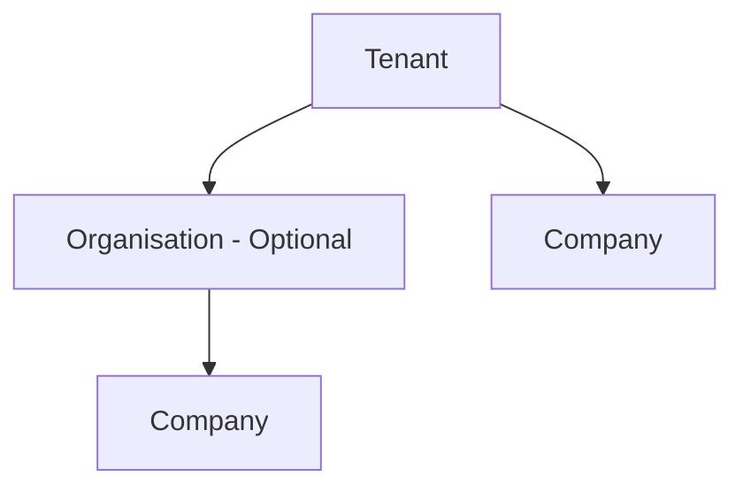

# SKMC ERP SaaS — Product Overview

## 1. Purpose of This Document

This document is the high-level product baseline for SKMC ERP SaaS. It is not a detailed requirements specification, database design, or implementation document. Detailed product requirements and module specifications will follow before domain modelling, database design, and implementation design.

## 2. Product Vision

SKMC ERP SaaS is a multi-tenant ERP product whose current functional focus is Accounts Receivable (AR) and Billing. It is intended for multiple SaaS customers rather than only for internal SKMC use.

The wider product vision includes AR, AP, Accounting, HR, KRA, and other future modules or services. Current development focuses on AR. The product separates reusable company, legal, statutory, and accounting concepts from module-specific configuration so later modules can consume shared information without duplicating masters. Shared ownership does not imply identical use by every module.

The product is modular and MVP-focused. Configuration and transaction processing must preserve historical financial integrity: later changes to masters, defaults, periods, rates, or presentation must not silently change the values used by historical transactions.

## 3. Product Scope at a Glance

| Area | Purpose |
|---|---|
| Core/shared company and legal setup | Maintain Tenant and Organisation context, company identity, locations, GST registrations, bank accounts, and related reusable information. |
| Core/shared financial and statutory references | Maintain fiscal periods, currencies/exchange rates, controlled tax/statutory references, cost centers, Company-created account hierarchies/groups, and stable GL Accounts. Full accounting classifications, posting and reconciliation remain later Accounting work. |
| AR financial configuration | Define LUT use for export/SEZ billing, AR document numbering, billing currency use, tax transaction behavior, and document presentation. |
| AR service and product catalogues | Represent billable services and sellable product/SKU variations according to a company's business nature. |
| AR management reporting setup | Let each Company enable any combination of the current Business Segment, Team, and Location reporting bases. |
| Customer management | Support customer onboarding, maintenance, and contacts used across billing and receivables activities. |
| Sales order and commercial setup | Capture commercial terms and drive one-time or recurring billing arrangements. |
| Billing and approval | Create and approve AR financial documents: PI, TI, DN, and CN. |
| Invoice delivery | Deliver financial documents using company defaults with document-level behaviour or overrides. |
| Receipts and allocation | Register payments and allocate them against receivables. |
| Receivables management | Track outstanding receivables and support reminders, reporting, and follow-up. |
| Reporting and audit | Provide management and financial visibility while preserving historical integrity and traceability. |
| Authentication and authorization | Integrate external authentication and apply ERP-owned business permissions where required. |

## 4. SaaS Hierarchy

A **Tenant** is the SaaS customer/account and the primary data-isolation boundary. A Tenant may contain multiple Companies and may optionally use Organisations to group them.

An **Organisation** is an optional grouping within a Tenant and is not necessarily a legal entity. Organisation-level configuration inheritance is not part of the current MVP.

A **Company** is the legal and billing entity. Company-specific configuration drives invoicing and AR operations.



## 5. Core and AR Configuration Boundary

| Configuration Area | Product Direction |
|---|---|
| Core / Shared | Tenant, Organisation, company identity and locations, financial years/periods, currencies/exchange rates, Company Bank Accounts, controlled tax references, Cost Centers, Company-created Account Hierarchies/Groups, and stable Company GL Accounts. Companies configure the HSN/SAC codes relevant to their own business. |
| AR-owned configuration and behavior | LUT configuration/use for export/SEZ billing; Service and Product/SKU Catalogues for current AR scope; PI/TI/CN/DN configuration, numbering, branding, delivery, customer payment terms, reminders/collections, billing, receivables, receipts, knock-off, and AR-specific approval workflows and audit events. |
| Shared frameworks with module-specific use | A common approval framework may be shared while AR invoice and AP bill/payment workflows differ. Common audit infrastructure may be shared while each module owns its audit events. |
| Transaction usage | AR consumes shared masters and its own configuration while retaining values actually used; it does not create duplicate AR copies of shared masters. AP or Accounting may consume the same masters differently. |

Development follows strong feature/module boundaries. The current AR service may contain clearly isolated Core/Shared modules needed by AR. AR may depend on Core/Shared; shared business concepts must not depend on AR-specific billing, invoices, reminders, or other AR behavior. Low coupling should make later extraction into independent services or repositories easier if the platform evolves in that direction. No immediate service or repository split is prescribed. These are conceptual ownership and dependency requirements, not a physical design.

## 6. Key Configuration Directions

### Business Nature and Catalogues

- A Company may operate in **Services**, **Goods**, or **Both**; this determines whether it configures the Service Catalogue, Product Catalogue, or both.
- Services follow **Service Category → Service Type**, with Service Type representing the billable service. Each Company defines its own Service Categories and Service Types.
- Goods follow **Product Category → Product → SKU**, with SKU representing the sellable variation. Each Company defines its own Product Categories, Products, and SKUs.
- Commercially similar catalogue entries belonging to different Companies remain separate. Similar names do not establish cross-Company equivalence or a basis for semantic consolidation.

### Cost-Centre and Management Reporting

- Cost Centers are shared organizational/accounting dimensions. AR may associate revenue with them; AP may associate expenses or purchases with them. Rent, Stationery, Maintenance, and Salary are expense/account classifications, not Cost Centers. For example, Rent Expense may be reported against the Noida Office Cost Center.
- A Company may enable Business Segment, Team, Location, any combination of those three current reporting bases, or disable Cost Center reporting completely. Company Cost Center settings are authoritative for enablement.
- Business Segments are tied to billable Service Types/SKUs; the same Service Type or SKU does not belong to multiple Business Segments in the current direction.
- Service Types and SKUs use direct optional Business Segment references under the current direction.
- A Cost Center Team is a Company-owned reporting bucket that may group multiple actual Company Teams. An actual Team may belong to zero or one Cost Center Team, and users belong to actual Teams through effective-dated memberships rather than directly to reporting buckets. A user may belong to multiple Companies, while the current business rule intends one active actual-Team membership within the applicable Company scope; exact IAM identity and overlap enforcement remain open.
- A Location Cost Center may group Company Locations; a Company Location cannot belong to multiple active Location Cost Centers. GSTIN is only a helper for preselecting linked locations.
- One GST Registration may have several Company Locations. Where a default is applicable, exactly one active mapped Location is the default for that GSTIN; the default is a preselection and does not replace explicit transaction context.

The current configuration is dynamic across the three supported bases, but it is not a generic user-defined accounting-dimension engine. Department, Project, Region, arbitrary Company-defined dimensions, and broader custom-dimension behavior remain deferred.

Chart of Accounts is a Core/Shared Company accounting capability. Each Company creates/imports its own non-posting Account Groups, stable posting GL Accounts, and effective-dated hierarchy relationships/placements. AR uses one effective Revenue GL Mapping by Supply Type and optional HSN/SAC, statutory-code Tax GL Mappings, one default Receivable GL, and a direct Bank Account-to-GL association. Finalized transactions retain resolved GL Account IDs. Names such as `Sales - Domestic`, `Output CGST`, or `Trade Receivables` are examples only. Account classifications, full posting/reconciliation, historical reclassification, and Inter-Unit clearing remain open Accounting design.

### Fiscal and Financial Periods

- A Company defines a default fiscal pattern, such as a start day and month, from which yearly financial periods can be derived.
- Authorized users may manually change future fiscal setup when necessary.
- Changing the default pattern must not silently rewrite historical financial periods.
- A configurable or optional display code/label is not the source of truth for a financial period.

### Currency and Exchange Rates

- A Company has exactly one Base Currency for accounting/books valuation, ledger values, consolidated receivables, future FX gain/loss accounting, and default financial reporting. The Base Currency is also available for reporting.
- A Company may configure multiple Reporting Currencies for dashboards, MIS, management reports, and analytical views. Changing the reporting view does not change book values or original transaction amounts.
- Billing and Receipt Currencies are separate transaction purposes; they are not interchangeable with Base or Reporting Currency.
- Exchange rates may serve Billing, Reporting, and potentially Receipt purposes.
- Historical transactions retain the exchange rate actually used.
- Exact conversion and rate-selection behavior across these purposes is **TBD**.

### Tax

- Product direction includes HSN, SAC, GST, TDS, and TCS.
- Controlled Tax Types identify broad families such as GST, TDS, TCS, VAT and CESS. They remain separate from HSN/SAC, numeric rates, Tax Treatments, statutory COMPONENT/SECTION codes, and Code Rates.
- Each Company configures the HSN/SAC codes relevant to its business rather than receiving a compulsory copy of the full statutory catalogue. Controlled numeric rates and TDS/TCS section/code/rate references are shared.
- Statutory classification is separate from Company-defined commercial naming: Service Type uses SAC, while SKU uses HSN. Category and Product levels do not determine the final classification.
- One Company HSN/SAC may have multiple valid GST rates through effective eligible-rate mappings. Service Type/SKU stores one current/default selected eligible rate directly; Billing revalidates it for the transaction date.
- Controlled GST/Tax Treatment uses `TAXABLE`, `NIL_RATED`, `EXEMPT`, or `NON_GST`; it is not a numeric Tax Rate Type, and numeric 0% does not establish a treatment. GST components are determined at billing time from the configured HSN/SAC, eligible rate, treatment, seller jurisdiction, Place of Supply, and Supply Type, then code/description, treatment, rate, components and amounts are snapshotted on the final line.
- Product supply types are B2B, B2C, EXPORT (EXPWOP/EXPWP), and DEEMED_EXPORT / SEZ (SEZWOP/SEZWP). All four Export/SEZ variants require the applicable LUT before final billing under the current product rule.
- TDS is primarily handled during Payment/Knock-Off through selection of an applicable section/code and its rate. TCS may require an item-level applicability check during Billing without implying that TCS is always charged.
- Statutory reference/configuration remains separate from transaction decision logic; a generic configurable tax-rule engine is not a confirmed MVP requirement.

### Documents, Delivery, and Access

- Current AR financial document types are Proforma Invoice (PI), Tax Invoice (TI), Debit Note (DN), and Credit Note (CN).
- Financial document numbering and branding/presentation are company configuration concerns; the depth of template customization remains open.
- Email delivery supports company-level enablement/defaults and document-level behaviour or override.
- Authentication is expected to integrate with an external identity system such as Keycloak. Authentication credentials remain outside the ERP domain, while ERP owns business authorization and permission usage where required.
- Company/user access concepts are shared. Approval and audit frameworks may be shared; actual AR approval workflows and AR audit events remain AR-owned.

These directions remain at overview level and do not define field-level requirements.

## 7. Commercial-to-Cash Flow


Recurring billing originates from Sales Order or contract configuration: **Sales Order → recurring billing schedule/terms → draft billing/invoice generation → approval → delivery**. Detailed scheduling rules remain to be specified.

## 8. Main Functional Areas

### Company Configuration

- Maintains reusable company/legal setup, locations, GST registrations, bank accounts, fiscal and currency context, and shared statutory references. AR configures and uses LUTs for applicable export/SEZ billing.
- Defines business nature and enables the applicable service and/or product catalogue.
- Treats Company `ACTIVE` as derived operational readiness for the supported MVP AR/Billing flow: legal/statutory identity, Registered Office, current fiscal/GST/catalogue configuration, default term/billing bank, all four document-numbering types, and Company-wide presentation are complete.
- Keeps Accounting/CoA, Cost Centers, email, reminders, Team membership, LUT, and FX outside the universal activation gate; transaction-specific Billing still validates LUT and FX when their contexts apply.
- Distinguishes shared fiscal, currency, exchange-rate reference, Cost Center, and tax-reference capabilities from AR numbering, catalogue, reporting use, tax transaction behavior, and document presentation.
- Separates shared company information from AR-specific settings.

### Customer Management

- Supports Company-specific Customer onboarding, material amendments, and maintenance of existing customers.
- Keeps common/Party-like legal identity, GST, Location, Contact, and endpoint concepts physically Customer-owned for MVP while separating Customer/AR-specific terms and communication purposes. No shared Party/Vendor/Contact master is introduced yet.
- Supports an optional external Customer Organisation without confusing it with the Tenant's grouping of seller Companies.
- Treats Customer Locations as reusable physical sites; Bill-To and Ship-To are selected per Sales Order/invoice and finalized documents snapshot the chosen addresses.
- Separates Contact identity, Contact Details, Contact roles, and explicit Contact-purpose assignments. A Primary role does not automatically make a Contact Detail an invoice recipient.
- Allows one optional Customer default Payment Term/credit period with fallback to the Company default; Credit Limit is deferred and Receivable GL remains Company-level.
- Uses a controlled Customer onboarding/amendment flow backed by one authoritative JSONB Draft, immutable exact request-payload snapshots, and append-only actions. Approved Customer state remains relational; Customer Locations use stable identity plus effective-dated versions. Customer Code is Company-prefix plus Company-scoped non-resetting sequence allocated on successful new-Customer publication. Post-approval Contact/GST-mapping change control and Customer reactivation remain REVIEW/OPEN.

### Sales Order / Commercial Setup

- Captures the commercial setup that precedes billing.
- Holds the schedule or terms that drive recurring billing rather than relying on a generic company-level recurring rule.
- Leads to draft billing/invoice generation for approval and delivery.

### Billing and Financial Documents

- Creates Proforma Invoices, Tax Invoices, Debit Notes, and Credit Notes.
- Uses applicable company configuration, customer information, billable Services/SKUs, currencies, exchange rates, tax rules, and numbering.
- Preserves the transaction values actually used for historical integrity.
- Classifies billing as `CUSTOMER_SALE` or `INTER_UNIT`. Inter-unit documents capture source and destination GST Registration/Location within the same Company, do not represent the destination as a Customer, and do not create a normal Customer receivable.
- Allows Ship-To to be either a Customer Location or the seller Company's own Location and snapshots the selected address on the final document.
- Uses this GSTR-1 hard-lock rule: **Invoice included in a FILED GSTR-1 return / filing batch.** A draft filing-batch membership does not permanently lock the invoice. Successful e-invoice/IRN generation is an independent edit lock.
- Automatically resolves the revenue account from Supply Type plus optional HSN/SAC specificity and resolves tax-component accounts from Company mappings. Missing or ambiguous mappings block finalization; invoice users do not normally choose GL accounts.

### Approval

- Provides an AR approval stage between draft billing and delivery; any common approval framework does not impose the same workflow on AP.
- Applies to the commercial-to-cash flow without defining an advanced workflow builder at this stage.

### Invoice Delivery

- Delivers approved financial documents by email.
- Uses company-level enablement/defaults with document-level behaviour or override.
- Keeps detailed delivery implementation outside this overview.

### Payment Register and Allocation

- Records customer payments received in supported receipt currencies.
- Supports knock-off/allocation of payments against receivables.
- Leaves detailed write-off and Payment Register rules for a later specification.

### Outstanding Receivables

- Represents receivables remaining after payment allocation.
- Supports payment follow-up, reminders, and reporting.

### AR Reminder Engine

- Supports reminder activity for outstanding receivables.
- Uses customer contacts relevant to finance/payment follow-up and escalation.
- Leaves detailed reminder rules and automation behaviour for later specifications.

### Reporting and Audit

- Supports financial and management reporting, including enabled cost-centre dimensions.
- Maintains historical financial integrity when configuration or master data changes.
- Preserves traceability for financial documents, exchange rates, payments, and allocations at overview level.
- Shared audit infrastructure may be reused, while AR owns the events arising from its own behavior.
- Leaves the final report/export catalogue to later documentation.

## 9. Core Business Concepts

| Concept | High-Level Meaning |
|---|---|
| Tenant | SaaS customer/account and primary data-isolation boundary. |
| Organisation | Optional, non-legal business grouping within a Tenant. |
| Company | Legal and billing entity whose configuration drives AR operations. |
| Company Location | A Company place of operation that may be linked to registrations and location reporting. |
| GST Registration | A Company's GST registration used in its legal and billing setup. |
| Fiscal Period | A financial period derived from, or managed alongside, the Company's fiscal pattern. |
| Base Currency | The Company's single accounting/books valuation currency and default financial reporting basis. |
| Reporting Currency | A configured currency for report and dashboard views that does not alter book or original transaction values. |
| Cost Center | Shared organizational/accounting dimension for allocation and reporting, distinct from an expense account. |
| GL Account | Stable Company posting-account identity. Name/code may change without changing the ID; hierarchy, group, classification, and balance are not embedded in it. |
| Account Group | Company-created non-posting folder/reporting node inside one hierarchy. |
| Account Hierarchy | Company view arranging Groups and GL Accounts through effective-dated relationships; ACCOUNTING is current and MANAGEMENT is a future purpose. |
| Revenue GL Mapping | Effective Company rule resolving a stable GL Account from Supply Type and optional HSN/SAC specificity. |
| Tax GL Account Mapping | Effective Company rule resolving a GL Account from a controlled GST COMPONENT or TDS/TCS SECTION code. |
| Company Accounting Settings | Current one-default Receivable GL selection for the Company. |
| Service Category | Company-defined grouping above billable Service Types. |
| Service Type | Company-defined billable service associated with its applicable SAC. |
| Product Category | Company-defined grouping above Products. |
| Product | Company-defined goods definition containing sellable variations. |
| SKU | Company-defined sellable variation associated with its applicable HSN. |
| Business Segment | Reporting dimension tied to billable Service Types/SKUs. |
| Cost Center Team | Company-owned Team-based reporting bucket that may group multiple actual Teams. |
| Team | Company-owned operational user grouping that may belong to zero or one Cost Center Team and owns effective-dated user memberships. |
| Location Cost Center | Reporting grouping of one or more Company Locations. |
| Sales Order | Commercial setup that can drive billing and recurring schedules/terms. |
| PI | Proforma Invoice. |
| TI | Tax Invoice. |
| DN | Debit Note. |
| CN | Credit Note. |
| Payment | Customer receipt recorded for receivables processing. |
| Allocation | Application or knock-off of a Payment against receivables. |

## 10. Important Product Principles

- Tenant is the primary boundary for multi-tenant data isolation.
- Company is the legal and billing entity.
- Shared company data should not be re-entered separately for every module.
- AR may depend on Core/Shared capabilities; Core/Shared concepts must not depend on AR-specific behavior.
- Company Configuration stores reusable setup and defaults; transaction modules consume the relevant settings.
- Historical financial transactions must preserve the values actually used.
- Master and configuration changes must not silently rewrite historical documents or periods.
- Mutable master/configuration data preserves historical changes through effective dating or versioning where appropriate; finalized financial/legal transactions preserve the actual values used.
- Tax Type, Company HSN/SAC, numeric Tax Rate, eligible-rate relationship, Tax Treatment, Tax Statutory Code, and Statutory Code Rate remain separate from contextual transaction tax decisions.
- GSTR-1 filing batches are auditable by GST Registration + Return Period + Return Type; only `FILED` membership creates the hard invoice-edit lock.
- Recurring billing is driven by Sales Order or contract configuration.
- Authentication credentials remain outside the ERP domain; ERP applies business authorization and permissions where required.
- Business rules should be defined before database design.
- The MVP should remain extensible without prematurely building a generic framework.

## 11. MVP Boundaries

| Area | Current Direction |
|---|---|
| Included in current design | Core company/legal setup; locations; GST registrations; AR LUT use; fiscal configuration; AR numbering/catalogues; reporting dimensions; currencies/exchange rates; bank accounts; tax; Company Account Hierarchies/Groups and stable GL Accounts; effective Revenue and Tax GL mappings; default Receivable GL; direct Bank GL association; document presentation; customers; sales orders; billing; approval; delivery; payments/allocation; receivables; reminders; reporting; audit; authentication/authorization. |
| Deferred | Department, Project, Region, arbitrary Company-defined or otherwise broader custom cost-centre dimensions; percentage-based allocation across cost centres; Organisation-level configuration inheritance; a full template-builder system; and an advanced approval workflow builder. |
| Still to be detailed | Publication and correction authority for controlled Tax Types, Tax Rates, Tax Treatments and statutory codes/rates; accounting classifications; CoA import/export rules; historical reclassification entries; detailed tax calculation conditions; Customer post-approval Contact/GST-mapping change control; Customer delivery/reminder precedence and Contact Detail verification; Customer Code configuration validation/readiness details; inactive Customer reactivation; recurring billing scheduler rules; Credit Note rules; Payment Register/write-off rules; reminder automation; template customization depth; and the final reporting/export catalogue. |

Deferred or still-to-be-detailed items are not considered permanently out of scope.

## 12. Known Open Design Areas

- Broader custom Cost Center dimensions and percentage-based allocation beyond the current Business Segment, Team, and Location bases.
- Organisation-level configuration inheritance beyond the MVP.
- Detailed recurring billing schedule and generation rules.
- Detailed Credit Note eligibility and business behaviour.
- Detailed Payment Register, allocation, and write-off rules.
- Detailed AR reminder rules and automation behaviour.
- Final reporting and export catalogue.
- Depth of financial document template customization.
- Detailed approval workflow behaviour beyond the current approval stage.
- Publication and correction process for controlled Tax Types, Tax Rates, Tax Treatments, statutory COMPONENT/SECTION codes/rates, and Company-configured HSN/SAC.
- Full Accounting posting journals, reconciliation, Inter-Unit clearing, and any future starter Chart-of-Accounts template engine.
- Exact exchange-rate conversion and rate-selection behavior between billing, receipt, base, and reporting purposes.
- Team master and membership ownership beyond current AR reporting use.
- Detailed tax conditions, including TDS amount override and TCS thresholds/exemptions/calculation; Customer Class A/B/C and post-approval Contact/GST-mapping change control, shared legal-identifier/geography/document-type alignment, delivery/reminder precedence, Contact Detail verification, Customer Code validation/readiness details, and inactive Customer reactivation; and the potential use of exchange rates for Receipt purposes.

## 13. Documentation Roadmap

```text
PRODUCT_OVERVIEW.md
        ↓
PRODUCT_REQUIREMENTS.md
        ↓
Feature / Module Specifications
        ↓
DOMAIN_MODEL.md
        ↓
DATABASE_DESIGN.md
        ↓
API / Implementation Design
```

Database design follows only after the relevant business requirements and domain rules are sufficiently clear. Open design areas remain open until addressed in the appropriate documentation layer.
