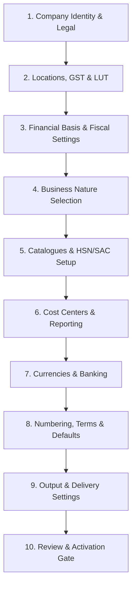

# Company Configuration Workflows and Setup Journey

## Status and purpose

**Document status:** `PROPOSED FOR FREEZE`; business setup sequence, wizard journey, and activation gates.

This document defines the setup sequence for configuring a Company and evaluating operational readiness.

## 1. Setup Sequence Overview

## 2. Four-Screen Company Wizard Journey

The activation minimum is **approved for the MVP**. Save/resume is available throughout; a draft does not have to satisfy activation constraints. `ACTIVE` means operationally ready for the supported MVP AR/Billing workflow, using one derived readiness evaluator rather than a persisted checklist flag.

| Step | Purpose | Required inputs / validations | Gate outcome |
|---|---|---|---|
| 1. Identity | Legal/display names, system-generated `COM` code, country, Entity Type, PAN and rule-applicable identifiers, contacts, optional Organisation/logo | Valid IANA time zone, PAN, REQUIRED Entity Type identifier rules satisfied; Tenant scope verified | Legal name, country, Entity Type, Base Time Zone, Base Currency, Business Nature, and PAN block activation |
| 2. Operating identity | Registered Office and additional Locations; GST Registration and Location association | Exactly one active Registered Office; active mapped GST Registration and Location association | Registered Office plus at least one active GST Registration and active Location mapping block activation |
| 3. Financial basis | Base Time Zone, Base Currency, fiscal start pattern, first Financial Year | Valid time zone; explicit active Base Currency; valid fiscal settings with current `OPEN` period | Base Time Zone/Currency, Fiscal Settings, and current `OPEN` FY block activation |
| 4. Review & activate | Review Business Nature catalogue, default term/bank, PI/TI/CN/DN numbering, document presentation | Evaluates derived readiness against authoritative configuration; locks Company row during transition | Ready `DRAFT` becomes `ACTIVE`; failed activation does not mutate; `INACTIVE` is terminal |

`DRAFT`, `ACTIVE`, and `INACTIVE` are the approved Company lifecycle values; incomplete setup persists only while Draft.

## 3. Conditional Preparation Cards (Post-Wizard Setup)

Cards may be completed independently when dependencies exist:

1. **What You Bill**: Service and/or Goods catalogue; Service Types, SKUs, HSN/SAC codes, Base GST Nature, selected eligible rates, `tcs_check_required` flags.
2. **Reporting**: Business Segment, Cost Center Team buckets, actual Teams, Team memberships, Location Cost Centers.
3. **Currencies & Banking**: Base Currency, Bank Accounts, `company_ar_currencies`, Reporting Currencies, `exchange_rates`, `fx_policies`.
4. **Accounting Setup**: Company Accounting hierarchy, GL Accounts, Revenue mappings, Tax mappings, default Receivable GL, Bank GL FK association.
5. **Export / SEZ**: LUT reference, seller GSTIN, FY validity.
6. **Numbering**: PI, TI, CN, DN series for current FY.
7. **Terms & Output**: Payment Terms, billing bank default, document presentation/branding, templates.
8. **Delivery & Reminders**: Email provider configuration, automatic sending ON/OFF, reminder policies & schedule rules.
9. **Approvals & Access**: IAM user memberships, approver assignments.

## 4. Activation vs Billing Readiness Gates

| Requirement | Company activation | AR billing readiness | Specific transaction check |
|---|---|---|---|
| Tenant / Company membership | Required | Required | Re-evaluate per request |
| Legal name, Entity Type, Base Currency, Time Zone | Required | Required | Snapshot on final document |
| Registered Office | Exactly one active | Required | Seller Location validation |
| Business Nature | Required | Select catalogue path | Match item type |
| PAN / Identifier Rules | PAN required | Revalidate seller identity | Missing required info blocks finalization |
| GST Registrations | At least 1 usable active registration & location mapping | Applicable establishment context | Wrong-state fallback prohibited |
| Financial Year & Periods | Fiscal settings + current `OPEN` FY | Intended date covered | Resolve from document date |
| Catalogue | Billing-ready leaf items | Revalidate item state | Validate Base GST Nature & eligible rate |
| LUT | Not required for activation | Required for `EXPWOP` / `SEZWOP` | Missing valid LUT blocks without-payment routes |
| Numbering | Active series per type | Eligible series for context | Auto-select or user choice |
| Bank Account | At least 1 usable active account & billing default | Account for billing currency | Bank-to-GL association checked |
