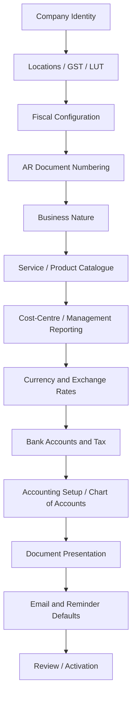

# Company Configuration Requirements

## 1. Purpose

This document defines the business and functional requirements for configuring a Company in SKMC ERP SaaS. It refines the baseline in `docs/PRODUCT_OVERVIEW.md` so that a Company Configuration domain model can be prepared next. It does not define a physical data model, APIs, implementation, or detailed requirements for downstream transaction modules.

Documentation sequence:

`PRODUCT_OVERVIEW.md` → Company Configuration Requirements → Company Configuration Domain Model → Database Design → API / Implementation Design

## 2. Scope

**Requirement — MVP**

Company Configuration establishes reusable Company masters, defaults, and policies needed before normal AR operations.

| In scope | Outside this document |
|---|---|
| Tenant and optional Organisation context; Company identity and lifecycle | Physical data structures, persistence, APIs, and implementation |
| Locations, GST registrations, LUTs, and fiscal configuration | Full statutory tax interpretation or tax-calculation engine |
| AR document numbering and business nature | Detailed Billing, Credit Note, Payment, or Reminder Engine rules |
| Service and Product/SKU catalogue setup | Customer-specific pricing and commercial terms |
| Management-reporting dimensions | Generic or arbitrary cost-centre framework |
| Currencies, FX configuration, and Company Bank Accounts | Sales-Order recurrence schedules and scheduler behaviour |
| Company-created Account Hierarchies/Groups, stable GL Accounts, effective Revenue/Tax mappings, default Receivable GL, and Bank-to-GL association | Full General Ledger posting, classifications, reconciliation, accounting correction/reclassification, and inter-unit clearing design |
| Reusable tax, document-presentation, email, and reminder defaults | Full template builder or advanced approval workflow builder |
| Review, activation, historical integrity, and audit expectations | Organisation-level configuration inheritance |

Tenant remains the data-isolation boundary; Company Configuration is Company-wise. An optional Organisation groups Companies but does not supply inherited configuration in the MVP.

## 3. Core vs AR-Specific Configuration Boundary

**Requirement — SYSTEM RULE**

Company Configuration must not be treated as one AR-only settings area. Shared facts about the Company must be reusable by future modules, while AR-only policies stay within the AR configuration boundary.

| Area | Conceptual ownership | Rationale |
|---|---|---|
| Tenant and optional Organisation relationship | Core / Shared | Establishes SaaS isolation and business grouping. |
| Company identity, legal details, lifecycle, and locations | Core / Shared | Describes the legal/business entity across modules. |
| GST registrations and LUTs | Core / Shared | Reusable legal and statutory Company information. |
| Fiscal pattern and financial periods | Core / Shared | Shared financial time context. |
| Business nature | Core / Shared | Describes whether the Company provides Services, Goods, or Both. |
| AR document numbering | AR-Specific | Controls PI, TI, DN, and CN numbering. |
| Billing, receipt, and reporting currency enablement | AR-Specific usage | Enables currencies for AR transaction purposes. |
| AR FX purposes and policies | AR-Specific | Controls Billing, Reporting, and potentially Receipt FX use. |
| Invoice bank-account selection behaviour | AR-Specific usage | Uses configured Company Bank Accounts during billing. |
| Billing tax configuration | AR-Specific usage | Supplies reusable inputs to Billing without defining the full tax engine. |
| Financial-document presentation and email delivery | AR-Specific | Controls AR document output and delivery. |
| AR reminder defaults | AR-Specific | Supplies defaults to the separate Reminder Engine. |
| Service catalogue platform suggestions vs Company adoption | **Boundary TBD** | Business behaviour is confirmed; exact ownership awaits domain modelling. |
| Company Bank Accounts | Core / Shared | Owns reusable Company Bank Account identity; invoice selection remains AR-specific usage. |
| Tax families, HSN/SAC, rates, treatments and statutory codes | **Confirmed boundary** | Controlled Tax Types identify GST/TDS/TCS/VAT/CESS families; Company HSN/SAC, numeric rates, eligible mappings, Tax Treatments, COMPONENT codes, SECTION codes, and code rates remain distinct. |
| Company CoA and shared accounting structure | Core / Shared accounting configuration | Owns stable Company GL identities, hierarchy/Group structure, default Receivable GL configuration, direct Bank GL association, and shared accounting/statutory identities. |
| AR Revenue and Tax GL mapping/resolution | AR accounting configuration | Owns effective Revenue and Tax GL mappings, invoice-context Revenue/Tax resolution, and preservation of resolved GL references in finalized AR transactions. |
| Teams and management-reporting setup | **Boundary TBD** | Team references may be shared, while current reporting use is AR-oriented. |

Changing the conceptual boundary later must not expose one Tenant's private data to another Tenant.

## 4. Company Configuration Journey

**Requirement — MVP**

The setup journey must cover the following conceptual sequence. Presentation may group steps, but it must not omit applicable configuration.



Company Configuration supplies reusable setup to the downstream flow: Customer → Sales Order → Billing → Approval → Invoice Delivery → Payment → Receivables → Reminders → Reporting.

## 5. Company Identity

**Requirement — CONFIGURABLE**

Company administrators can maintain the identity and contact information of the legal/billing entity.

| Information | Requirement | Classification |
|---|---|---|
| Legal Company Name | Identifies the legal entity. | MVP |
| Display / Short Name | Provides a shorter business-facing name. | CONFIGURABLE |
| Company Code | System-generated global operational reference in `COM000001` form; immutable in normal operation and not the database primary key. | SYSTEM |
| Entity Type | Selects the Company's primary legal form from jurisdiction-scoped, platform-managed reference data; it is not Company-entered free text. | CONFIGURABLE |
| Company Legal Identifiers | The system shows jurisdiction- and Entity-Type-applicable identifier inputs such as PAN, CIN, or LLPIN; values are stored as Company identifier records rather than permanent identifier-specific Company columns. | CONDITIONAL |
| MSME applicability/details | Captured where applicable. | CONDITIONAL |
| Country | Establishes Company country context. | MVP |
| Base Time Zone | Supplies Company-local time for scheduled behaviour. | MVP |
| Company Email, Phone, Website | Maintains Company contact channels; exact activation requirements remain TBD. | CONFIGURABLE |
| Company Logo | Reusable Company identity asset. | CONFIGURABLE |
| Company Status | Supports `DRAFT`, `ACTIVE`, and `INACTIVE`; incomplete setup may persist while Draft. | MVP |

**Requirement — SYSTEM RULE**

- Company is the legal, billing, tax, and accounting entity and retains direct authoritative ownership by exactly one Tenant.
- Organisation is an optional non-legal grouping layer within that Tenant and provides no current configuration inheritance.
- Company Code is generated from a global concurrency-safe sequence, is globally unique, and is not entered manually during normal onboarding. Gaps are acceptable and codes are never intentionally reused.
- A Draft Company requires only Tenant ownership, legal name, generated Company Code, and explicit Draft status at initial persistence. Country, Entity Type, Base Time Zone, Base Currency, and Business Nature may remain incomplete until activation.
- Country selection uses the global platform-managed Country master and saves its uppercase two-letter code. Reference data is provisioned separately; the existing Company Country FK is not added until catalogue coverage and stored values are audited.
- Activation business logic, rather than one large table CHECK, must require country, a jurisdiction-compatible Entity Type, a valid IANA time zone, Base Currency, Business Nature, Registered Office, and other applicable configuration.
- Company saves the selected `entity_type_id` from the controlled options applicable to its country/jurisdiction. Normal Company users cannot create arbitrary Entity Types through typed or search text.
- Entity Type selection determines which controlled legal Identifier Types are shown and whether each is REQUIRED or OPTIONAL. No rule means the identifier is normally hidden/not applicable for that Entity Type.
- The system and UI consume the same platform-managed applicability rules. Normal Company users enter identifier values but cannot create Identifier Types or change applicability rules.
- The complete statutory applicability matrix and identifier-specific format/normalization rules remain OPEN; illustrative PAN/CIN/LLPIN examples are not the full authoritative India matrix.
- Platform reference-data administration may add supported foreign-jurisdiction legal forms later without changing the Company schema.
- Company legal name is the current Company-level projection. Dedicated effective-dated legal-name history preserves each prior value for the stable Company identity; current-row timestamps and generic Audit are not substitutes for this version history.
- Authorized Company maintenance may change the current legal name without replacing the stable Company identity. Normal MVP changes take effect immediately, close the prior inclusive date range on the preceding day, and create a new current version atomically with the current projection. A second transition on the same effective date is rejected rather than overwriting history. Future-dated scheduling is outside MVP.
- Making a Company inactive must not remove or hide its historical transactions.
- The current controlled inactivation transition is `ACTIVE` to `INACTIVE`. Inactive is terminal for the current MVP: there is no reactivation or generic status-edit operation, and the inactive Company profile is read-only through ordinary maintenance.

**Acceptance Criteria**

- An administrator can capture the applicable identity information and Company-local time zone.
- Entity Type is selected from canonical jurisdiction-compatible options, and only its stable reference is saved.
- Company Code is generated automatically, has the `COM` plus at-least-six-digits format, and remains stable through normal Company operations.
- Company can persist incomplete configuration while Draft and move through Active/Inactive lifecycle without loss of historical access.
- Private Company data remains within its Tenant boundary.

Company Identity follows this flow:

```text
Country
→ Entity Type
→ resolve applicable legal identifiers
→ show only applicable inputs
→ require REQUIRED values and allow OPTIONAL values
→ store the Company's identifier values in company_identifiers
```

Entity Type describes what legal form the Company is. Identifier Type describes what kind of legal registration/identity number is being collected. Company Identifier is the actual value belonging to that Company. GSTIN remains part of GST Registration architecture rather than this generic Company legal-identifier flow.

## 6. Company Locations

**Requirement — CONFIGURABLE**

A Company can maintain multiple stable physical/business Locations, such as a Noida Registered Office, Mumbai Branch, or Bangalore Warehouse. A Location stores its current usable address and configuration and belongs directly to the Company; Organisation grouping is unrelated to Location configuration.

Each Location has two distinct business-facing identifiers. `location_code` is the immutable Company-scoped stable reference used for Excel re-import, integrations, and rename-safe identification. `location_name` is the mutable human-friendly display and search name; duplicate Location Names are permitted. The internal UUID remains the relational identity and is not replaced by Location Code.

One Company Location represents one physical/business place. The same Location may serve more than one applicable fixed purpose. For example:

```text
Noida Office
├── Registered Office
├── Corporate Office
└── Billing Office
```

This is one Location with several purposes, not three duplicate Location records. The current model uses the defined fixed purposes and does not introduce a generic Location-purpose framework or mapping table.

**Requirement — SYSTEM RULE**

- At most one active Registered Office exists per Company at all times.
- Location Code is unique within its Company, is immutable after creation, and is retained after inactivation. A retired code is not reassigned to another Location.
- User-supplied Location Codes are trimmed and uppercased and must contain 1-50 uppercase letters, digits, underscores, or hyphens, beginning with a letter or digit. When omitted at creation, the backend allocates the next concurrency-safe Company sequence value using `LOC-0001`, `LOC-0002`, and so on. Codes are never derived from Location Name.
- Exactly one active Registered Office is required when Company setup is completed/usable; an incomplete draft may temporarily have none.
- One Company Location may carry more than one applicable fixed purpose.
- Non-Registered-Office purposes may repeat across different Locations where applicable; they are not implicitly unique per Company.
- A billing or operational address may differ from the Registered Office.
- A Company Location may exist without a GST registration.
- First-level State, Union Territory, Province, Region, or equivalent choices come from the global Country Subdivision master. City remains address text; there is no City, District, postal-code, or generic address-hierarchy master.
- Every Location references one active Country when it is created. A first-level Country Subdivision is optional; when supplied, it must be active and belong to the selected Country. PostgreSQL protects that compatibility through the approved composite Country/Subdivision relationship.
- Every saved Location has at least one fixed purpose or a non-blank `other_purpose`.
- A Location belongs to zero or one GST Registration through its nullable direct association.
- A GST-linked Location's State/UT jurisdiction must be compatible with the GST Registration, and this rule must be protected beyond frontend filtering.
- At most one active Location mapped to a GST Registration is marked as that GSTIN's default. Where the product flow requires a default, setup validation ensures one exists. The default is only a preselection aid; transactions may still select another eligible Location explicitly.
- A Location may optionally belong to one Location Cost Center. The Location and Cost Center must belong to the same Company, and a Location does not automatically become a Cost Center.
- A historically used location is deactivated rather than deleted.
- Location address and jurisdiction history is effective-dated for the same stable Location. The version history is deliberately narrow: it does not imply historical GST Registration, Cost Center, purpose, name, default, or status mapping.
- Creating a Location creates its first address version from the current business date. A real address/jurisdiction change closes the current version on the preceding date and creates one immediately effective open version; no-op and non-address changes do not create versions. Future-dated scheduling and backdated correction workflows are outside the MVP.
- Location lifecycle is terminal `ACTIVE` -> `INACTIVE`. An inactive Location cannot be reactivated or mutated, including address, GST Registration, or Location Cost Center changes; a later operational need creates a new Location.
- Changing a current Location or address must not rewrite historical financial documents. Finalized documents retain their own transaction-time address snapshots rather than being reconstructed from current or versioned Location masters.
- Company Location represents a legal/business location, not a logged-in user's physical work location.

**Acceptance Criteria**

- A Company can maintain more than one location.
- A Location retains the same Company-scoped Location Code across name, address, purpose, and lifecycle changes.
- Import can match a Location by its code without exposing or replacing its UUID.
- One physical Location can be assigned several applicable fixed purposes without duplicating its address into separate Location records.
- More than one Location can carry the same non-Registered-Office purpose where applicable.
- The system prevents a Company from having zero or more than one active Registered Office once the applicable setup is active.
- A location can be saved without a GST registration.
- A location can omit Subdivision where the address does not require one, but any supplied Subdivision must belong to the selected Country.
- Historically referenced locations cannot be hard-deleted through normal configuration.
- Inactive Locations remain historically readable but cannot be reactivated, edited, or reassigned.
- The system prevents more than one active default Location for the same GST Registration.
- A mapped Location's state/jurisdiction must be compatible with its GST Registration.
- The system can resolve the address/jurisdiction effective for a Location on a date without treating Location versions as full configuration history.

## 7. GST Registrations

**Requirement — CONDITIONAL**

A Company can maintain multiple GST registrations when GST registration is applicable.

The Company legal name and GST-registration legal name are distinct current facts. A Company-name change and amendment of each GST Registration may take effect on different dates. The registration-specific legal name therefore must not be treated as redundant or automatically overwritten from the Company master.

**Requirement — SYSTEM RULE**

- Each GST registration belongs to one Indian State/UT represented by the shared Country Subdivision master. The selected active Subdivision must belong to `IN`, have a provisioned two-digit GST State code, and match the first two GSTIN digits.
- GSTIN is stored in trimmed canonical uppercase form, must satisfy the approved 15-character structural format, and is unique across the ERP. Checksum, GST portal verification, and Company-PAN verification are outside the current foundation.
- GST Registration lifecycle is `DRAFT` → `ACTIVE` → `INACTIVE`; new registrations start as `DRAFT`, and normal hard deletion is not used. Activation transitions and readiness validation remain separate work.
- GST Registration Type is a controlled GST-specific platform reference separate from the generic Tax Type/family master. It may be omitted while a registration is `DRAFT`; exact supported reference values and provisioning remain open and are not seeded by the schema migration.
- GST Registration creation is permitted only for a Company whose current `country_code` is `IN`.
- One GST registration may be associated with multiple Company Locations.
- A Company Location need not have a GST registration.
- A mapped Location and GST Registration must belong to the same Company and use the same Country Subdivision jurisdiction.
- Where applicable, one and only one active mapped Location is the default for that GST Registration.
- The seller GSTIN used by Billing is selected or derived from the billing workflow, never from the logged-in user's physical location.
- The MVP does not support multiple active GST registrations for the same Company in the same state. This is an MVP product constraint, not a general legal claim.
- GSTIN-wise Bank Account routing is not required in the MVP.
- Company profile history and GST Registration history are preserved separately. Finalized invoices retain the seller legal name, GSTIN, address, and registration context actually used at finalization rather than rebuilding them from current masters.

**Excel Import — APPROVED**

- `GST Registrations` is an onboarding/create-or-compare sheet keyed by normalized GSTIN. A normalized GSTIN may appear only once in that sheet.
- Import never edits an existing GST Registration: equivalent data is `UNCHANGED`, while any difference is `CONFLICT` and must be maintained through the normal GST Registration flow.
- Registered Legal Name remains optional for a new imported registration and is independent from Company Legal Name; import does not copy or derive it.
- New imported registrations use the existing service lifecycle and therefore start `DRAFT`; Status is not importable.
- `GST Location Mappings` is a separate normalized sheet keyed by GSTIN plus Company-scoped Location Code. It writes the existing nullable Location-to-GST association and does not introduce a bridge table.
- Mapping is additive-only. An exact existing association is unchanged; an unassigned active Location may be assigned; omission never unmaps; and a Location already assigned to another GSTIN is a conflict rather than a reassignment.
- `DRAFT` and `ACTIVE` GST Registrations may receive new Location assignments. An `INACTIVE` GST Registration cannot receive a new or changed Location assignment, but an association already present when it becomes inactive is not automatically removed.
- Location purpose flags do not determine GST eligibility. Company ownership and matching Subdivision remain mandatory.
- A new Location referenced by another sheet in the same workbook must have an explicitly supplied Location Code. Import never predicts a generated `LOC-xxxx` value or uses Location Name as mapping identity.

**Acceptance Criteria**

- A Company can configure GST registrations for different states/jurisdictions.
- Multiple Company Locations can be associated with one GST registration.
- A GST Registration can have one active default mapped Location without requiring a bridge table.
- The system prevents a second active same-state GST registration for the Company in the MVP.
- A malformed GSTIN, non-Indian/unprovisioned State/UT, or GSTIN/State-code mismatch is rejected even while the registration is `DRAFT`.
- Billing can consume seller-GSTIN context without using the user's physical location.
- A Company legal-name update does not erase earlier Company or GST-registration states and does not rewrite seller identity on finalized invoices.

## 8. LUT

**Requirement — CONDITIONAL**

LUT configuration applies to the current without-payment Export/SEZ routes under the current product rule.

| Information | Requirement |
|---|---|
| LUT ARN / Reference | Identifies the LUT. |
| Fiscal period | Establishes the relevant financial period. |
| Status | Identifies whether the LUT is active for use. |
| Validity/context | Captured where applicable. |

**Requirement — SYSTEM RULE**

- At most one active LUT exists for a GSTIN and fiscal period.
- Historical LUT records are preserved.
- LUT document upload is not required in the MVP.
- If LUT document upload is enabled later, the binary is stored through shared `ObjectStorage`, PostgreSQL retains its `stored_files` metadata, and `company_luts` references that stable file identity through a typed FK. LUT bytes and temporary/signed URLs do not belong in the LUT configuration row.
- EXPWOP and SEZWOP require the applicable valid LUT for the seller GST Registration and fiscal period before final billing.
- EXPWP and SEZWP do not require LUT merely because the transaction is Export or SEZ.
- Missing required LUT blocks finalization. Management/legal policy may relax this product rule later.

**Acceptance Criteria**

- An administrator can configure the applicable LUT reference against a GST registration and fiscal period.
- The system does not allow two active LUTs for the same GSTIN and fiscal period.
- Required LUT absence blocks final billing for EXPWOP and SEZWOP.
- EXPWP and SEZWP are not blocked solely for missing LUT.
- Prior-period LUT history remains available.

## 9. Fiscal / Financial Period Configuration

**Requirement — CONFIGURABLE**

A Company defines one normal recurring fiscal-year pattern using `APR_MAR`, `JAN_DEC`, or `CUSTOM`. `APR_MAR` resolves to 1 April, `JAN_DEC` resolves to 1 January, and `CUSTOM` supplies an explicit recurring start month and day. This pattern is separate from the actual dated Financial Year records created for the Company.

The recurring month/day must exist in every calendar year. February 29 and impossible combinations such as April 31 are rejected when settings are configured; recurring dates are never normalized to another day.

Example: a start of 1 April can derive 1 April 2026 through 31 March 2027, followed by 1 April 2027 through 31 March 2028.

**Requirement — SYSTEM RULE**

- Actual period dates are authoritative.
- Each Financial Year has a required human-readable display code such as `2026`, `2026-27`, or `FY 2026-27`; the actual dates remain the source of truth.
- Normal generated Financial Years start in `DRAFT` and use the lifecycle `DRAFT` → `OPEN` → `CLOSED`. Reopening a closed year is not approved. Lifecycle transition APIs remain separate from initial generation.
- Past, current, and future are derived from `start_date`, `end_date`, and the applicable date; they are not persisted lifecycle statuses.
- Short or transition Financial Years are supported explicitly rather than inferred later from the current normal pattern.
- The system can calculate and propose/create the next expected Financial Year from the recurring pattern, including when a future transaction date lacks an applicable configured FY.
- Creating the next Financial Year does not close or lock the previous Financial Year, prevent transactions in it, or change accounting-period state.
- Only authorized users may adjust future fiscal setup.
- Changing the recurring fiscal pattern affects future proposals only and must not rewrite existing Financial Years or their transaction associations.
- Financial Years for the same Company must not overlap. Gaps are handled as configuration/workflow issues rather than being unconditionally forbidden in storage.
- A transaction date must resolve to exactly one configured Financial Year; otherwise the applicable workflow proposes/creates the expected FY or blocks until setup is completed.
- Financial Year, accounting close, and accounting lock remain separate concepts. Accounting close/lock belongs to future Accounting design.
- Closing a Financial Year does not imply that its invoices or receivables are settled. Invoice, receivable, Receipt/Knock-off, and Financial Year lifecycles remain independent.
- Arbitrary reporting date ranges are reporting inputs rather than special Financial Years.

**Acceptance Criteria**

- An administrator can select `APR_MAR`, `JAN_DEC`, or a valid every-year `CUSTOM` fiscal start day and month.
- The system can derive consecutive annual periods from the pattern.
- The normal pattern need not be re-entered every year.
- An administrator can record an explicit short/transition Financial Year.
- The system prevents overlapping Financial Years for the same Company.
- Creating a future Financial Year leaves the prior Financial Year's close/lock state unchanged.
- An authorized user can make a controlled change to future fiscal setup.
- Historical periods and transaction associations remain unchanged after a pattern change.

## 10. AR Document Numbering

**Requirement — CONFIGURABLE**

The Company can configure numbering/series for Proforma Invoice (PI), Tax Invoice (TI), Debit Note (DN), and Credit Note (CN).

Numbering may vary by Company, fiscal period, seller GST registration, and parallel series where required. Prefix, format, sequence behaviour, and fiscal rollover are configurable; suffix is not required currently.

**Requirement — SYSTEM RULE**

- All four AR document types require numbering.
- A final financial document number is assigned only after approval/finalisation.
- A consumed final number is never reused after cancellation.
- Parallel series retain independent counters, and final allocation must atomically consume the selected series so retries cannot allocate a second number.
- Current eligible-series behavior remains: one eligible series is auto-selected, multiple eligible series require user selection, and no eligible series blocks finalization.
- Eligibility conditions use a controlled condition model rather than executable rules. Exact operator vocabulary, multiple-condition AND/OR behavior and current priority semantics remain OPEN.
- At year-end, the system can propose the next series/prefix/format for authorized confirmation or change.
- Configuration persistence stores Company/FY/document-type series identity, format, independent counter, lifecycle, and controlled condition rows. Runtime allocation remains part of later Billing finalization.
- The exact first-release condition-type vocabulary, operator vocabulary, multi-condition combination, and priority semantics remain OPEN; no condition-write API may guess them.
- Condition selection, operator/combination semantics, matching priority, conflict resolution, and concurrency-safe final-number allocation belong to later Billing/finalization implementation rather than Company Configuration maintenance.

**Acceptance Criteria**

- Authorized users can configure applicable PI, TI, DN, and CN series.
- More than one parallel series can be configured where required.
- Draft documents do not consume final numbers before approval/finalisation.    
- A cancelled final number cannot be reassigned.
- Fiscal rollover can propose new numbering configuration without silently changing historical numbering.

## 10A. Payment Terms

**Requirement — CONFIGURABLE**

A Company can maintain reusable `IMMEDIATE` and `NET_DAYS` Payment Terms, including at most one active default. Immediate terms use zero credit days; Net Days terms use a positive number of credit days.

**Requirement — SYSTEM RULE**

- A selected Payment Term, credit-days value and derived due date are preserved by the owning Sales Order/invoice according to its snapshot rules.
- A Payment Term marked as the Company default must be ACTIVE. Inactivating the current default must clear its default flag or move the default to another ACTIVE term; the product does not require that a default always exist.
- Changing or inactivating current Payment Term configuration must not recalculate previously approved or finalized transactions.
- Historically used terms are retained rather than hard-deleted.
- Installment schedules are outside the current Payment Term configuration.

## 11. Business Nature

**Requirement — CONFIGURABLE**

During Company Configuration, the Company identifies what it sells or provides:

| Selection | Required catalogue setup |
|---|---|
| Services | Service Catalogue |
| Goods | Product Catalogue |
| Both | Service Catalogue and Product Catalogue |

**Acceptance Criteria**

- An administrator can select Services, Goods, or Both.
- The setup journey requires only the catalogue paths applicable to that choice.
- A later change does not rewrite historical document lines or descriptions.

## 12. Service Catalogue

**Requirement — MVP**

Services use the conceptual structure **Service Category → Service Type**. Service Type is the actual billable service.

Possible Service Type information includes Service Name, optional internal code, Service Category, description, optional UOM, Company-configured SAC, Base GST Nature, conditionally selected eligible GST rate, TCS applicability-check requirement, and Active/Inactive status.

**Requirement — CONFIGURABLE**

- A Company can select/adopt services it sells from platform suggestions.
- A Company can create its own custom services.
- A Company can apply its own internal code, description, SAC/configuration, and lifecycle state.

**Requirement — SYSTEM RULE**

- A Tenant or Company's private custom service must not automatically become visible to another Tenant.
- Historically used Service Types are deactivated rather than treated as if they never existed.
- Service Type directly references a Company-configured SAC and a controlled Base GST Nature through `base_tax_treatment_id`. Base GST Nature is an item fact, not the final transaction GST outcome. `TAXABLE` requires an active selected GST rate eligible through the Company SAC-to-rate relationship; `NIL_RATED` requires an eligible 0% rate; `EXEMPT` and `NON_GST` require no selected rate. No separate service-tax assignment history is required for MVP.
- The Service Category and SAC must belong to the same Company as the Service Type.
- `tcs_check_required` requires Billing to make/perform the applicable TCS decision; it does not automatically charge TCS.
- Current catalogue create operations persist complete records as `ACTIVE`; `DRAFT` is not a catalogue lifecycle value. Historically used records are retained through `INACTIVE`.
- A Service Type may reference zero or one same-Company Business Segment through its nullable direct relationship. Assignment and reassignment API behavior remains outside the current catalogue create API.
- A Service Type does not move to another Service Category. Restructuring inactivates the old Service Type and creates the appropriate replacement.
- A Service Category may be inactivated only after all of its Service Types are inactive. Inactivation never cascades, moves, or deletes child Service Types, and neither Service Category nor Service Type is reactivated in the current MVP.

The platform may offer canonical/suggested Service Categories and Service Types. Exact ownership between platform definitions, Company adoption, and Company-specific configuration is **Boundary TBD** for domain modelling.

**Acceptance Criteria**

- A Services or Both Company can configure its billable Service Types by adoption or custom creation.
- Company-specific configuration does not alter the platform suggestion for other Companies.
- Private custom services stay within their Tenant boundary.
- Inactive services remain identifiable in historical transactions.

## 13. Product / SKU Catalogue

**Requirement — MVP**

Goods use the conceptual structure **Product Category → Product → SKU**. SKU is the actual sellable variation.

SKU information may include SKU Code, Product, Company-configured HSN, Base GST Nature, conditionally selected eligible GST rate, UOM, description, TCS applicability-check requirement, and Active/Inactive status.

**Requirement — CONFIGURABLE**

- Platform-level Product Category suggestions may be offered.
- Actual Products and SKUs are generally Company-owned.
- A Goods or Both Company can configure the Products and SKUs it sells.

**Requirement — SYSTEM RULE**

- Customer-specific pricing belongs to Sales Order/commercial setup, not permanent Company Catalogue setup.
- Historical transactions retain the relevant sold-item information even if catalogue data changes or becomes inactive.
- SKU directly references a Company-configured HSN and a controlled Base GST Nature through `base_tax_treatment_id`. Base GST Nature is an item fact, not the final transaction GST outcome. `TAXABLE` requires an active selected GST rate eligible through the Company HSN-to-rate relationship; `NIL_RATED` requires an eligible 0% rate; `EXEMPT` and `NON_GST` require no selected rate. No separate SKU-tax assignment history is required for MVP.
- The Product and HSN must belong to the same Company as the SKU.
- `tcs_check_required` requires Billing to make/perform the applicable TCS decision; it does not automatically levy TCS.
- Current catalogue create operations persist complete records as `ACTIVE`; `DRAFT` is not a catalogue lifecycle value. Historically used records are retained through `INACTIVE`.
- An SKU may reference zero or one same-Company Business Segment through its nullable direct relationship. Assignment and reassignment API behavior remains outside the current catalogue create API.
- Product Category, Product, and SKU hierarchy is terminal/replacement based. An existing Product is never reassigned to a different Product Category, and an existing SKU is never reassigned to a different Product. Classification changes inactivate the old record and create a new record under the correct parent.
- Product Category and Product support controlled terminal inactivation with no reactivation or hard-delete operation. Product Category inactivation is rejected while any active Product references it; Product inactivation is rejected while any active SKU references it. Inactive children remain readable and do not block later parent inactivation.
- Inactive Product Categories, Products, and SKUs remain readable for history but cannot be edited or reassigned. Parent inactivation never moves or cascade-deletes children.

Future Service Type/SKU Excel import terminology must use **Base GST Nature Code**, with allowed catalogue values `TAXABLE`, `NIL_RATED`, `EXEMPT`, and `NON_GST`. Selected GST Rate is conditional under the same validation matrix. `ZERO_RATED` is not an Excel catalogue nature. This wording does not expand the currently implemented Company Configuration import sheets.

**Acceptance Criteria**

- Applicable Companies can maintain Product, SKU, HSN, UOM, description, and lifecycle information.
- Company-owned Products/SKUs are not exposed across Tenant boundaries.
- Company Catalogue setup does not become the source of customer-specific pricing.

## 14. HSN / SAC Classification

**Requirement — CONFIGURABLE**

A Company configures the HSN/SAC codes relevant to its business. The MVP does not require copying a global catalogue of thousands of unrelated codes into each Company. This Company-owned concept is `company_hsn_sac_codes`; it is separate from the controlled `tax_types` family master.

**Requirement — SYSTEM RULE**

- HSN/SAC is an item classification, not a Tax Type, Tax Treatment, or permanent tax-rate assignment.
- A Company-configured HSN/SAC may map to multiple eligible controlled GST rates through effective-dated Company HSN/SAC-to-rate relationships.
- Service Type references a Company-configured SAC; SKU references a Company-configured HSN. Neither stores an uncontrolled percentage as text.
- Service Type/SKU stores its one current/default selected eligible rate directly; Billing revalidates that selection against the dated eligible mapping.
- GST, TDS, and TCS applicability/rules remain conceptually separate from HSN/SAC. TDS/TCS stay section-based and do not use the GST HSN/SAC-rate mapping.
- The same classification may receive different tax treatment by effective date or transaction context.
- Historical approved financial documents preserve the classification and tax treatment actually used.
- When a Company HSN/SAC classification is no longer valid for new use, it is inactivated and a replacement classification is created. Inactive classifications remain readable for history, cannot be edited or reactivated, and are never hard-deleted through Company Configuration.

Platform suggestions may assist entry, but each selected classification used by the catalogue is Company-configured. Detailed transaction applicability and calculation belong to Billing/Tax specifications.

The current `company_hsn_sac_codes` design is India-first. Generalizing it to foreign item-tax classification schemes remains DEFERRED until foreign-seller requirements are approved; current Company setup does not introduce a generic classification engine.

**Acceptance Criteria**

- A Company can configure a relevant HSN/SAC directly, with controlled suggestions assisting entry where available.
- Changing a tax rule does not change the meaning/history of an approved document's stored treatment.
- Configuration does not force one permanent GST, TDS, or TCS rate onto an HSN/SAC.
- Service Type rejects HSN and SKU rejects SAC.

## 15. Cost-Centre / Management Reporting

**Requirement — CONFIGURABLE**

A Company chooses whether Cost Center reporting is enabled. If enabled, a completed usable configuration selects one or more of the three current supported bases: Business Segment, Team, and Location. Different Companies may enable different combinations, or disable Cost Center reporting completely.

The configuration flow is:

1. Enable or disable Cost Center reporting.
2. If enabled, choose Business Segment, Team, Location, or any combination of them.
3. Show only the selected setup sections.

The UI is driven by `company_cost_center_settings`: `business_segment_enabled = true` shows Business Segment setup, `team_enabled = false` hides Team setup, and `location_enabled = true` shows Location Cost Center setup. Existing inactive or previously configured master rows do not enable a basis; the settings row is authoritative. Whether an enabled but incomplete draft may temporarily be saved without a selected basis remains OPEN, but such a draft is not a completed usable configuration.

**Requirement — SYSTEM RULE**

Business Segment, Team, and Location are independent reporting choices. Business Segment is not assumed to be the parent of Team or Location.

The current Cost Center configuration is dynamic across the supported Business Segment, Team and Location bases. It is not a generic user-defined accounting-dimension engine.

The bases remain separate business entities because their behavior differs: Business Segments relate directly to Service Types and SKUs, Cost Center Team reporting buckets group actual Company Teams, actual Teams have effective-dated user membership history, and Location Cost Centers group physical Company Locations. No generic `cost_centers`, `cost_center_types`, polymorphic mapping, arbitrary dimension-value, or JSON-driven dimension model is introduced.

Business Segment, Cost Center Team, actual Team, and Location Cost Center use terminal `ACTIVE` to `INACTIVE` lifecycle for the current MVP. Inactivation does not delete or automatically remap current references; administrators create replacement masters and explicitly remap current records. Inactive masters remain readable but cannot be edited, reassigned, or selected as new assignment targets. Optional Cost Center master codes are stable Company business-reference/import keys and are not edited in place.

### 15.1 Business Segment

**Requirement — MVP**

Business Segment is a management-reporting bucket and is not the same as Service Category or Product Category.

- A Service Type or SKU may directly reference one Business Segment or no Business Segment.
- The same Service Type or SKU cannot belong to multiple current Business Segments.
- The referenced Business Segment must belong to the same Company as the Service Type or SKU.
- Historically used Business Segments are inactivated rather than deleted.

**Acceptance Criteria**

- An administrator can maintain Company-owned Business Segments and directly associate applicable Service Types/SKUs.
- The system prevents a Service Type/SKU from having more than one current Segment and rejects cross-Company references.
- Segment deactivation preserves historical references.

### 15.2 Team

**Requirement — CONFIGURABLE**

If Team reporting is enabled, a Cost Center Team is the reporting bucket. It is not the actual operational Company Team master. One Cost Center Team may group multiple actual Company Teams for reporting.

**Requirement — SYSTEM RULE**

- A Company may have multiple Cost Center Team reporting buckets and multiple actual Teams.
- One Cost Center Team may group multiple actual Teams.
- One actual Team may belong to zero or one Cost Center Team through a nullable direct relationship; it cannot belong to multiple Cost Center Team buckets in the current scope.
- A Cost Center Team and every actual Team assigned to it must belong to the same Company.
- An actual Team may contain multiple users and may span multiple physical Company Locations.
- A user may belong to multiple Companies, but within the applicable Company scope the design intends one active actual-Team membership.
- Team-based reporting is currently a billing/header-level dimension, not an invoice-line-level catalogue dimension.
- Authentication identities may come from an external IAM system such as Keycloak; ERP references business identity/team membership without owning passwords.
- An actual Team is a Company business identity, not an IAM group. It may continue while its membership changes.
- Team membership attaches users/IAM subjects to actual Teams, not directly to Cost Center Team reporting buckets.
- Membership changes preserve history by closing the prior effective-dated membership and creating a new membership row; historical membership is not overwritten.
- The physical user/IAM reference and exact database enforcement of the one-active-membership rule remain OPEN until the repository's Company/user membership identity and scope are frozen.
- Historically used Cost Center Team buckets and actual Teams are inactivated rather than deleted.
- An actual Team may remain unassigned to a Cost Center Team. Mandatory complete Team-bucket coverage is not a current requirement; whether a future activation/readiness rule requires it remains OPEN.

**Team-basis setup flow**

1. Create Cost Center Team reporting buckets.
2. Create or select actual Company Teams.
3. Assign zero or one Cost Center Team to each actual Team; one reporting bucket may receive many Teams.
4. Manage users through effective-dated memberships on the actual Teams.

For example, the `Regulatory Operations` Cost Center Team may group the actual `BIS Team`, `AEO Team`, and `FEMA Team`; users belong to those actual Teams rather than directly to `Regulatory Operations`.

### 15.3 Location Cost Center

**Requirement — CONFIGURABLE**

A Location Cost Center can group multiple Company Locations for reporting.

**Requirement — SYSTEM RULE**

- One Company Location belongs to at most one active Location Cost Center.
- A Location Cost Center may contain many physical Company Locations, and each mapped Location and Cost Center must belong to the same Company.
- A Location Cost Center is not a GST registration.
- During setup, selected GSTINs may be used as a convenience helper to preselect associated Company Locations.
- The user may remove individual preselected locations before saving.
- Final membership is determined by Company Locations, not GSTINs.

**Acceptance Criteria**

- An administrator can group multiple Company Locations into one Location Cost Center.
- The system prevents overlapping active Location Cost Center membership for a location.
- GSTIN selection preselects linked locations without making GSTIN the stored business meaning of the grouping.
- The user can refine the preselected list before saving.
- Historically used Location Cost Centers are inactivated rather than deleted.

### 15.4 Future Reporting Bases

**Requirement — DEFERRED**

The current supported Cost Center bases are Business Segment, Team, and Location. If later requirements introduce Department, Project, Region, or arbitrary Company-defined reporting dimensions, a broader accounting/reporting-dimension model may be reviewed then. Generic arbitrary dimensions, advanced custom parameters, and percentage allocation are not current requirements, and the current schema does not claim to support user-created dimensions.

## 16. Currency Configuration

**Requirement — CONFIGURABLE**

The platform maintains a shared Currency reference. A Company selects currencies for three distinct configuration purposes while retaining one primary Base Currency:

| Currency use | Meaning |
|---|---|
| Base / Accounting | Company's primary accounting currency, stored on the Company. |
| Reporting | Additional currencies allowed for management/MIS presentation. |
| AR Billing / Receipt | Currencies explicitly permitted for Billing, Receipt, or both. |

**Requirement — SYSTEM RULE**

- Reporting Currency and AR Currency are separate controls. A Currency may be Reporting-only, Billing-only, Receipt-only, or enabled independently for multiple purposes.
- The Base Currency is already available as the Company's primary reporting/book currency and is not duplicated as an additional Reporting Currency.
- Reporting conversion changes presentation only; it does not change original transaction or book values.
- AR always uses explicit AR Currency configuration. The Base Currency requires its own AR row when it is allowed for Billing or Receipt; setup may propose that row without creating a separate permission path.
- One active default Billing Currency and one active default Receipt Currency may be configured per Company.
- A default Billing Currency must be Billing-enabled, and a default Receipt Currency must be Receipt-enabled.
- An active AR Currency must enable Billing, Receipt, or both. A Currency no longer used for either operation is made inactive.
- Foreign-currency/EEFC Bank Account behavior remains Bank Account configuration; AR Currency configuration only controls operation permission.
- Exchange-rate facts and selection policies remain in their separate FX configuration.

**Acceptance Criteria**

- An administrator can distinguish base, billing, receipt, and reporting currency use.
- Transaction currency choices are restricted to the Company's applicable configured set.
- Currency purpose is preserved rather than treating every enabled currency as interchangeable.
- Reporting selections include Base Currency without requiring a duplicate additional-Reporting row.
- The system prevents an operation default unless that operation is enabled and prevents multiple active defaults for the same operation.
- Reporting conversion leaves original transaction/book values unchanged.

## 17. Exchange Rate Configuration

**Requirement — CONFIGURABLE**

A Company can configure effective-dated exchange-rate facts only for relevant Currency pairs. Reusable Exchange Rate Types are Corporate and Spot. User Fixed is a conditional, transaction-specific override and is not reusable Exchange Rate master data.

Exchange-rate purpose distinguishes Billing, Reporting, and potentially Receipt. Billing and Reporting may intentionally use different rates or policies.

An FX Policy controls the default Exchange Rate Type for each purpose and whether authorized User-Fixed override is supported. `default_rate_type` means the default **Exchange Rate Type** (`CORPORATE` or `SPOT`), not a default Currency, Billing Currency, or Company Base Currency. Currency selection answers which Currency the transaction uses; FX Rate Type selection answers which rate method/source applies.

**Requirement — SYSTEM RULE**

- Authorized Finance/Admin users may override a rate only where permitted.
- For Billing, the policy default is a preselection rather than a forced Rate Type. Corporate and Spot remain selectable, and changing the selection resolves the applicable rate for that selected type.
- User Fixed appears only when the FX Policy permits override and the permission system authorizes the current user. A required override reason must be supplied before Apply/Finalize.
- FX Policy does not store an override role. IAM/RBAC owns authorization.
- The configuration must not force a monthly-only FX model.
- Updating a current rate never rewrites the rate retained by an approved historical transaction.
- Historical approved transactions retain the transaction Currency, Base Currency, actual Rate Type and rate used, and applicable User-Fixed override context/reason.

Detailed Receipt FX policy, rate-date behavior, stale-rate behavior, and Reporting conversion behavior remain **OPEN**. The selectable Billing behavior below is not automatically imposed on Receipt or Reporting.

### FX Policy administration reference

```text
Currency & FX Configuration

Billing FX Policy
Default Rate Type:          [ Corporate ▼ ]
Allow Manual Override:      [ Yes ]
Override Reason Required:   [ Yes ]

Receipt FX Policy
Default Rate Type:          [ Spot ▼ ]
Allow Manual Override:      [ No ]

Reporting FX Policy
Default Rate Type:          [ Corporate ▼ ]
Allow Manual Override:      [ No ]
```

Default Rate Type refers to the default **Exchange Rate Type** (Corporate or Spot), not to a Currency. The configuration conceptually produces one FX Policy row per purpose: `BILLING`, `RECEIPT`, and `REPORTING`.

### Billing FX Details reference

```text
FX Details

Invoice Currency:       USD
Base Currency:          INR

FX Rate Type:           [ Corporate ▼ ]
                        Corporate
                        Spot
                        User Fixed*

Applicable FX Rate:     83.750000
Base Currency Value:    INR 83,750.00

* User Fixed appears only when allowed by FX Policy
  and authorized for the current user.
```

Corporate being the default does not remove Spot from the selector. Switching Rate Type resolves the applicable rate for the selected type. Default means preselection, not mandatory selection.

When User Fixed is available, the Billing reference becomes:

```text
FX Rate Type:           [ User Fixed ▼ ]
FX Rate:                [ 83.850000 ]
Override Reason *:      [ __________________ ]
```

### Billing FX flow reference

```text
Invoice Currency differs from Base Currency
        ↓
Load BILLING FX Policy
        ↓
Preselect default_rate_type
        ↓
Show FX Rate Type selector
        ↓
Corporate / Spot
        ↓
Resolve selected type from exchange_rates

OR

User Fixed
        ↓
Only if policy + user authorization allow
        ↓
Manual rate
        ↓
Reason if required
        ↓
Finalize
        ↓
Snapshot actual applied rate + type + override context
```

**Acceptance Criteria**

- The Company configures only pairs relevant to its allowed transaction/reporting currencies.
- Billing and Reporting rates can differ for the same currencies and effective context.
- Billing users can select Corporate or Spot even when one is preselected by policy.
- User Fixed remains unavailable unless both policy and user authorization permit it.
- Effective-dated rates can change without rewriting approved transaction values.
- Unauthorized users cannot apply an allowed manual override.

## 18. Company Bank Accounts

**Requirement — CONFIGURABLE**

A Company may maintain multiple Currency-specific Bank Accounts, including INR, foreign-currency, and EEFC accounts. Information may include Account Holder, Bank Name, Account Number, Branch, IFSC, SWIFT, IBAN, Account Currency, Account Type, Billing-default indicator, and Active/Inactive status.

For AR use, the ERP may preselect one configured default Bank Account for the applicable Company and Currency, and an authorized user may choose another eligible configured account.

**Requirement — SYSTEM RULE**

- GSTIN-wise Bank Account routing is not required in the MVP.
- At most one active default Billing Bank Account exists per Company + Currency. Separate INR and USD defaults can therefore coexist.
- A default is a preselection only and does not prevent explicit selection of another eligible account.
- A Bank Account may directly reference a same-Company GL Account. That reference may remain incomplete during setup, but an Accounting-integrated operation requiring a Bank GL must block until an active/applicable same-Company GL is assigned.
- Historical approved documents preserve the bank details actually presented.

Company Bank Accounts are Core/Shared Company-owned masters. AR owns invoice-selection behavior that consumes those shared identities; Core does not depend on Billing behavior.

**Acceptance Criteria**

- A Company can maintain multiple active or inactive configured Bank Accounts.
- Billing can preselect a configured default and permit authorized selection of another configured account.
- The system prevents multiple active Billing-default Bank Accounts for the same Company and Currency.
- The MVP does not require routing an account by GSTIN.
- Later account changes do not alter bank details shown on historical approved documents.

## 19. Tax Configuration

**Requirement — MVP**

Company Configuration establishes reusable inputs required by Billing for HSN, SAC, GST, TDS, and TCS while keeping each tax concept explicit.

**Requirement — CONFIGURABLE**

- Controlled Tax Types identify broad families such as GST, TDS, TCS, VAT and CESS; they do not store HSN/SAC, percentages, statutory components, or sections.
- The Company can maintain applicable Company HSN/SAC codes without receiving a full national catalogue.
- Applicable Company HSN/SAC-to-GST-rate relationships can vary by effective date and restrict catalogue/Billing choices.
- Ordinary reusable item/supply rates are separate from effective statutory SECTION/case rates. GST HSN/SAC eligibility uses ordinary Tax Rates; TDS/TCS section cases use Tax Statutory Code Rates and do not reference an ordinary Tax Rate merely because the percentage matches.
- Controlled catalogue Base GST Nature uses `TAXABLE`, `NIL_RATED`, `EXEMPT`, or `NON_GST`; it is not a numeric Tax Rate Type or the final transaction GST outcome. Numeric `0%` does not imply `NIL_RATED`, and `ZERO_RATED` is transaction context rather than a catalogue Base GST Nature.
- Reusable TDS/TCS reference configuration may identify applicable sections/codes and rates without requiring advanced threshold or cumulative automation in Company Configuration.

**Requirement — SYSTEM RULE**

- Tax Type, Company HSN/SAC, numeric Tax Rate, Company HSN/SAC-to-rate eligibility, Base GST Nature, transaction-level GST outcome, Tax Statutory Code (COMPONENT/SECTION), and Code Rate are distinct concepts.
- A Tax Statutory Code's code and name are required and nonblank. Its optional rate-case code represents the default logical case when absent and must be nonblank when supplied. These values are not automatically trimmed or case-normalized.
- A Tax Statutory Code uses an exact two-character uppercase ASCII country code. This field is format-controlled and is not linked to the Country master in this persistence slice.
- Selecting an item resolves its Company-configured SAC/HSN, Base GST Nature, and conditionally selected eligible rate. Future Billing resolution also considers Supply Type, seller GST context, Place of Supply, transaction date, and LUT context to determine the final GST outcome and components, then snapshots the final line values.
- TDS/TCS SECTION codes and their effective rates resolve through the Tax Statutory Code model, never through the GST HSN/SAC-to-rate mapping.
- Statutory code rates are linked to their parent code identity only. SECTION codes are their primary current use, but persistence does not prohibit a COMPONENT-linked rate or duplicate the parent's kind on a rate row.
- Active effective periods cannot overlap for the same HSN/SAC-rate relationship or for the same statutory code/logical case.
- Approved financial documents preserve the actual tax treatment used.
- Company Configuration supplies reusable inputs; final transaction applicability and calculation belong to Billing/Tax specifications.

The complete tax-calculation engine and its detailed decision rules are **DEFERRED** to later specifications.

## 20. Accounting Setup / Chart of Accounts

**Requirement — MVP**

Each Company creates or imports its own Account Groups, GL Accounts, and hierarchy. The product does not predefine a Chart of Accounts, groups such as Revenue/Liability/Sale of Services, or GL Account names. A GL Account is a stable posting identity; an Account Group is a non-posting folder/reporting node; a hierarchy is one effective-dated way of arranging both.

### A. Account Hierarchies and Groups

UI flow:

```text
Company Configuration
→ Accounting Setup
→ Account Hierarchies
→ Create/select primary ACCOUNTING hierarchy
→ Create Account Groups
→ Arrange Groups with effective dates
```

- A Company has at most one primary `ACCOUNTING` hierarchy under the current rule.
- Group parentage is effective-dated and preserves old placement.
- A root Group has no effective parent.
- Groups are not posting accounts and store no balances.
- The same GL Account may later appear in a separate `MANAGEMENT` hierarchy without being duplicated.
- Cross-Company/cross-hierarchy relationships, parent cycles, and overlapping effective periods are rejected.

No `parent_group_id` is stored permanently on the Group.

For the current MVP, Account Hierarchy and Account Group persistence follows these
approved rules:

- `ACCOUNTING` is the only allowed hierarchy purpose. `MANAGEMENT` remains future
  scope and is not an allowed persisted value yet.
- Hierarchy and Group status is exactly `ACTIVE` or `INACTIVE`, with no status
  default.
- A Company may have at most one hierarchy that is simultaneously `ACCOUNTING`,
  `ACTIVE`, and primary. An inactive historical primary does not block a replacement
  and its `is_primary` value is not rewritten merely because it becomes inactive.
- Hierarchy names are non-blank and case-sensitively unique within Company and
  purpose.
- Group names are non-blank and case-sensitively unique within their hierarchy.
  Optional Group codes are non-blank when supplied and case-sensitively unique
  within their hierarchy; multiple null codes are allowed.
- A Group and its hierarchy must belong to the same Company, enforced by the
  database rather than only by application validation.
- Hierarchies and Groups preserve historical references through inactivation and
  restrictive deletion. Neither table stores effective placement dates; those
  remain owned by the later relationship tables.

#### Effective Account Group relationship behavior

The following business contract is approved for the `ACCOUNTING` hierarchy. Its
physical relationship-table contract and cycle-enforcement mechanism are not yet
frozen.

- An Account Group has zero or one effective parent on a date. Multiple effective
  parents are not allowed.
- A root Group is represented by the absence of an effective parent relationship
  row. The design must not create an artificial child-to-null relationship row.
- Absence of a parent row can also represent temporarily incomplete/draft setup;
  later validation must distinguish intentional roots from incomplete structure.
- Parent and child Groups must belong to the same Company and hierarchy. A Group
  cannot parent itself, and effective parent relationships cannot form a cycle.
- Parentage is effective-dated and retained as history. Reparenting closes the old
  relationship and creates a new one; it does not overwrite the historical row.
- A normal move must not accidentally leave a business-date gap between the old
  and new parentage. Moving a Group to root is a separate explicit action. Exact
  interval-bound representation and the UI interaction remain for later design.
- Siblings are displayed alphabetically by Group name in MVP. Account Groups do
  not gain sort, display-order, or sequence columns. Custom sibling ordering is
  deferred.
- The hierarchy has arbitrary conceptual depth; no business maximum depth is
  approved.
- When discontinuing a Group that has children, the children may be moved,
  effective-dated, to the discontinued Group's current parent, another existing
  Group, a newly created Group, or root. No option silently rewrites history; the
  detailed restructuring UI remains for later design.
- A Group must not be changed to `INACTIVE` while it has a current-effective or
  future-effective GL Account placement, or while it is the parent in a
  current-effective or future-effective child-Group relationship. The user must
  first explicitly relocate or date-end those placements/relationships.
- Historical placement/relationship rows ending before the applicable
  inactivation point remain stored and do not block inactivation. Inactivation
  never moves GL Accounts or child Groups, closes periods, changes parents,
  creates replacement Groups/root placements, or rewrites history automatically.

### B. Stable GL Accounts

GL Account form:

- Account Name — required Company-defined display name
- Account Code — optional and unique within Company when supplied
- Valid From / Valid To
- Status — Active or Inactive

The GL Account does not store Account Type, parent, Group, `is_group`, or calculated balance in the current AR foundation. Rename/code changes preserve its stable ID. Used Accounts are never hard-deleted or converted into Groups.

Account Group and GL Account identities remain distinct throughout their
lifecycle. If an existing posting GL `C` later needs child-level detail, the
Company creates a new structural Group and the required new GL Accounts while
retaining `C` as the posting identity referenced by prior transactions. The
system never converts `C` into a Group merely to obtain a tree shape.

### C. Effective GL Placement

The Company places a GL Account within a hierarchy through a separate
effective-dated relationship. Within the current `ACCOUNTING` hierarchy, one GL
has at most one effective placement on a date. That placement may be inside an
Account Group or intentionally at the hierarchy root. The GL Account must not
permanently embed a `group_id`, parent, or equivalent convenience link.

The three placement states are distinct:

- **Unplaced:** no effective `gl_account_group_mappings` row exists. This is
  allowed during draft/incomplete configuration and restructuring. A later
  readiness contract may require placement where applicable, but no
  publish/activation workflow is introduced here.
- **Placed inside an Account Group:** an effective row exists with
  `account_group_id` set to that Group's UUID.
- **Intentionally placed at hierarchy root:** an effective row exists with
  `account_group_id = NULL`. Row presence distinguishes this state from an
  unplaced GL; no `is_root`, `is_unplaced`, or `placement_type` field is used.

Group and root placements participate in the same effective-dated history and
cannot overlap for the same GL and hierarchy. Placement changes end the old
effective row and create the future row; they never overwrite earlier placement,
alter GL identity, or rewrite posting history. A placed GL may become unplaced by
ending its current row without creating a replacement row. Group-to-Group,
Group-to-root, root-to-Group, and unplaced-to-Group/root transitions remain
explicit user actions rather than automatic restructuring.

Example:

```text
ACCOUNTING hierarchy, FY 2026-27:
Sales Export → Sale of Services

ACCOUNTING hierarchy, from 01-Apr-2027:
Sales Export → International Services

Future MANAGEMENT hierarchy:
Sales Export → International Business
```

The stable `Sales Export` GL Account remains unchanged.

This placement relationship only determines where a GL appears in the hierarchy.
SKU, Service Type, HSN/SAC, Supply Type, Location, and other approved transaction
criteria selecting a GL belong to the separate future Account Determination
contract.

### D. Revenue GL Mapping

Revenue GL determination is item-based. Each effective-dated Revenue GL Mapping represents:

- Company
- Item identity: **Service Type OR SKU** (exactly one of `service_type_id` or `sku_id`, never both, never neither)
- Optional Supply Type (`supply_type_code`: B2B, B2C, EXPWOP, EXPWP, SEZWOP, SEZWP; NULL acts as wildcard/fallback)
- Optional Company Location (`company_location_id`: references stable Company Location ID, not location address version ID; NULL acts as wildcard/fallback)
- Revenue GL Account (`gl_account_id`: must be ACTIVE for creation of a new mapping)
- Effective dates (`valid_from` / `valid_to`) and lifecycle (`status`: ACTIVE / INACTIVE)

**HSN/SAC is NOT a Revenue GL criterion.** HSN/SAC does not participate in Revenue GL determination.

**Fixed Specificity Precedence (Deterministic Resolution):**
There is no user-configurable priority column or arbitrary ordering. Revenue GL resolution evaluates active mappings for `effective_on` using this fixed precedence:

1. `Item + Supply Type + Location`
2. `Item + Supply Type`
3. `Item + Location`
4. `Item only`

Where `Item` means Service Type OR SKU. `Item + Supply Type` has higher specificity than `Item + Location`.
Service Type rules never match SKU requests and SKU rules never match Service Type requests (no cross-item fallback).
Overlapping effective periods for the same exact criteria tuple are prohibited at the database level via GIST exclusion constraints.
If multiple mappings match at the highest specificity level, an ambiguity error (`RevenueGlMappingAmbiguityError`) is raised. If no mapping matches, a controlled "no mapping configured" result/error is returned.
Mappings are preserved historically; ending a mapping sets `valid_to` and `status = INACTIVE` without hard deletion or rewriting historical criteria.

### E. Tax / Statutory GL Mapping

The Company maps a controlled Tax Statutory Code to a GL Account with effective dates:

- GST `COMPONENT`: CGST, SGST, IGST
- TDS/TCS `SECTION`: for example 194C or 194J where applicable

CGST/SGST/IGST are components, not statutory sections. Ordinary GST item rates such as 5%, 12%, or 18% remain separate in the Tax Rate model. The invoice/receipt user does not normally choose the mapped GL manually.

### F. Default Receivable and Bank GL

- Company Accounting Settings stores one current default Receivable GL Account.
- Each Company Bank Account may reference its same-Company GL Account directly.
- Current scope does not add receivable-routing or bank-mapping tables.
- Domestic/Export/customer-category Receivable routing is DEFERRED.

### G. Future Account Determination Direction

**Approved business direction - FUTURE implementation**

A future effective-dated Account Determination capability may select a Company
GL Account from controlled criteria. This direction is not a persistence or
runtime resolver approval, and it does not replace or change the current Revenue
GL, Tax/Statutory GL, default Receivable GL, or Bank Account contracts above.
Promotion or integration with those mappings requires a separate approved
contract.

The currently approved criterion vocabulary is:

- Goods: Product Category, SKU, and optional HSN.
- Services: Service Category, Service Type, and optional SAC.
- Transaction context: Supply Type, Company Location, and GST/GST-location
  context.
- Fallback: an applicable Company Default GL.

A rule may use one or multiple applicable criteria. More-specific matching wins;
where equally specific rules are otherwise eligible, explicit priority is the
next discriminator. A remaining ambiguity blocks resolution instead of choosing
silently. The physical representation of specificity and priority, exact
conflict constraints, account-purpose eligibility, and the meaning and scope of
each Company-default fallback are not yet frozen.

Account Determination is effective-dated: a later rule change preserves the
earlier rule period for historical interpretation rather than overwriting it.

Cost Centre is deliberately excluded from Account Determination. The design must
not become an uncontrolled `dimension_name` / `dimension_value` rule bag. New
criteria require deliberate product approval; Industry, Channel, Salesperson,
Project, and Cost Centre are not approved criteria. SKU and service masters do
not gain a permanent `gl_account_id` merely for this future resolver.

Any future transaction-level account override is a separate AR transaction
design. If approved later, it would require Finance authorization, reason and
audit evidence, and must not modify Company master configuration. Whether and how
an override is allowed remains OPEN and is not part of this Company Configuration
persistence slice.

### Complete business flow

```text
COMPANY CONFIGURATION
→ Create ACCOUNTING hierarchy and Groups
→ Create stable GL Accounts
→ Place GL Accounts in Groups or intentionally at hierarchy root for effective periods
→ Configure effective Revenue and Tax/Statutory GL mappings
→ Select default Receivable GL and associate Bank Accounts with GLs
→ INVOICE / RECEIPT
  resolve mappings for transaction date and context
→ preserve resolved GL Account IDs on finalized transactions
```

Examples such as `Sales Domestic`, `Output CGST`, `Trade Receivables`, or `HDFC Bank GL` are illustrations only. Companies choose their own names.

### Split and merge behavior

- **Split:** Keep an old `Product Sales` GL for historical transactions; create `Product Sales Domestic` and `Product Sales Export`; date-end/inactivate the old account for future use as appropriate; change mappings from the approved date. Do not convert the old GL into a Group.
- **Merge:** Keep `Consulting Revenue` and `Advisory Revenue` historically referenceable; create/use `Professional Services Revenue` for future mappings; optionally inactivate the old GLs.
- Historical accounting amounts and resolved account IDs never change because hierarchy or mapping configuration changes.

### Posting history and reporting-structure history

Source posting history and reporting-structure history are distinct. Finalized
transactions preserve the GL Account identity selected at posting time. Moving a
GL between Groups, moving a Group within the hierarchy, or changing an Account
Determination rule never rewrites that source posting identity.

For an already-open current financial year, two possible future mechanisms are
kept separate:

- a prospective mapping or placement change for transactions from an approved
  future date, with prior postings unchanged; and
- a future reporting restatement or an explicit future accounting
  reclassification when authorized users need a different historical view or
  accounting outcome.

Reporting restatement and accounting reclassification are not interchangeable.
Their permissions, audit evidence, journal behavior, periods, and UI remain
OPEN/DEFERRED to the full Accounting design. Neither mechanism may silently
rewrite a finalized transaction.

**Requirement — FUTURE-FRIENDLY**

Future Company self-service import/export should support Account Groups, GL Accounts, Group relationships, and GL hierarchy placements. UUIDs remain internal; external files may use Account Code plus Company/template context after file, conflict, and idempotency rules are approved. Manual SQL/VPS maintenance is not the intended product flow. Import/export and starter-template implementation are DEFERRED.

**Open Accounting Design**

`account_types` and classifications such as ASSET, LIABILITY, EQUITY, INCOME, and EXPENSE are DEFERRED to the full Accounting design. `INTER_UNIT` clearing, posting journals, reconciliation, period closing, accounting correction/reclassification entries, and richer Receivable mapping also remain OPEN/DEFERRED.

**Acceptance Criteria**

- A Company can create its own Accounting hierarchy, Groups, and stable GL Accounts without predefined groups or Account Types.
- Group parentage and GL placement preserve effective history, reject overlaps/cycles, and never mutate GL identity.
- Account and mapping screens reference GL Account IDs rather than hardcoded names/codes.
- Revenue GL Mapping uses the invoice date, already-resolved Supply Type, and optional Company HSN/SAC condition.
- A specific Supply Type + HSN/SAC match takes precedence over a general Supply Type match.
- Missing or ambiguous mappings block validation/finalization instead of choosing a wrong account.
- Tax COMPONENT/SECTION codes resolve configured Company GL Accounts through FKs rather than free text.
- Eligible Customer-Sale documents preserve the resolved default Receivable GL; lines preserve resolved Revenue and Tax GL IDs.
- Bank Accounts reference same-Company GL Accounts directly without another mapping table.
- Hierarchy/mapping changes affect future dates only; historical correction requires a future explicit accounting entry.

## 21. Document Presentation / Branding

**Requirement — CONFIGURABLE**

A Company selects one current billing-document template/design in Company Configuration. The same selection is used for PI, TI, CN, and DN until an administrator changes it; document creation does not ask the user to choose a template. MVP template identities such as `STANDARD_V1`, `MODERN_V1`, and `COMPACT_V1` are approved renderer/layout definitions owned by application code rather than user-authored HTML, CSS, JavaScript, layout JSON, or executable renderer code.

Company-specific branding remains separate from the selected layout. Reusable branding may include Company Logo, Signature, Stamp, header text, and footer text.

**Requirement — SYSTEM RULE**

Historical financial documents must remain reproducible and must not change unexpectedly when current assets or presentation settings change.

Logo, Signature, and Stamp binaries use shared object storage and stable `stored_files` identities. Company branding configuration later references those identities through typed FKs; it does not store binary content, arbitrary file paths, or temporary/signed URLs. Server-side template identity remains separate from a generated output PDF artifact.

Branding uses typed `logo_file_id`, `signature_file_id`, and `stamp_file_id` references to same-Company `stored_files` rows. Replacing an asset or text configuration creates a new immutable branding row rather than overwriting the prior row. When a current template selection exists, the branding change also creates a new template-selection version that retains the same `template_key` and references the new branding row.

Template selections are immutable Company-wide configuration versions over the supported code-owned `template_key` registry. At most one selection and at most one branding row are current/`ACTIVE` for a Company. Changing either configuration retires the prior current row and preserves history. PI/TI/CN/DN do not participate in selection cardinality, and no per-document-type or per-document template choice is part of MVP. A Company may initially have no explicit selection or branding; no persisted default is invented.

The selected code-owned template controls MVP presentation. Existing physical `show_*` fields are legacy/non-governing and are not exposed as Company-configurable MVP options; no `show_stamp` option is added. Final PDFs, finalized-document configuration snapshots, object-storage upload/runtime integration, and renderer execution remain outside this configuration batch.

**Requirement — DEFERRED**

A full drag-and-drop template builder and per-Company field visibility, logo placement/size, font, and section-position controls are not part of MVP. PDF rendering, object-storage upload integration, and finalized-document snapshots remain later runtime work.

**Acceptance Criteria**

- An administrator can choose one current Company billing template used by PI, TI, CN, and DN without choosing again on each document.
- Unsupported template keys cannot be persisted through the configuration API.
- Template and branding changes create new rows, retire the prior current rows, and retain deterministic history.
- Branding file references must exist and belong to the same Company.
- Current setting changes apply to future documents without mutating historical selection or branding rows.
- MVP exposes neither a generic template builder nor Company-configurable `show_*` presentation options.

## 22. Invoice Email Delivery Configuration

**Requirement — CONFIGURABLE**

Company-level delivery configuration defaults include automatic sending explicit ON/OFF (default is false), Default Sender Email, Default Reply-To, Default Invoice Email Template, and Default CC. PI, TI, DN, and CN may apply document-specific behaviour or override. Company Configuration stores only delivery defaults.

**Requirement — SYSTEM RULE**

- Automatic send is explicit ON/OFF (default false).
- Manual send can still occur when automatic sending is OFF.
- Actual recipients come from Customer/Contact/document context, not Company Configuration.
- Delivery is asynchronous after financial finalization.
- Provider secrets are external to PostgreSQL (stored in a secret manager, database stores reference only).

**Acceptance Criteria**

- An administrator can explicitly configure automatic sending and maintain delivery defaults.
- Authorized manual sending is allowed even if automatic delivery is off.
- Actual recipients are sourced contextually.
- Delivery intent is asynchronous and independent of the financial finalization transaction.
- Provider secrets are externalized.

## 23. AR Reminder Defaults

**Requirement — CONFIGURABLE**

Company Configuration defines one current default Reminder Policy. This includes an enabled flag (default false) and schedule offsets (signed days relative to due date).

The control hierarchy is **Company → Customer → Invoice**, with Invoice-level control taking highest priority for that invoice. Schedule rows are not copied to each Customer/Invoice.

**Requirement — SYSTEM RULE**

- Runtime stop conditions (e.g., fully paid, cancelled) are evaluated by the Reminder Engine and are not duplicated as Company settings.
- The default reminder policy is a singular Company baseline.

**Requirement — DEFERRED**

Detailed reminder scheduling, evaluation, recipient, and execution behaviour belongs to the separate AR Reminder Engine specification.

**Acceptance Criteria**

- The Company has one current default Reminder Policy with an enabled default of false.
- The reminder schedule uses signed offsets relative to due date.
- Reminder precedence follows Company → Customer → Invoice.
- Runtime stop conditions remain Reminder Engine behaviour.
- Schedule rows are inherited, not copied directly to Customer/Invoice records.

## 24. Recurring Billing Boundary

**Requirement — SYSTEM RULE**

Recurring Billing is a confirmed product capability, but actual recurrence belongs to Sales Order or contract configuration, not to a generic Company Configuration schedule.

Conceptual flow: **Sales Order → recurring terms/schedule → billing generation → approval → invoice delivery**.

Company Configuration may later contain only genuinely reusable prerequisites or defaults if separately confirmed. Detailed recurrence and scheduler rules are **DEFERRED** to the Sales Order/Recurring Billing specification.

## 25. Review / Activation

**Requirement — MVP**

The system allows authorized users to review applicable Company Configuration before activation. Activation readiness distinguishes required, conditional, optional, and unresolved setup without inventing field-level mandatory rules.

| Configuration Area | Required for Activation? | Notes |
|---|---|---|
| Tenant relationship | Required | Every Company operates inside one Tenant isolation context. |
| Organisation relationship | Optional | No MVP inheritance is provided. |
| Company identity minimum | TBD | Legal identity is required conceptually; the exact activation field set is not confirmed. |
| One active Registered Office | Required | Exactly one active Registered Office is the confirmed Company rule. |
| GST registration | Conditional | Applies where the Company is GST-registered/applicable. |
| LUT | Conditional | Required for current EXPWOP and SEZWOP final billing; EXPWP and SEZWP are not blocked solely for missing LUT. |
| Fiscal setup | TBD | Authoritative period context is required for financial activity; whether incomplete setup blocks Company activation itself is not confirmed. |
| AR document numbering | Conditional | Required before finalising each applicable AR document type; whether every series must exist at Company activation is TBD. |
| Business nature | Required | Determines required Service/Product catalogue path. |
| Service Catalogue | Conditional | Required for Services or Both. Exact minimum entries before activation are TBD. |
| Product/SKU Catalogue | Conditional | Required for Goods or Both. Exact minimum entries before activation are TBD. |
| Cost-centre reporting | Optional | Configured only when the Company enables it. |
| Currency setup | TBD | Relevant AR transactions must use allowed Company currencies; the activation gate and exact minimum currency set are not confirmed. |
| Exchange rates | Conditional | Needed only when relevant configured currency purposes require conversion. |
| Bank Accounts | TBD | Company may maintain accounts; activation dependency is not confirmed. |
| Tax setup | Conditional | Applies according to Company and transaction tax context. |
| Accounting setup | No for Company activation; required before applicable invoice finalization | Stable GL Accounts, one default Receivable GL for eligible Customer Sales, and unambiguous date-effective Revenue/Tax GL mappings must cover the resolved context. Hierarchy setup preserves reporting placement but does not change transaction amounts. |
| Document presentation/assets | Optional | Reusable presentation is configurable; full template builder is deferred. |
| Email delivery | Optional | May be OFF; document overrides operate only when applicable. |
| AR reminder defaults | Optional | Reminder is part of the product but Company defaults can be enabled/configured. |

**Acceptance Criteria**

- Authorized users can review readiness before activation.
- The review distinguishes blocking, conditional, optional, and TBD areas.
- Conditional checks are evaluated only when their stated condition applies.
- The system does not infer unconfirmed mandatory identity fields or configuration.

## 25A. Company Access

**Requirement — CONFIGURABLE**

Explicit Company membership is required for a user to access a Company.

**Requirement — SYSTEM RULE**

- Tenant membership alone is insufficient to grant access to every Company within the Tenant.
- `company_user_memberships` table maintains the authorization/data-isolation boundary for Company access.
- IAM/RBAC remains responsible for action permissions.
- There is no duplicate Tenant ID in the Company membership row.

**Acceptance Criteria**

- A user must have an active `company_user_memberships` row to operate within a specific Company context.
- IAM/RBAC controls what the user can do within that authorized Company.

## 26. Historical Integrity

**Requirement — SYSTEM RULE**

Changes to current Company Configuration must not silently change historical approved financial documents.

This applies to Company legal details, addresses, GST details, fiscal periods, document numbering, historically captured Service/Product descriptions, HSN/SAC, tax rates/treatment, resolved GL accounts, exchange rates, bank details, branding/presentation, and email history.

The later domain and database designs will decide what is referenced, versioned, or snapshotted. This document requires the business outcome without selecting a persistence mechanism.

**Acceptance Criteria**

- An approved document remains reproducible with the material values and presentation used at approval/delivery time.
- Current configuration changes do not rewrite historical periods, numbers, rates, classifications, bank details, or output.
- Inactivation of a Company or master does not remove historical transaction access.

## 27. Audit Requirements

**Requirement — SYSTEM RULE**

Configuration changes that affect financial behaviour are auditable. Audit information captures who changed the configuration, when it changed, and what changed.

Audit coverage includes GST, fiscal pattern/period, numbering, exchange rates, tax configuration, Chart of Accounts and account mappings, Bank Accounts, document/email configuration, and cost-centre assignments. The same expectation applies to other configuration changes that materially affect financial output or behaviour.

Audit storage design is outside this document.

**Acceptance Criteria**

- An authorized reviewer can identify actor, timestamp, and change for covered configuration.
- Audit history remains available when current configuration is changed or deactivated.
- Audit evidence does not depend solely on the current value.

## 28. MVP vs Deferred / Extensible Areas

| Classification | Area | Direction |
|---|---|---|
| MVP | Company/legal setup, locations, GST, LUT, fiscal setup, and lifecycle | Provide reusable Company setup with conditional statutory configuration. |
| MVP | PI/TI/DN/CN numbering | Support configurable, non-reusable final numbers and fiscal rollover. |
| MVP | Service and Product/SKU catalogues | Support Company adoption/configuration according to business nature. |
| MVP | Business Segment, Team, and Location Cost Center | Let each Company enable any supported combination through authoritative settings while retaining Business Segment and Location identities plus separate Cost Center Team reporting buckets, actual Teams, and Team memberships. |
| MVP | Currency, FX, Bank Accounts, tax inputs, presentation, email, and reminder defaults | Supply reusable Company/AR configuration within the stated boundaries. |
| MVP | Company-created Accounting hierarchy/Groups, stable GL Accounts, effective Revenue/Tax mappings, one default Receivable GL, and direct Bank-to-GL association | Resolve Company-defined accounts automatically while keeping hierarchy separate and preserving final references. |
| DEFERRED | Organisation-level configuration inheritance | Not part of the current MVP. |
| DEFERRED | Generic cost-centre framework, arbitrary dimensions, and percentage allocations | Preserve an extension path without implementing them now. |
| DEFERRED | Full template builder and detailed versioning | Retain historical reproducibility; specify advanced customization later. |
| DEFERRED | Detailed Tax, Reminder, Billing/Credit Note, Payment/write-off, and recurring scheduler rules | Define in their relevant module specifications. |
| DEFERRED | Full Accounting posting/reconciliation, starter CoA template engine, and inter-unit clearing rules | Keep approved account configuration/mapping while defining wider Accounting behavior separately. |
| Extensible | Platform catalogues and Company adoption | Support suggestions plus Tenant-private custom content while ownership is finalized later. |

### 28.1. Approved Validation Decisions (Batch 2)

#### Unit of Measure (UOM)
**Status:** APPROVED & IMPLEMENTED
- UOM is a global/shared controlled master (`core.uoms`) serving both Goods and Services.
- SKUs require a mandatory controlled UOM reference; Service Types may carry an optional controlled UOM reference.
- Service Types and SKUs reference stable UOM codes (e.g. `NOS`, `KGS`, `MTR`, `HRS`, `DAY`, `SET`, `JOB`).
- Arbitrary free-text UOM strings are prohibited after migration.

#### Bank Account Validation
**Status:** APPROVED & IMPLEMENTED
- Explicit bank country context (`bank_country_code`) defines the bank jurisdiction independently of Company country.
- India-specific IFSC structural validation (`^[A-Z]{4}0[A-Z0-9]{6}$`) is enforced optionally when `bank_country_code == 'IN'`.
- Structural validation for optional SWIFT/BIC (`8` or `11` alphanumeric) and optional IBAN (ISO 7064 Modulo 97 checksum).
- Controlled account types: `CURRENT`, `SAVINGS`, `OVERDRAFT`, `CASH_CREDIT`, `MONEY_MARKET`, `OTHER`.
- Lightweight offline structural validation only; no live bank or network verification.

## 29. Open Company-Configuration Decisions

Only the following unresolved decisions materially influence Company Configuration or its domain model:

1. What is the exact ownership boundary among platform Service Catalogue suggestions, Company adoption, and Company-specific service configuration?
2. Are Team and other management-reporting references shared across modules, or owned by AR configuration in the MVP?
3. What exact minimum identity, catalogue, numbering, currency, Bank Account, and tax setup blocks Company activation?
4. What Company-level Receipt FX configuration is required, and how does its purpose differ from Billing and Reporting FX?

These remain **TBD**; this document does not resolve them by assumption.

Numbering-condition vocabulary, operators, combination/priority/conflict semantics, and final-number allocation remain open under later Billing/finalization design; they are not remaining Company Configuration implementation decisions.

## 30. Acceptance Summary

| Capability | Acceptance outcome |
|---|---|
| Isolation and hierarchy | Company setup remains inside one Tenant; Organisation is optional and provides no MVP inheritance. |
| Core/AR boundary | Shared Company facts and AR-specific policies are distinguishable, with uncertain ownership labelled Boundary TBD. |
| Identity and lifecycle | Company identity can be maintained and inactivation preserves history. |
| Locations/GST/LUT | Confirmed uniqueness, association, conditional-validation, and history rules are enforceable. |
| Fiscal periods | Annual periods derive from a pattern, future changes are controlled, and history is preserved. |
| Numbering | PI/TI/DN/CN support configurable series; final numbers are assigned after approval and never reused. |
| Catalogues | Business nature drives applicable setup; platform suggestions and Tenant-private configuration can coexist. |
| Management reporting | Company settings drive the enabled Business Segment, Team, and Location bases; Team reporting uses Cost Center Team buckets over separate actual Teams and no generic user-defined dimension engine is implied. |
| Currency and FX | Currency purpose is explicit; Billing and Reporting FX may differ; approved values are retained. |
| Bank and tax setup | Reusable inputs support Billing without forcing GSTIN routing or conflating classification with tax rules. |
| Accounting setup | Company-defined stable GL Accounts and effective mappings resolve Receivable, Revenue, and CGST/SGST/IGST accounts without hardcoded account names. |
| Presentation and email | Reusable Company defaults and document behaviour coexist without changing historical output. |
| Reminders and recurrence | Company reminder defaults are bounded; actual recurrence remains Sales-Order/contract driven. |
| Activation | Review presents required, conditional, optional, and TBD readiness accurately. |
| Integrity and audit | Material configuration changes preserve historical outcomes and record who/when/what. |

## 31. Inputs for Domain Modeling

The next documentation layer must use the following business concepts and constraints without treating this list as a physical schema:

| Domain input | Required interpretation |
|---|---|
| Ownership context | Tenant isolation; optional Organisation grouping; Company as legal/billing entity; no Organisation inheritance in MVP. |
| Core and AR boundaries | Shared Company identity/masters versus AR-specific numbering, FX use, document, delivery, and reminder configuration; preserve Boundary TBD items. |
| Company lifecycle | Active/Inactive state with historical access and auditable change. |
| Location/GST/LUT relationships | One physical Company Location may carry multiple applicable fixed purposes; non-Registered-Office purposes may repeat; exactly one active Registered Office; GST Registration to multiple Locations; zero-or-one Registration per Location; exactly one active default Location per GSTIN where applicable; no same-state duplicate active GST registration in MVP; one active LUT per GSTIN and fiscal period; LUT required for current EXPWOP and SEZWOP routes. |
| Fiscal behaviour | Default annual pattern, derived periods, controlled future adjustment, authoritative dates, and immutable historical associations. |
| Numbering invariants | PI/TI/DN/CN series scopes, approval-time final assignment, non-reuse, parallel series, and fiscal rollover. |
| Catalogue structures | Service Category → Service Type and Product Category → Product → SKU; platform suggestions, Company adoption/configuration, and Tenant-private extensions. |
| Classification and tax | Controlled Tax Types; Company-configured HSN/SAC; controlled numeric rates; effective eligible-rate mappings; controlled GST/Tax Treatment (`TAXABLE`, `NIL_RATED`, `EXEMPT`, `NON_GST`); separate Tax Statutory COMPONENT/SECTION codes and Code Rates; actual approved line tax facts retained. |
| Accounting setup | Company-created Hierarchies and Groups; stable GL Accounts; effective Group and GL placements; one-table Supply-Type/optional-HSN-SAC Revenue GL Mapping; statutory-code Tax GL Mapping; one default Receivable GL; direct Bank GL FK; finalized resolved account references. |
| Reporting dimensions | Independent Business Segment, Team, and Location bases; Team reporting separates Cost Center Team buckets from actual Teams and effective-dated user memberships; broader custom/arbitrary dimensions remain DEFERRED. |
| Currency and FX | Currency purpose, relevant pairs, rate type/purpose/effective context, authorization, and historical rate retention. |
| Bank, presentation, and delivery | Multiple Company accounts, AR selection behaviour, reusable assets/settings, document-level email behaviour, and historical reproducibility. |
| Reminder and recurrence boundaries | Company → Client → Invoice reminder precedence; Sales Order/contract ownership of recurrence. |
| Activation, history, and audit | Conditional readiness, no silent historical rewrite, and actor/time/change evidence for material configuration changes. |

Domain modelling must retain the unresolved decisions in Section 29 and must not convert deferred module behaviour into Company Configuration requirements.
